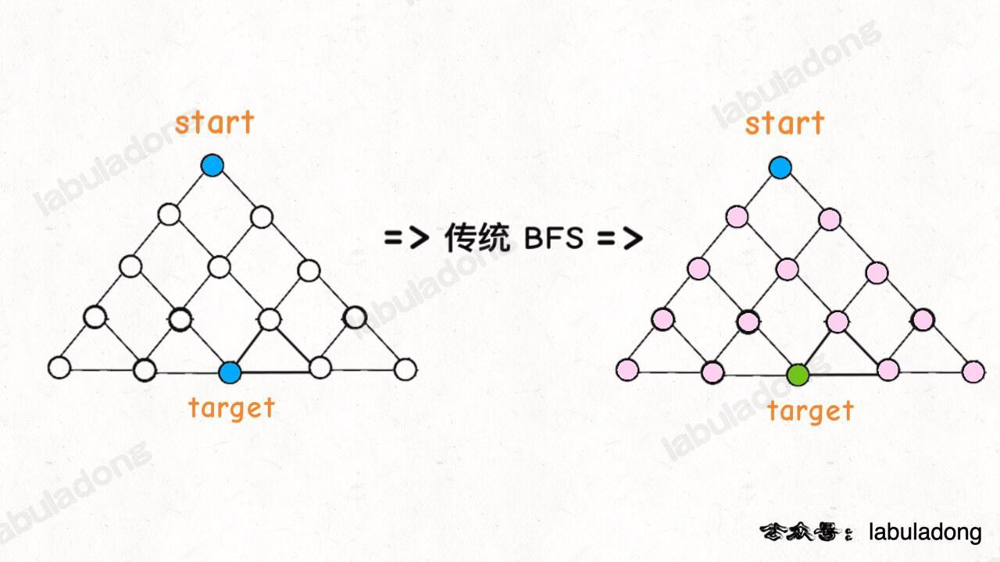
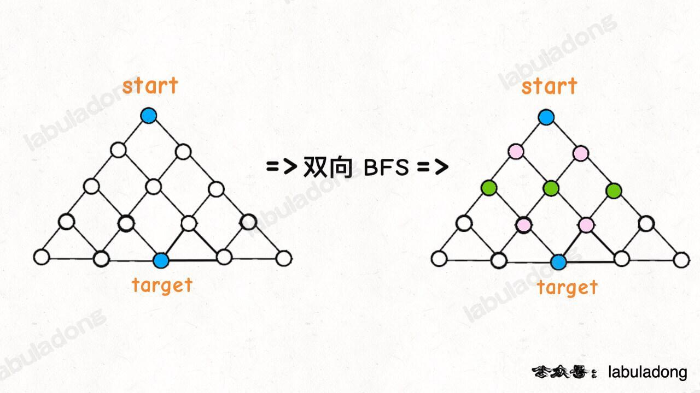
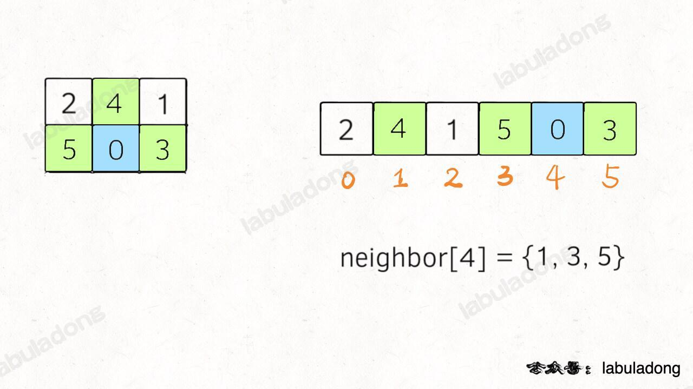

## 广度优先搜索 BFS

广度优先遍历(BFS): 

从起始节点开始，`逐层遍历`. 首先遍历起始节点的所有邻居节点，然后再逐层遍历下一层的节点. 
使用`队列数据结构`来辅助实现，保证按照`先入先出`的顺序访问节点. 
BFS通常使用`迭代`实现. 

- [从上到下打印二叉树](../../dataStructure/二叉树/leetcode+字节-二叉树的层序遍历.md)
- [单词接龙](https://leetcode.cn/problems/word-ladder/description/) hard
- [员工的重要性](https://leetcode.cn/problems/employee-importance/description/)
- [课程表](../../dataStructure/图/leetcode207-课程表问题.md)

```js
tip:  a 的 ASCII 值是 97，A 的 ASCII 值是 65. 相差32
String.fromCharCode - 指定的 UTF-16 码元序列创建的字符串. 
String.fromCharCode(97) //  'a'
String.charAt(index) 方法 表示字符串 index 位置的字符
String.charCodeAt() 方法可以用来获取字符串中指定位置的字符的 Unicode 编码

Array.prototype.find()
find() 方法返回数组中满足提供的测试函数的第一个元素的值
findIndex() 方法返回数组中满足提供的测试函数的第一个元素的索引
filter() 方法创建给定数组一部分的浅拷贝，其包含通过所提供函数实现的测试的所有元素. 返回一个数组

```

## 深度优先搜索 DFS

深度优先遍历(DFS): 

从起始节点开始，`一直向下深入直到无法继续前进`，然后回溯到上一个节点，继续向未探索的方向前进. 
使用`栈数据结构`来辅助实现，保证按照`后入先出`的顺序访问节点. 
DFS可以使用`递归或迭代`实现. 


- [二叉树的中序遍历](../../dataStructure/二叉树/leetcode+字节-二叉树的中序遍历.md)
- [二叉树的最大深度](../../dataStructure/二叉树/leetcode+tx-二叉树的最大深度.md)
- [二叉树的最小深度](../../dataStructure/二叉树/二叉树的最小深度.md)
- [路径总和](https://leetcode.cn/problems/path-sum/description/)


均可用BFS &  DFS
- [二叉树的层序遍历](../../dataStructure/二叉树/leetcode+字节-二叉树的层序遍历.md)
- [二叉树的层次遍历](../../dataStructure/二叉树/leetcode-二叉树的层次遍历.md)
- [二叉树的最小深度](../../dataStructure/二叉树/二叉树的最小深度.md)
- [岛屿数量](./岛屿数量.md)

tip: 
广度优先遍历按照层级顺序访问节点，先访问离起始节点近的节点，再访问离起始节点远的节点. 而深度优先遍历按照深度优先的原则，一直向下深入直到无法继续前进，然后回溯到上一个节点，继续向未探索的方向前进. 

在实际应用中，
- BFS常用于寻找最短路径、拓扑排序等问题
- DFS常用于图的连通性判断、回溯算法等问题. 选择使用哪种遍历算法取决于具体的需求和问题特点. 


--------labuladong<br>
https://labuladong.online/algo/di-san-zha-24031/bao-li-sou-96f79/bfs-suan-f-463fd/

```js
其实 DFS 算法就是回溯算法

我们写 BFS 算法都是用***「队列」***这种数据结构，每次将一个节点周围的所有节点加入队列. 

>> BFS 相对 DFS 的最主要的区别是: BFS 找到的路径一定是最短的，但代价就是空间复杂度可能比 DFS 大很多

BFS 本质: 就是一幅「图」，让你从一个起点，走到终点，问最短路径. 

BFS 可以找到最短距离，但是**空间复杂度高**，而 DFS 的空间复杂度较低. 

一般来说在找最短路径的时候使用 BFS，其他时候还是 DFS 使用得多一些(主要是递归代码好写）. 

//  经典框架
function minDepth(root) {
  if (!root) return 0
  //  用一个队列来存储每一层的节点
  let queue = [root]
  //  记录深度
  let depth = 0
  //  循环遍历每一层
  while(queue.length > 0) {
    depth++
        //  记录当前层的节点个数
    let levelSize = queue.length
    //  遍历 当前层 的每个节点
    for (let i=0; i<levelSize; i++) {
            //  弹出每个节点
      let node = queue.shift()
      //  如果没有左右子树，说明已经到头了！！！ 最小的深度, 会优先走到这步
      if (!node.left && !node.right) return depth;
      
      //  如果当前节点有左子节点，将左子节点入队
      if (node.left) queue.push(node.left)
      if (node.right) queue.push(node.right)
    }
  }

  return depth
}
```

[力扣第 752 题 打开转盘锁](https://leetcode.cn/problems/open-the-lock/description/)

```js
var openLock = function(deadends, target) {

  let q = ['0000']
  // 记录需要跳过的死亡密码
  let dead = new Set(deadends)
  // 记录已经穷举过的密码，防止走回头路
  let visited = new Set()
  // 从起点开始启动广度优先搜索
  let step = 0
  visited.add('0000')

  //  某个轮盘 往上滚动
  const plus = (s, j) => {
    let ch = s.split('')
    if (ch[j] === '9') {
      ch[j] = '0'
    } else {
      ch[j] = String.fromCharCode(ch[j].charCodeAt(0) + 1)
      // ch[j] = String(parseInt(ch[j]) + 1)
    }

    return ch.join('')
  }
  //  某个轮盘往下滚动
  const minor = (s, j) => {
    let ch = s.split('')
    if (ch[j] === '0') {
      ch[j] = '9'
    } else {
      ch[j] = String.fromCharCode(ch[j].charCodeAt(0) - 1)
      // ch[j] = String(parseInt(ch[j]) - 1)
    }

    return ch.join('')
  }

  while(q.length > 0) {
    let size = q.length

    for(let i=0; i<size; i++) {
      let cur = q.shift()
      /* 跳过死亡密码 */
      if (dead.has(cur)) continue
      /* 判断是否到达终点 */
      if (cur === target) return step


      /* 将一个节点的相邻节点加入队列 */
      //  4个轮盘, 每个轮盘有上/下 2种可能
      for (let j=0; j<4; j++) {
        let up = plus(cur, j)
        if (!visited.has(up)) {
          q.push(up)
          visited.add(up)
        }
        let down = minor(cur, j)
        if (!visited.has(down)) {
          q.push(down)
          visited.add(down)
        }
      }
    }
    //  增加步数
    step++
  }
   // 如果穷举完都没找到目标密码，那就是找不到了
  return -1

};


```

### BFS 算法还有一种稍微高级一点的优化思路

双向 BFS，可以进一步提高算法的效率. 

传统的 BFS 框架就是从起点开始向四周扩散，遇到终点时停止; 而双向 BFS 则是从起点和终点同时开始扩散，当两边有交集的时候停止. 




```
图示中的树形结构，如果终点在最底部，按照传统 BFS 算法的策略，会把整棵树的节点都搜索一遍，最后找到 target; 而双向 BFS 其实只遍历了半棵树就出现了交集，也就是找到了最短距离. 从这个例子可以直观地感受到，双向 BFS 是要比传统 BFS 高效的. 
```

双向 BFS 也有局限，因为你必须知道终点在哪里; 可以用于密码锁的优化


```js
var openLock = function(deadends, target) {

  let q1 = new Set()
  let q2 = new Set()
  // 记录需要跳过的死亡密码
  let dead = new Set(deadends)
  // 记录已经穷举过的密码，防止走回头路
  let visited = new Set()
  // 从起点开始启动广度优先搜索
  let step = 0

  q1.add('0000')
  q2.add(target)

  //  某个轮盘 往上滚动
  const plus = (s, j) => {
    let ch = s.split('')
    if (ch[j] === '9') {
      ch[j] = '0'
    } else {
      ch[j] = String.fromCharCode(ch[j].charCodeAt(0) + 1)
    }

    return ch.join('')
  }
  //  某个轮盘往下滚动
  const minor = (s, j) => {
    let ch = s.split('')
    if (ch[j] === '0') {
      ch[j] = '9'
    } else {
      ch[j] = String.fromCharCode(ch[j].charCodeAt(0) - 1)
    }

    return ch.join('')
  }
  //  注意！！！ set map 的 长度 用size 表示
  while(q1.size > 0 &&  q2.size > 0) {

    let tmp = new Set()

    /* 将 q1 中的所有节点向周围扩散 */
    for (let cur of q1) {
      /* 跳过死亡密码 */
      if (dead.has(cur)) continue
      /* 判断是否到达终点 */
      if (q2.has(cur)) return step

      visited.add(cur)

            //  4个轮盘, 每个轮盘有上/下 2种可能
      for (let j=0; j<4; j++) {
        let up = plus(cur, j)
        if (!visited.has(up)) {
          tmp.push(up)
          // visited.add(up)
        }
        let down = minor(cur, j)
        if (!visited.has(down)) {
          tmp.push(down)
          // visited.add(down)
        }
      }
    }

    step++
    // temp 相当于 q1
    // 这里交换 q1 q2，下一轮 while 就是扩散 q2
    q1 = q2
    q2 = tmp

  }
   // 如果穷举完都没找到目标密码，那就是找不到了
  return -1

};

双向 BFS 还是遵循 BFS 算法框架的，只是不再使用队列，而是使用 HashSet 方便快速判断两个集合是否有交集. 

另外的一个技巧点就是 while 循环的最后交换 q1 和 q2 的内容，所以只要默认扩散 q1 就相当于轮流扩散 q1 和 q2. 

无论传统 BFS 还是双向 BFS，无论做不做优化，从 Big O 衡量标准来看，时间复杂度都是一样的，只能说双向 BFS 是一种 trick，算法运行的速度会相对快一点
```


### BFS 算法如何解决智力题

[力扣第 773 题「滑动谜题」](https://leetcode.cn/problems/sliding-puzzle/)

给你一个 2x3 的滑动拼图，用一个 2x3 的数组 board 表示. 拼图中有数字 0~5 六个数，其中数字 0 就表示那个空着的格子，你可以移动其中的数字，当 board 变为 [[1,2,3],[4,5,0]] 时，赢得游戏. 

请你写一个算法，计算赢得游戏需要的最少移动次数，如果不能赢得游戏，返回 -1. 

### 思路

这种计算最小步数的问题，我们就要敏感地想到 BFS 算法

BFS 算法并不只是一个寻路算法，而是一种暴力搜索算法

每次先找到数字 0，然后和周围的数字进行交换，形成新的局面加入队列…… 当第一次到达 target 时，就得到了赢得游戏的最少步数

我们这里的 board 仅仅是 2x3 的二维数组，所以可以压缩成一个一维字符串. 其中比较有技巧性的点在于，二维数组有「上下左右」的概念，压缩成一维后，直接手动写出来这个映射

neighbor 帮助理解: 


```js
var slidingPuzzle = function(board) {
  let m=2, n=3
  let str = ''
  let target = '123450'

  const swap = (chars, i, j) => {
    [chars[i], chars[j]] = [chars[j], chars[i]];
    return chars.join('')
  }

  for (let i=0; i<m; i++) {
    for (let j=0; j<n; j++) {
      str += board[i][j].toString()
    }
  }
  //  初始一维 字符串 '134520'
  let start = str

  let neighbor = [

    [1, 3],
    [0, 2, 4],
    [1, 5],
    [0, 4],
    [1, 3, 5],
    [2, 4]
  ]

  //  BFS 框架开始
  let step = 0
  let q = []
  let visited = new Set()
  q.push(start)
  visited.add(start)

  while(q.length > 0) {
    let size = q.length

    for (let i=0; i<size; i++) {
      let cur = q.shift()

      if (target === cur) {
        return step
      }
      // 找到数字 0 的索引
      let idx = cur.split('').findIndex((item) => item === '0')

      for (let adj of neighbor[idx]) {
        let str = cur.split('')
        let new_board = swap(str, adj, idx)

        if (!visited.has(new_board)) {
          q.push(new_board)
          visited.add(new_board)
        }
      }

    }
    step++
  }

  return -1
};
```


