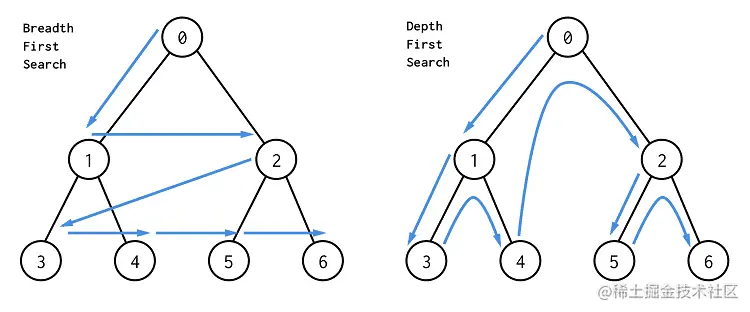

## 广度优先搜索 BFS

广度优先遍历(BFS): 

从起始节点开始，`逐层遍历`。首先遍历起始节点的所有邻居节点，然后再逐层遍历下一层的节点。
使用`队列数据结构`来辅助实现，保证按照`先入先出`的顺序访问节点。
BFS通常使用`迭代`实现。

- [从上到下打印二叉树](../../dataStructure/二叉树/leetcode+字节-二叉树的层序遍历.md)
- [单词接龙](https://leetcode.cn/problems/word-ladder/description/) hard
- [员工的重要性](https://leetcode.cn/problems/employee-importance/description/)
- [课程表](../../dataStructure/图/leetcode207-课程表问题.md)

```js
tip:  a 的 ASCII 值是 97，A 的 ASCII 值是 65。相差32
String.fromCharCode - 指定的 UTF-16 码元序列创建的字符串。
String.fromCharCode(97) //  'a'
String.charAt(index) 方法 表示字符串 index 位置的字符
String.charCodeAt() 方法可以用来获取字符串中指定位置的字符的 Unicode 编码

Array.prototype.find()
find() 方法返回数组中满足提供的测试函数的第一个元素的值
findIndex() 方法返回数组中满足提供的测试函数的第一个元素的索引
filter() 方法创建给定数组一部分的浅拷贝，其包含通过所提供函数实现的测试的所有元素。返回一个数组

```

## 深度优先搜索 DFS

深度优先遍历(DFS): 

从起始节点开始，`一直向下深入直到无法继续前进`，然后回溯到上一个节点，继续向未探索的方向前进。
使用`栈数据结构`来辅助实现，保证按照`后入先出`的顺序访问节点。
DFS可以使用`递归或迭代`实现。



- [二叉树的中序遍历](../../dataStructure/二叉树/leetcode+字节-二叉树的中序遍历.md)
- [二叉树的最大深度](../../dataStructure/二叉树/leetcode+tx-二叉树的最大深度.md)
- [二叉树的最小深度](../../dataStructure/二叉树/二叉树的最小深度.md)
- [路径总和](https://leetcode.cn/problems/path-sum/description/)


均可用BFS &  DFS
- [二叉树的层序遍历](../../dataStructure/二叉树/leetcode+字节-二叉树的层序遍历.md)
- [二叉树的层次遍历](../../dataStructure/二叉树/leetcode-二叉树的层次遍历.md)
- [岛屿数量](./岛屿数量.md)

tip: 
广度优先遍历按照层级顺序访问节点，先访问离起始节点近的节点，再访问离起始节点远的节点。而深度优先遍历按照深度优先的原则，一直向下深入直到无法继续前进，然后回溯到上一个节点，继续向未探索的方向前进。

在实际应用中，
- BFS常用于寻找最短路径、拓扑排序等问题
- DFS常用于图的连通性判断、回溯算法等问题。选择使用哪种遍历算法取决于具体的需求和问题特点。

