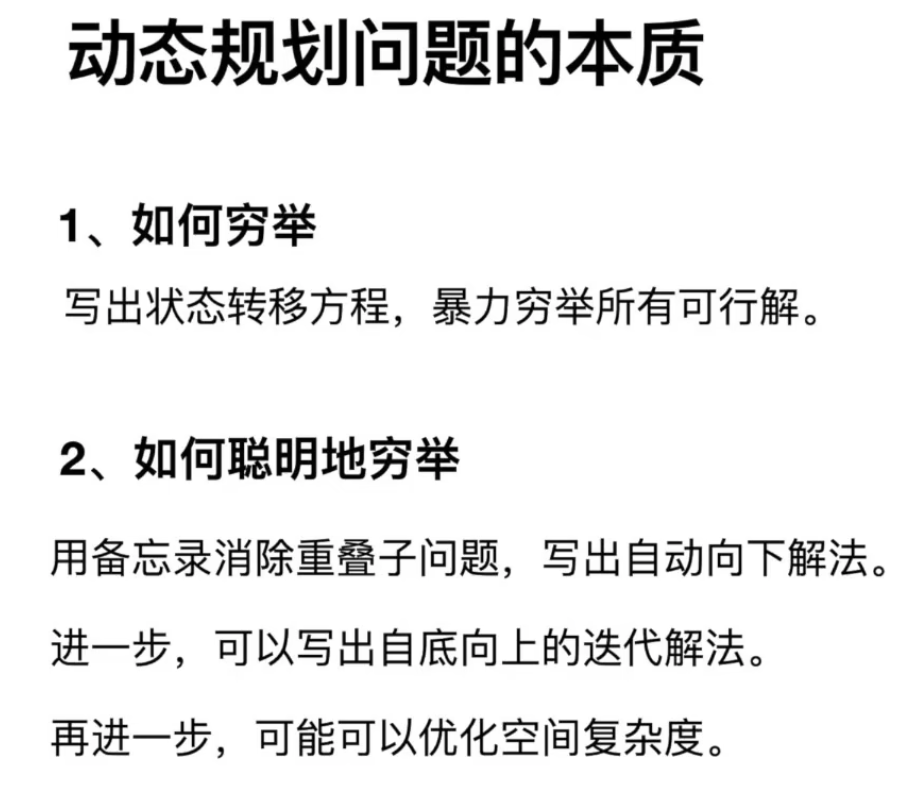

特点: 
1. 重叠子问题
2. 状态转移方程【最关键】
3. 最优子结构

```
题型: 求最值
核心: 穷举

解题套路
1 明确 [状态]
2 明确 [选择]
3 明确 dp函数/数组 定义
4 明确 base case

```

```js
// 自顶向下递归的动态规划
def dp(状态1, 状态2, ...):
    for 选择 in 所有可能的选择:
        // 此时的状态已经因为做了选择而改变
        result = 求最值(result, dp(状态1, 状态2, ...))
    return result

// 自底向上迭代的动态规划
// 初始化 base case
dp[0][0][...] = base case
// 进行状态转移
for 状态1 in 状态1的所有取值: 
    for 状态2 in 状态2的所有取值: 
        for ...
            dp[状态1][状态2][...] = 求最值(选择1，选择2...)

```

---------

动态规划问题的一般形式就是*求最值*; 比如说让你求最长递增子序列呀，最小编辑距离呀等等

既然是要求最值，核心问题是什么呢？求解动态规划的核心问题是穷举。因为要求最值，肯定要把所有可行的答案穷举出来，然后在其中找最值呗。

> 首先，虽然动态规划的核心思想就是穷举求最值，但是问题可以千变万化，穷举所有可行解其实并不是一件容易的事，需要你熟练掌握递归思维，只有列出正确的「状态转移方程」，才能正确地穷举。而且，你需要判断算法问题是否具备「最优子结构」，是否能够通过子问题的最值得到原问题的最值。另外，动态规划问题存在「重叠子问题」，如果暴力穷举的话效率会很低，所以需要你使用「备忘录」或者「DP table」来优化穷举过程，避免不必要的计算。

以上提到的`重叠子问题、最优子结构、状态转移方程`就是动态规划三要素。

```
重叠子问题（Overlapping Subproblems）: 指的是在解决一个大问题的过程中，会反复遇到相同的小问题。动态规划通过保存已经解决过的子问题的解，避免重复计算，从而提高效率。

最优子结构（Optimal Substructure）: 表示一个问题的最优解包含其子问题的最优解。换句话说，通过子问题的最优解可以推导出原问题的最优解。这种性质有助于将问题分解成子问题，并利用子问题的最优解来求解原问题。

状态转移方程（State Transition Equation）: 描述了问题的状态之间的关系和转移规律。通过状态转移方程，我们可以找到当前问题与子问题之间的联系，从而建立动态规划的递推关系，实现问题的逐步求解。

简单来说，重叠子问题指的是重复计算相同的小问题，最优子结构表示问题的最优解包含子问题的最优解，状态转移方程描述了问题状态之间的关系，帮助我们建立动态规划的递推关系，从而高效地解决问题。
```

辅助你思考状态转移方程: 
*明确 base case -> 明确「状态」-> 明确「选择」 -> 定义 dp 数组/函数的含义。*

先看[斐波那契的例子](../递归和循环/斐波拉契数列.md)

问题:  存在大量重复计算，比如 f(18) 被计算了两次 -》 动态规划问题的第一个性质: 重叠子问题

所以有了 带备忘录的递归解法！！！！！
> 造一个「备忘录」，每次算出某个子问题的答案后别急着返回，先记到「备忘录」里再返回；每次遇到一个子问题先去「备忘录」里查一查，如果发现之前已经解决过这个问题了，直接把答案拿出来用，不要再耗时去计算了。

```js
function fibonacci(n, memory = []) {
  if (n < 2) return n

  if (!memory[n]) {
    //  前后两个fibonacci, 计算斐波那契数列的每一项时只需计算一次，避免了重复计算。这样可以大大提高计算效率
    memory[n] = fibonacci(n - 1, memory) + fibonacci(n - 2, memory)
  }

  return memory[n]
}

时间复杂度是 O(n)
```
以上是「自顶向下」进行递归求解；【如说 f(20)，向下逐渐分解规模，直到 f(1) 和 f(2) 这两个 base case，然后逐层返回答案，这就叫「自顶向下」。】

动态规划代码是「自底向上」进行「递推」求解。【已知结果的 f(1) 和 f(2)（base case）开始往上推，直到推到我们想要的答案 f(20)。】

```js
//  「自底向上」进行「递推」求解
function fibonacci(n) {
  let result = Array(n+1)
  result[0] = 0
  result[1] = 1

  for (let i=2; i<=n; i++) {
    result[i] = result[i-1] + reuslt[i-2]
  }

  return result[n]
}
```

引出「状态转移方程」这个名词，实际上就是描述问题结构的数学形式: 


`f(n) `的函数参数会不断变化，所以你把参数 `n `想做一个状态，这个状态 `n `是由状态 `n - 1 `和状态 `n - 2 `转移（相加）而来，这就叫状态转移，仅此而已。


千万不要看不起暴力解，动态规划问题最困难的就是写出这个暴力解，即状态转移方程。


优化 - 当前状态 n 只和之前的 n-1, n-2 两个状态有关，其实并不需要那么长的一个 DP table 来存储所有的状态，只要想办法存储之前的两个状态就行了。

可以进一步优化，把空间复杂度降为 O(1)
```js
function fibonacci(n) {
  if (n<2) return n

  let rel, pre=0, cur=1, i=1

  while(i++ < n) {
    rel = pre + cur
    pre = cur
    cur = rel
  }

  return rel
}
```


这一般是动态规划问题的最后一步优化，如果我们发现每次状态转移只需要 DP table 中的一部分，那么可以尝试缩小 DP table 的大小，只记录必要的数据，从而降低`空间复杂度`。


### 凑零钱问题

[力扣第 322 题「零钱兑换」](https://leetcode.cn/problems/coin-change/description/)

```js
//  暴力递归解法
// 状态 - 目标金额
// 选择 - coins 数组中列出的所有硬币面额
// 函数定义 - 凑出总金额amount 至少需要coinChange(coins, amount) 枚硬币
// base case - amount = 0 时，需要0枚，amout<0时，不可能

//  coinChange([1,2,5], 11) === 1 + min(coinChange([1,2,5], 10), coinChange([1,2,5], 9), coinChange([1,2,5], 6))
//  分解成子问题

// 注意: javascript 代码由 chatGPT🤖 根据我的 java 代码翻译，旨在帮助不同背景的读者理解算法逻辑。
// 本代码不保证正确性，仅供参考。如有疑惑，可以参照我写的 java 代码对比查看。

var coinChange = function(coins, amount) {
    // 题目要求的最终结果是 dp(amount)
    return dp(coins, amount);
}

// 定义: 要凑出金额 n，至少要 dp(coins, n) 个硬币
function dp(coins, amount) {
    // base case
    if (amount == 0) return 0;
    if (amount < 0) return -1;

    let res = Infinity;
    for (let coin of coins) {
        // 计算子问题的结果
        let subProblem = dp(coins, amount - coin);
        // 子问题无解则跳过
        if (subProblem == -1) continue;
        // 在子问题中选择最优解，然后加一
        res = Math.min(res, subProblem + 1);
    }

    return res == Infinity ? -1 : res;
}

```

有重叠的子问题，可以用备忘录优化[9， 5 都是需要重复计算的节点]


```js
var coinChange = function(coins, amount) {
  //  创建备忘录, 如果后续还有重复的值，直接调用[子节点数量肯定不会超过amount+1， 最小力度1]
  let memo = Array(amount+1).fill(-666)

  var dp = function(coins, amount) {
    //  base case
    if (amount == 0) return 0
    if (amount < 0) return -1

    if(memo[amount] !== -666) return memo[amount]
  
    let res = Infinity
  
    for (let i of coins) {
      //  计算子问题结果
      let subProblem = dp(coins, amount-i)
      //  子问题无解，跳过
      if (subProblem === -1) continue
      //  在子问题中选择最优解，然后加1
      res = Math.min(res, subProblem + 1)
    }
    //  -1 和 -666 也能做区分
    memo[amount] = (res === Infinity) ? -1 : res

    return memo[amount]
  
  };

  return dp(coins, amount)
}
O(k * n)
```


解法三 - 自底向上

```js

/**
 * @param {number[]} coins
 * @param {number} amount
 * @return {number}
 */
var coinChange = function(coins, amount) {
    //  凑齐amount 金额，最多要用amount 枚1元硬币; 所以赋值amount + 1， 取不到的一个数
    var dp = new Array(amount + 1).fill(amount + 1);

    //  dp[i] 代表凑齐总数i 最小的枚数 represents the minimum number of coins needed for the amount i
    dp[0] = 0;

    for (var i = 0; i < dp.length; i++) {
        // The inner loop is to find the minimum value of all choices
        for (var coin of coins) {
            // Sub-problems are unsolvable, skip
            if (i - coin < 0) {
                continue;
            }

            dp[i] = Math.min(dp[i], 1 + dp[i - coin]);
        }
    }
    //  还是初始值的话，返回-1
    return (dp[amount] == amount + 1) ? -1 : dp[amount];
};

```




## 动态规划的通用技巧: 数学归纳思想。

[力扣第 300 题「最长递增子序列」](https://leetcode.cn/problems/longest-increasing-subsequence/description/)

注意「子序列」和「子串」这两个名词的区别，子串一定是连续的，而子序列不一定是连续的。下面先来设计动态规划算法解决这个问题。

我们设计动态规划算法，不是需要一个 dp 数组吗？我们可以假设 dp[0...i-1] 都已经被算出来了，然后问自己: 怎么通过这些结果算出 dp[i]？

我们的定义是这样的: dp[i] 表示以 nums[i] 这个数结尾的最长递增子序列的长度。

根据这个定义，我们就可以推出 base case: dp[i] 初始值为 1，因为以 nums[i] 结尾的最长递增子序列起码要包含它自己。


根据这个定义，我们的最终结果（子序列的最大长度）应该是 dp 数组中的最大值。

我们应该怎么设计算法逻辑来正确计算每个 dp[i] 呢？

！！！！！这就是动态规划的重头戏，如何设计算法逻辑进行状态转移，才能正确运行呢？这里需要使用数学归纳的思想: 

假设我们已经知道了 dp[0..4] 的所有结果，我们如何通过这些已知结果推出 dp[5] 呢？

> nums[5] = 3，既然是递增子序列，我们只要找到前面那些结尾比 3 小的子序列，然后把 3 接到这些子序列末尾，就可以形成一个新的递增子序列，而且这个新的子序列长度加一。

```js
for (int i = 0; i < nums.length; i++) {
    for (int j = 0; j < i; j++) {
        // 寻找 nums[0..j-1] 中比 nums[i] 小的元素
        if (nums[i] > nums[j]) {
            // 把 nums[i] 接在后面，即可形成长度为 dp[j] + 1，
            // 且以 nums[i] 为结尾的递增子序列
            dp[i] = Math.max(dp[i], dp[j] + 1);
        }
    }
}

```


完整代码
```js
var lengthOfLIS = function(nums) {
  // 定义: dp[i] 表示以 nums[i] 这个数结尾的最长递增子序列的长度
  // base case: dp 数组全都初始化为 1
  let dp = Array(nums.length).fill(1)

  for (let i=0; i<nums.length; i++) {
    for (let j=0; j<i; j++) {
      if (nums[i] > nums[j]) {
        dp[i] = Math.max(dp[i], dp[j]+1)
      }
    }
  }

  let res = 0
  res = Math.max.apply(null, dp)
  
  return res
}

O(n^2)
```

### 总结
如何找到动态规划的状态转移关系: 

1、明确 dp 数组的定义。这一步对于任何动态规划问题都很重要，如果不得当或者不够清晰，会阻碍之后的步骤。

2、根据 dp 数组的定义，运用数学归纳法的思想，假设 dp[0...i-1] 都已知，想办法求出 dp[i]，一旦这一步完成，整个题目基本就解决了。

但如果无法完成这一步，很可能就是 dp 数组的定义不够恰当，需要重新定义 dp 数组的含义；或者可能是 dp 数组存储的信息还不够，不足以推出下一步的答案，需要把 dp 数组扩大成二维数组甚至三维数组。

目前的解法是标准的动态规划，但对最长递增子序列问题来说，这个解法不是最优的，可能无法通过所有测试用例了，下面讲讲更高效的解法。


如何看出重叠子问题

首先，最简单粗暴的方式就是画图，把递归树画出来，看看有没有重复的节点。有的话 需要用备忘录技巧去优化

dp 数组的遍历方向

1、遍历的过程中，所需的状态必须是已经计算出来的。

2、遍历结束后，存储结果的那个位置必须已经被计算出来。


## 下降路径最小和
[题目](https://leetcode.cn/problems/minimum-falling-path-sum/)
```js
// 这个 dp 函数的含义如下: 
// 从第一行（matrix[0][..]）向下落，落到位置 matrix[i][j] 的最小路径和为 dp(matrix, i, j)。
var minFallingPathSum = function(matrix) {
  let n = matrix.length
  let res = Infinity

  let memo = Array.from({length: n}, () => Array(n).fill(66666))

  const min = (a, b, c) => {
    return Math.min(a, Math.min(b, c))
  }

  const dp = (matrix, i, j, memo) => {
    //  合法性
    if(i<0 || i>=n || j<0 || j>=n) {
      return 99999
    }

    // base case 
    if (i === 0) {
      return matrix[0][j]
    }

    //  备忘录
    if (memo[i][j] !== 66666) {
      return memo[i][j]
    }

    //  状态转移 = 当前值 + 从左上，正上，右上 过来的值
    memo[i][j] = matrix[i][j] + min(
      dp(matrix, i-1, j-1, memo), 
      dp(matrix, i-1, j, memo),
      dp(matrix, i-1, j+1, memo)
    )

    return memo[i][j]
  }

  for (let j=0; j<n; j++) {
    res = Math.min(res, dp(matrix, n-1, j, memo))
  }

  return res
};
```