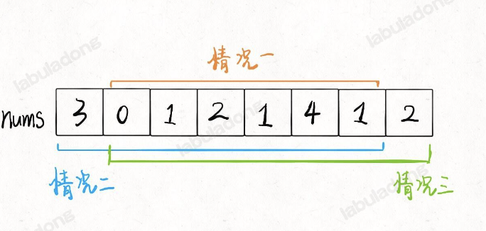

[题目](https://leetcode.cn/problems/house-robber-ii/description/)

你是一个专业的小偷，计划偷窃沿街的房屋，每间房内都藏有一定的现金. 这个地方所有的房屋都 围成一圈 ，这意味着第一个房屋和最后一个房屋是紧挨着的. 同时，相邻的房屋装有相互连通的防盗系统，如果两间相邻的房屋在同一晚上被小偷闯入，系统会自动报警 . 

给定一个代表每个房屋存放金额的非负整数数组，计算你 在不触动警报装置的情况下 ，今晚能够偷窃到的最高金额. 

## 思路

首先，首尾房间不能同时被抢，那么只可能有三种不同情况: 要么都不被抢; 要么第一间房子被抢最后一间不抢; 要么最后一间房子被抢第一间不抢. 



这三种情况哪个结果最大，就是最终答案. 其实，情况一的结果肯定最小，我们只要比较情况二和情况三就行了，因为这两种情况对于房子的选择余地比情况一大，房子里的钱数都是非负数，所以选择余地大，最优决策结果肯定不会小. 

```js
  //  相当于分成情况二 / 情况三 分别计算最大收益，然后取最大值
let rob = function (nums) {
  //  存放情况二的备忘录
  let memo1 = Array(nums.length).fill(-1)
  //  存放情况三的备忘录
  let memo2 = Array(nums.length).fill(-1)

  let n = nums.length
  if (n === 1) {
    return nums[0]
  }
  
  // 定义: 计算闭区间 [start,end] 的最优结果
  const dp = (start, end, memo) => {
    if (start > end) {
      return 0
    }

    if (memo[start] !== -1) {
      return memo[start]
    }

    memo[start] = Math.max(dp(start+1, end, memo), nums[start] + dp(start+2, end, memo))

    return memo[start]
  }

  return Math.max(dp(0, n-2, memo1), dp(1, n-1, memo2))

}
```