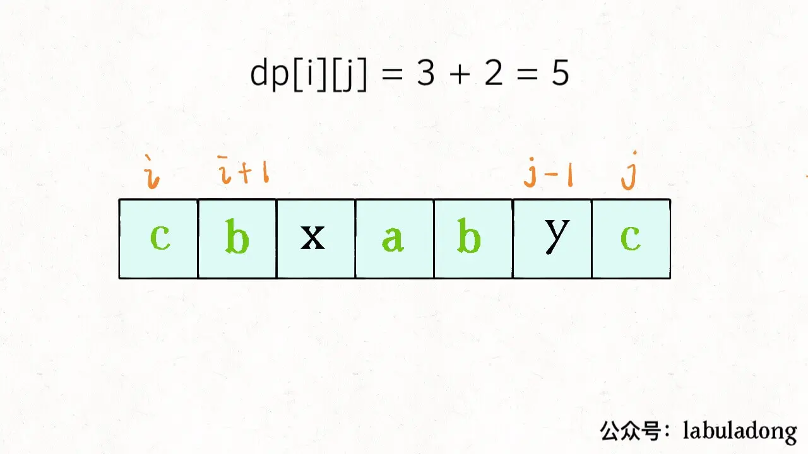
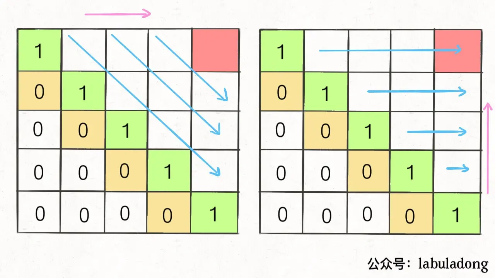

[题目516](https://leetcode.cn/problems/longest-palindromic-subsequence/description/)

## 思路

[文章](https://www.jianshu.com/p/c4138e451b7f)

子序列问题是常见的算法问题，而且并不好解决。

首先，子序列问题本身就相对子串、子数组更困难一些，因为前者是不连续的序列，而后两者是连续的，就算穷举你都不一定会，更别说求解相关的算法问题了。

子序列问题很可能涉及到两个字符串，比如前文「最长公共子序列」

一般来说，这类问题都是让你求一个最长子序列，因为最短子序列就是一个字符嘛，没啥可问的。一旦涉及到子序列和最值，那几乎可以肯定，考察的是动态规划技巧，时间复杂度一般都是 O(n^2)。

1、第一种思路模板是一个一维的 dp 数组：
```js
int n = array.length;
int[] dp = new int[n];

for (int i = 1; i < n; i++) {
    for (int j = 0; j < i; j++) {
        dp[i] = 最值(dp[i], dp[j] + ...)
    }
}
```

举个我们写过的例子「最长递增子序列」，在这个思路中 dp 数组的定义是：

在子数组 array[0..i] 中，我们要求的子序列（最长递增子序列）的长度是 dp[i]。

2、第二种思路模板是一个二维的 dp 数组：
```js
int n = arr.length;
int[][] dp = new dp[n][n];

for (int i = 0; i < n; i++) {
    for (int j = 0; j < n; j++) {
        if (arr[i] == arr[j]) 
            dp[i][j] = dp[i][j] + ...
        else
            dp[i][j] = 最值(...)
    }
}
```

2.1 涉及两个字符串/数组时（比如最长公共子序列），dp 数组的含义如下：

在子数组 arr1[0..i] 和子数组 arr2[0..j] 中，我们要求的子序列（最长公共子序列）长度为 dp[i][j]。

2.2 只涉及一个字符串/数组时（比如本文要讲的最长回文子序列），dp 数组的含义如下：

在子数组 array[i..j] 中，我们要求的子序列（最长回文子序列）的长度为 dp[i][j]。

第一种情况可以参考这两篇旧文：[编辑距离72](https://leetcode.cn/problems/edit-distance/)
[参考](https://labuladong.online/algo/dynamic-programming/edit-distance/)

[公共子序列1143](https://leetcode.cn/problems/longest-common-subsequence/description/)

下面就借最长回文子序列这个问题，详解一下第二种情况下如何使用动态规划。

[最长回文子串](https://leetcode.cn/problems/longest-palindromic-substring/description/)

[双指针技巧](https://labuladong.online/algo/essential-technique/array-two-pointers-summary/#%E4%B8%80%E3%80%81%E5%BF%AB%E6%85%A2%E6%8C%87%E9%92%88%E6%8A%80%E5%B7%A7)

题解
```js
//  寻找回文串的问题核心思想是：从中间开始向两边扩散来判断回文串，对于最长回文子串，就是这个意思：
var longestPalindrome = function(s) {
  let res = ''

  for (let i=0; i<s.length; i++) {
    // 以 s[i] 为中心的最长回文子串 - 奇数情况
    let s1 = palindrome(s, i, i)
    // 以 s[i] 和 s[i+1] 为中心的最长回文子串 - 偶数情况
    let s2 = palindrome(s, i, i+1)

    res = res.length > s1.length ? res : s1
    res = res.length > s2.length ? res : s2

  }

  return res

  function palindrome(s, l, r) {
    //  边界情况
    while (l>=0 && r<s.length && s[l] === s[r]) {
      //  向两边展开
      l--
      r++
    }

    return s.slice(l+1, r)
  }
}


```


对于最长回文子序列，对 dp 数组的定义是：在子串 s[i..j] 中，最长回文子序列的长度为 dp[i][j]; 找状态转移需要归纳思维，说白了就是如何从已知的结果推出未知的部分

假设你知道了子问题 dp[i+1][j-1] 的结果（s[i+1..j-1] 中最长回文子序列的长度），你是否能想办法算出 dp[i][j] 的值（s[i..j] 中，最长回文子序列的长度）呢？



```js
if (s[i] == s[j])
    // 它俩一定在最长回文子序列中
    dp[i][j] = dp[i + 1][j - 1] + 2;
else
    // 不想等的话，比较 s[i+1..j] 和 s[i..j-1] 谁的回文子序列更长？
    dp[i][j] = max(dp[i + 1][j], dp[i][j - 1]);


首先明确一下 base case，如果只有一个字符，显然最长回文子序列长度是 1，也就是 dp[i][j] = 1 (i == j)。

因为 i 肯定小于等于 j，所以对于那些 i > j 的位置，根本不存在什么子序列，应该初始化为 0。

另外，看看刚才写的状态转移方程，想求 dp[i][j] 需要知道 dp[i+1][j-1]，dp[i+1][j]，dp[i][j-1] 这三个位置

为了保证每次计算 dp[i][j]，左下右方向的位置已经被计算出来，只能斜着遍历或者反着遍历

我们选择反着遍历 - 目标是求的  dp[0][n-1] 的值 即 s[0..n-1] 中，最长回文子序列的长度
```


```js

/**
 * @param {string} s
 * @return {number}
 */
var longestPalindromeSubseq = function(s) {
  const n = s.length
  //  构建n*n 的矩阵, 用0填充； i>j 的情况 不存在 即为0
  const dp = Array.from({length: n}, ()=> Array(n).fill(0))
  //  base case i === j 的时候, 最长回文子序列长度就是1；
  for (let i=0; i<n; i++) {
    dp[i][i] = 1
  }
  //  反着遍历，因为状态转移方程
  for (let i=n-1; i>=0; i--) {

    for (let j=i+1; j<n; j++) {
      // 它俩一定在最长回文子序列中
      if (s[i] === s[j]) {
        dp[i][j] = dp[i+1][j-1] + 2
      } else {
        // 不想等的话，比较 s[i+1..j] 和 s[i..j-1] 谁的回文子序列更长？
        dp[i][j] = Math.max(dp[i+1][j], dp[i][j-1])
      }

    }
  }

  return dp[0][n-1]
};

```