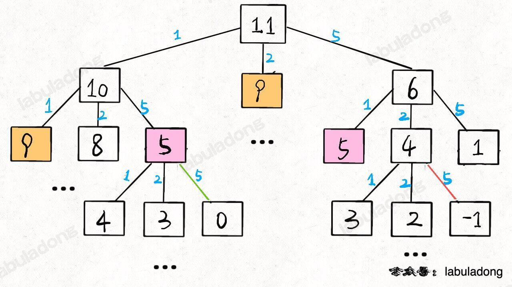
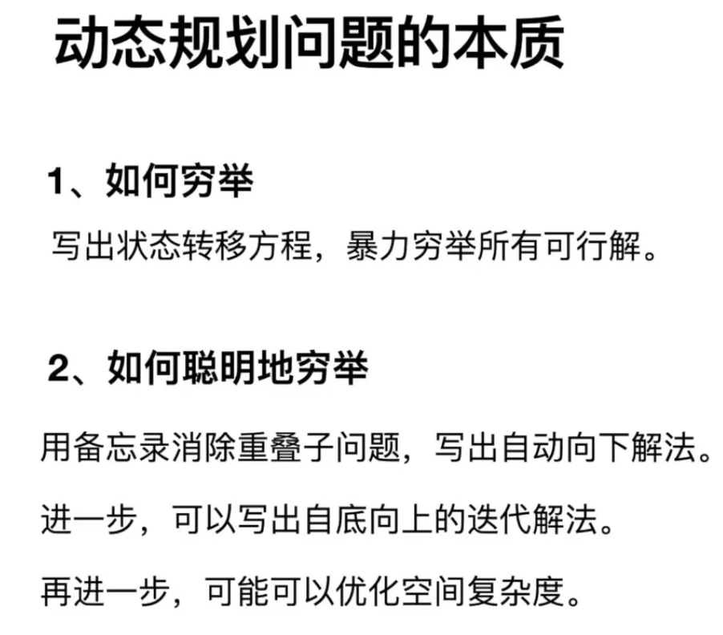

[力扣第 322 题「零钱兑换」](https://leetcode.cn/problems/coin-change/description/)

```js
//  暴力递归解法
// 状态 - 目标金额
// 选择 - coins 数组中列出的所有硬币面额
// 函数定义 - 凑出总金额amount 至少需要coinChange(coins, amount) 枚硬币
// base case - amount = 0 时，需要0枚，amout<0时，不可能

//  coinChange([1,2,5], 11) === 1 + min(coinChange([1,2,5], 10), coinChange([1,2,5], 9), coinChange([1,2,5], 6))
//  分解成子问题

var coinChange = function(coins, amount) {
    // 题目要求的最终结果是 dp(amount)
    return dp(coins, amount);
}

// 定义: 要凑出金额 n，至少要 dp(coins, n) 个硬币
function dp(coins, amount) {
    // base case
    if (amount == 0) return 0;
    if (amount < 0) return -1;

    let res = Infinity;
    for (let coin of coins) {
        // 计算子问题的结果
        let subProblem = dp(coins, amount - coin);
        // 子问题无解则跳过
        if (subProblem == -1) continue;
        // 在子问题中选择最优解，然后加一
        res = Math.min(res, subProblem + 1);
    }

    return res == Infinity ? -1 : res;
}

```

有重叠的子问题，可以用备忘录优化[9， 5 都是需要重复计算的节点]


```js
var coinChange = function(coins, amount) {
  //  创建备忘录, 如果后续还有重复的值，直接调用[子节点数量肯定不会超过amount+1， 最小力度1]
  let memo = Array(amount+1).fill(-666)

  var dp = function(coins, amount) {
    //  base case
    if (amount == 0) return 0
    if (amount < 0) return -1

    if(memo[amount] !== -666) return memo[amount]
  
    let res = Infinity
  
    for (let i of coins) {
      //  计算子问题结果
      let subProblem = dp(coins, amount-i)
      //  子问题无解，跳过
      if (subProblem === -1) continue
      //  在子问题中选择最优解，然后加1
      res = Math.min(res, subProblem + 1)
    }
    //  -1 和 -666 也能做区分
    memo[amount] = (res === Infinity) ? -1 : res

    return memo[amount]
  
  };

  return dp(coins, amount)
}
O(k * n)
```


解法三 - 自底向上

```js

/**
 * @param {number[]} coins
 * @param {number} amount
 * @return {number}
 */
var coinChange = function(coins, amount) {
    //  凑齐amount 金额，最多要用amount 枚1元硬币; 所以赋值amount + 1， 取不到的一个数
    var dp = new Array(amount + 1).fill(amount + 1);

    //  dp[i] 代表凑齐总数i 最小的枚数 represents the minimum number of coins needed for the amount i
    dp[0] = 0;

    for (var i = 0; i < dp.length; i++) {
        // The inner loop is to find the minimum value of all choices
        for (var coin of coins) {
            // Sub-problems are unsolvable, skip
            if (i - coin < 0) {
                continue;
            }

            dp[i] = Math.min(dp[i], 1 + dp[i - coin]);
        }
    }
    //  还是初始值的话，返回-1
    return (dp[amount] == amount + 1) ? -1 : dp[amount];
};

```



