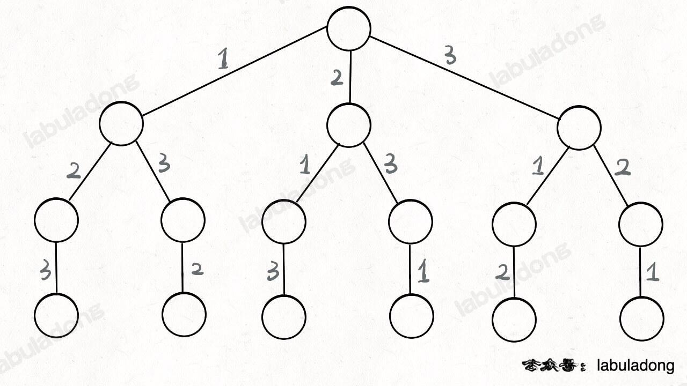

## 回溯算法（Backtracking Algorithm）

> 是一种经典的求解问题的算法，它通过穷举所有可能的解，并逐步构建解决方案，当发现当前方案不能得到正确结果时，会回溯到上一步进行其他选择，以找到最终的解。

回溯算法的特点是穷举所有可能解，因此在问题的解空间较大时，时间复杂度往往比较高。但回溯算法通常可以通过剪枝优化和合理选择搜索顺序来减少计算量。

--- labuladong <br>
https://labuladong.online/algo/di-san-zha-24031/bao-li-sou-96f79/hui-su-sua-c26da/

其实回溯算法和我们常说的 DFS 算法非常类似，本质上就是一种暴力穷举算法。回溯算法和 DFS 算法的细微差别是：回溯算法是在遍历「树枝」，DFS 算法是在遍历「节点」

抽象地说，解决一个回溯问题，实际上就是遍历一棵决策树的过程，树的每个叶子节点存放着一个合法答案。你把整棵树遍历一遍，把叶子节点上的答案都收集起来，就能得到所有的合法答案。

站在回溯树的一个节点上，你只需要思考 3 个问题：

1、路径：也就是已经做出的选择。

2、选择列表：也就是你当前可以做的选择。

3、结束条件：也就是到达决策树底层，无法再做选择的条件。

只要从根遍历这棵树，记录路径上的数字，其实就是所有的全排列。我们不妨把这棵树称为回溯算法的「决策树」。

为啥说这是决策树呢，因为你在每个节点上其实都在做决策


回溯算法的框架：
```js
result = []

function backtrack(路径, 选择列表) {
  if (满足结束条件) {
    result.push(路径)
    return
  }

  for(选择 in 选择列表) {
    //  剪枝操作
    if (满足条件) {
      do sth
    }

    // 做选择  // 前序位置需要的操作
    将该选择从选择列表移除
    路径.add(选择)

    backtrack(路径, 选择列表)

    路径.remove(选择)
    将该选择再加入选择列表
    // 撤销选择  // 后序位置需要的操作
  }
}
前序遍历的代码在进入某一个节点之前的那个时间点执行，后序遍历代码在离开某个节点之后的那个时间点执行。
```
核心就是 for 循环里面的递归，在递归调用之前「做选择」，在递归调用之后「撤销选择」，特别简单。

回溯算法就是纯暴力穷举，复杂度一般都很高

回溯算法就是个多叉树的遍历问题，关键就是在前序遍历和后序遍历的位置做一些操作

