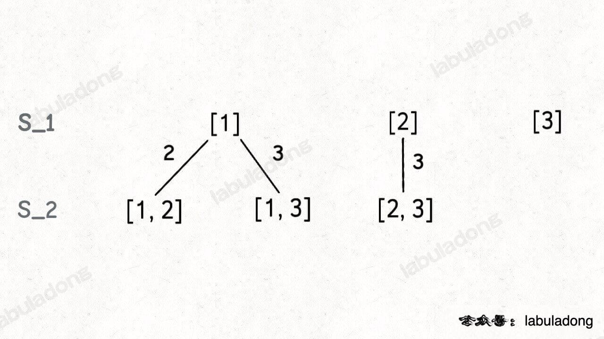
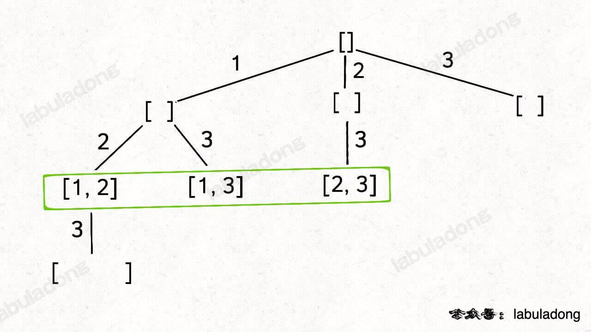

## 回溯算法(Backtracking Algorithm)

> 是一种经典的求解问题的算法,它通过穷举所有可能的解,并逐步构建解决方案,当发现当前方案不能得到正确结果时,会回溯到上一步进行其他选择,以找到最终的解. 

回溯算法的特点是穷举所有可能解,因此在问题的解空间较大时,时间复杂度往往比较高. 但回溯算法通常可以通过剪枝优化和合理选择搜索顺序来减少计算量. 

--- labuladong <br>
https://labuladong.online/algo/di-san-zha-24031/bao-li-sou-96f79/hui-su-sua-c26da/

其实回溯算法和我们常说的 DFS 算法非常类似,本质上就是一种暴力穷举算法. 回溯算法和 DFS 算法的细微差别是: 回溯算法是在遍历「树枝」,DFS 算法是在遍历「节点」

抽象地说,解决一个回溯问题,实际上就是遍历一棵决策树的过程,树的每个叶子节点存放着一个合法答案. 你把整棵树遍历一遍,把叶子节点上的答案都收集起来,就能得到所有的合法答案. 

站在回溯树的一个节点上,你只需要思考 3 个问题: 

1, 路径: 也就是已经做出的选择. 

2, 选择列表: 也就是你当前可以做的选择. 

3, 结束条件: 也就是到达决策树底层,无法再做选择的条件. 

只要从根遍历这棵树,记录路径上的数字,其实就是所有的全排列. 我们不妨把这棵树称为回溯算法的「决策树」. 

为啥说这是决策树呢,因为你在每个节点上其实都在做决策


回溯算法的框架: 
```js
result = []

function backtrack(路径, 选择列表) {
  if (满足结束条件) {
    result.push(路径)
    return
  }

  for(选择 in 选择列表) {
    //  剪枝操作
    if (满足条件) {
      do sth
    }

    // 做选择  // 前序位置需要的操作
    将该选择从选择列表移除
    路径.add(选择)

    backtrack(路径, 选择列表)

    路径.remove(选择)
    将该选择再加入选择列表
    // 撤销选择  // 后序位置需要的操作
  }
}
前序遍历的代码在进入某一个节点之前的那个时间点执行,后序遍历代码在离开某个节点之后的那个时间点执行. 
```
核心就是 for 循环里面的递归,在递归调用之前「做选择」,在递归调用之后「撤销选择」,特别简单. 

回溯算法就是纯暴力穷举,复杂度一般都很高

回溯算法就是个多叉树的遍历问题,关键就是在前序遍历和后序遍历的位置做一些操作


## 回溯算法秒杀所有排列组合
https://labuladong.online/algo/di-san-zha-24031/bao-li-sou-96f79/hui-su-sua-56e11/

无论是排列, 组合还是子集问题,简单说无非就是让你从序列 nums 中以给定规则取若干元素,主要有以下几种变体: 

- 形式一, 元素无重不可复选,即 nums 中的元素都是唯一的,每个元素最多只能被使用一次,这也是最基本的形式. 
以组合为例,如果输入 nums = [2,3,6,7],和为 7 的组合应该只有 [7]. 

- 形式二, 元素可重不可复选,即 nums 中的元素可以存在重复,每个元素最多只能被使用一次. 
以组合为例,如果输入 nums = [2,5,2,1,2],和为 7 的组合应该有两种 [2,2,2,1] 和 [5,2]. 

- 形式三, 元素无重可复选,即 nums 中的元素都是唯一的,每个元素可以被使用若干次. 
以组合为例,如果输入 nums = [2,3,6,7],和为 7 的组合应该有两种 [2,2,3] 和 [7]. 

当然,也可以说有第四种形式,即元素可重可复选. 但既然元素可复选,那又何必存在重复元素呢?元素去重之后就等同于形式三,所以这种情况不用考虑. 

## 子集(元素无重不可复选)
[力扣第 78 题 - 子集](https://leetcode.cn/problems/subsets/description/)


```js
为什么集合 [2] 只需要添加 3,而不添加前面的 1 呢?

因为集合中的元素不用考虑顺序,[1,2,3] 中 2 后面只有 3,如果你添加了前面的 1,那么 [2,1] 会和之前已经生成的子集 [1,2] 重复. 

换句话说,我们通过保证元素之间的相对顺序不变来防止出现重复的子集. 

```
## 组合(元素无重不可复选)
[力扣第 77 题「组合」](https://leetcode.cn/problems/combinations/description/)

对上一题做稍微的调整即可; 

现在你只需要把第 2 层(根节点视为第 0 层)的节点收集起来,就是大小为 2 的所有组合: 


```js
//  得到[1, 2, 3, .... n]数组
const nums = Array.from({length: n}, (_, i) => i+1) 

//  增加回溯函数的终止条件
if (track.length === k) {
  res.push([...track])
  return
}
```
## 排列(元素无重不可复选)
### 力扣第 46 题「全排列」就是标准的排列问题: 
[「全排列」](./百度+leetcode46-全排列问题.md)

刚才讲的组合/子集问题使用 start 变量保证元素 nums[start] 之后只会出现 nums[start+1..] 中的元素,通过固定元素的相对位置保证不出现重复的子集. 

但排列问题本身就是让你穷举元素的位置,nums[i] 之后也可以出现 nums[i] 左边的元素,所以之前的那一套玩不转了,需要额外使用 used 数组来标记哪些元素还可以被选择. 

```js
//  基于以上结论进行改良
function permute(nums) {
  const res = []
  const track = []
  const used = [] // 事实上, used 都可以不用,直接用track 就行 

  const backtrack = () => {
    if (track.length === nums.length) {
      res.push([...track])
      return
    }

    for(let i=0; i<nums.length; i++) {
      if (used.includes(nums[i])) {
        continue
      }
      used.push(nums[i])
      track.push(nums[i])
      backtrack(i+1)
      track.pop()
      used.pop()

    }
  }
  
  backtrack()
  return res
}
```

但如果题目不让你算全排列,而是让你算元素个数为 k 的排列,怎么算?

```js
function permute(nums, k) {
  const res = []
  const track = []
  const used = []  

  const backtrack = () => {
    //  修改此处的条件即可!!!!!!!!!!
    if (track.length === k) {
      res.push([...track])
      return
    }

    for(let i=0; i<nums.length; i++) {
      if (used.includes(nums[i])) {
        continue
      }
      used.push(nums[i])
      track.push(nums[i])
      backtrack(i+1)
      track.pop()
      used.pop()

    }
  }
  
  backtrack()
  return res
}
```

## 子集/组合(元素可重不可复选)
[力扣第 90 题「子集 II」](https://leetcode.cn/problems/subsets-ii/)

需要先进行排序,让相同的元素靠在一起,如果发现 nums[i] == nums[i-1],则跳过: 

```js
var subsetsWithDup = function(nums) {
  const res = []
  const track = []
  // 排序,以便于剪枝算法的实现
  nums.sort((a, b) => a - b)

  const backtrack = (start) => {
    res.push([...track])
    //  按照数组的顺序 防止出现重复子集
    for (let i=start; i<nums.length; i++) {
      // 剪枝逻辑,值相同的相邻树枝,只遍历第一条
      if (i>start && nums[i] === nums[i-1]) {
        continue
      }
      track.push(nums[i])

      backtrack(i+1)

      track.pop()
    }
  }

  backtrack(0)

  return res
};
```

我们说了组合问题和子集问题是等价的,所以我们直接看一道组合的题目吧,这是[力扣第 40 题「组合总和 II」](https://leetcode.cn/problems/combination-sum-ii/description/)

```js
var combinationSum2 = function(candidates, target) {
  const res = []
  const track = []
  let trackSum = 0

  candidates.sort((a, b) => a - b)

  const backtrack = (start) => {
    // 达到目标和,找到符合条件的组合,记录结果
    if (trackSum === target) {
      res.push([...track])
      return
    }
    // 先剪枝,超过目标和,直接结束 ！！！！！！！
    if (trackSum > target) return

    // 回溯算法标准框架
    for(let i=start; i<candidates.length; i++) {
      // 剪枝逻辑,值相同的树枝,只遍历第一条
      if (i>start && candidates[i] === candidates[i-1]) {
        continue
      }
      //  选择
      track.push(candidates[i])
      trackSum += candidates[i]
      backtrack(i+1)
      //  撤销选择
      track.pop()
      trackSum -= candidates[i]
    }
  }

  backtrack(0)

  return res
};
```

## 排列(元素可重不可复选)
力扣第 47 题「全排列 II」: 
[「全排列」](./百度+leetcode46-全排列问题.md)
```js
function permuteUnique(nums) {
  const result = []
  const visited = []
  nums.sort((a, b) => a-b)

  const backtrack = (track) => {
    if (track.length === nums.length) {
      result.push([...track])
      return 
    }

    for(let i=0; i<nums.length; i++) {
      //  比如输入 nums = [1,2,2',2''],2' 只有在 2 已经被使用的情况下才会被选择,同理,2'' 只有在 2' 已经被使用的情况下才会被选择,这就保证了相同元素在排列中的相对位置保证固定. 
      if (visited[i] || (i>0 && nums[i] === nums[i-1] && !visited[i-1])) {
        continue
      }
      visited[i] = true
      track.push(nums[i])
      backtrack(track)
      track.pop()
      visited[i] = false
    }

  }

  backtrack([])
  return result

}
```

## 子集/组合(元素无重可复选)
终于到了最后一种类型了: 输入数组无重复元素,但每个元素可以被无限次使用. 

直接看[力扣第 39 题「组合总和」](https://leetcode.cn/problems/combination-sum/)

标准的子集/组合问题是如何保证不重复使用元素的?

答案在于 backtrack 递归时输入的参数 start: 
```js

var backtrack = function(nums, start) {
    for (var i = start; i < nums.length; i++) {
        // ...
        // 递归遍历下一层回溯树,注意参数
        backtrack(nums, i + 1);
        // ...
    }
};

这个 i 从 start 开始,那么下一层回溯树就是从 start + 1 开始,从而保证 nums[start] 这个元素不会被重复使用: 

那么反过来,如果我想让每个元素被重复使用,我只要把 i + 1 改成 i 即可: 


```

```js
var combinationSum = function(candidates, target) {
  const res = []
  let trackSum = 0

  const backtrack = (track, start) => {
    if (trackSum === target) {
      res.push([...track])
      return;
    };

    if (trackSum > target) return
    
    for(let i=start; i<candidates.length; i++) {
      let tmp =candidates[i]
      trackSum += tmp;
      track.push(tmp)

      backtrack(track, i)

      track.pop()
      trackSum -= tmp
    }
  }

  backtrack([], 0)

  return res
};
```


## 排列(元素无重可复选)
力扣上没有类似的题目,我们不妨先想一下,nums 数组中的元素无重复且可复选的情况下,会有哪些排列?

比如输入 nums = [1,2,3],那么这种条件下的全排列共有 3^3 = 27 种

```js
标准的全排列算法利用 used 数组进行剪枝,避免重复使用同一个元素. 如果允许重复使用元素的话,直接放飞自我,去除所有 used 数组的剪枝逻辑就行了. 

/**
 * @param {number[]} nums
 * @return {number[][]}
 */
var permuteRepeat = function(nums) {

    // 创建结果集和回溯路径
    let res = [];
    let track = [];

    // 回溯算法核心函数
    const backtrack = function(nums) {
        // base case,到达叶子节点
        if (track.length === nums.length) {
            // 收集叶子节点上的值
            res.push([...track]);
            return;
        }

        // 回溯算法标准框架
        for (let i = 0; i < nums.length; i++) {
            // 做选择
            track.push(nums[i]);
            // 进入下一层回溯树
            backtrack(nums);
            // 取消选择
            track.pop();
        }
    }

    // 从第一层开始回溯
    backtrack(nums);

    return res;
};

```

## 总结

### 形式一, 元素无重不可复选
即 nums 中的元素都是唯一的,每个元素最多只能被使用一次,backtrack 核心代码如下: 

```js

// 组合/子集问题回溯算法框架
var backtrack = function(nums, start) {
    // 回溯算法标准框架
    for (var i = start; i < nums.length; i++) {
        // 做选择
        track.addLast(nums[i]);
        // 注意参数
        backtrack(nums, i + 1);
        // 撤销选择
        track.removeLast();
    }
}

// 排列问题回溯算法框架
var backtrack = function(nums) {
    for (var i = 0; i < nums.length; i++) {
        // 剪枝逻辑
        if (used[i]) {
            continue;
        }
        // 做选择
        used[i] = true;
        track.addLast(nums[i]);

        backtrack(nums);
        // 撤销选择
        track.removeLast();
        used[i] = false;
    }
}

```

### 形式二, 元素可重不可复选
即 nums 中的元素可以存在重复,每个元素最多只能被使用一次,其关键在于排序和剪枝,backtrack 核心代码如下: 

```js

var backtrack = (nums, start, track, used) => {
    nums = nums.sort();
    if (!used) {
        used = Array(nums.length).fill(false);
    }
    if (!track) {
        track = [];
    }
    if (track.length === nums.length) {
        // 结果处理
        return;
    }
    for (let i = start; i < nums.length; i++) {
        // 剪枝逻辑,跳过值相同的相邻树枝
        if (i > start && nums[i] === nums[i - 1]) {
            continue;
        }
        // 做选择
        track.push(nums[i]);
        used[i] = true;
        // 注意参数
        backtrack(nums, i + 1, track, used);
        // 撤销选择
        track.pop();
        used[i] = false;
    }
};

```


### 形式三, 元素无重可复选
即 nums 中的元素都是唯一的,每个元素可以被使用若干次,只要删掉去重逻辑即可,backtrack 核心代码如下: 


```js
//  子集和集合问题
var backtrack = function(nums, start) {
    // 回溯算法标准框架
    for (var i = start; i < nums.length; i++) {
        // 做选择
        track.add(nums[i]);
        // 注意参数, 不是 i+1 
        backtrack(nums, i);
        // 撤销选择
        track.pop();
    }
};

// 排列问题
var backtrack = function(nums) {
    // 排列问题回溯算法框架
    for (var i = 0; i < nums.length; i++) {
        // 做选择
        track.add(nums[i]);
        backtrack(nums);
        // 撤销选择
        track.pop();
    }
};

```