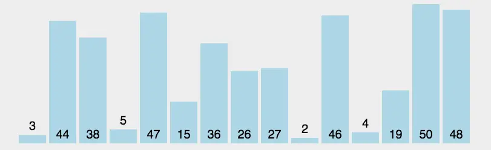

排序或许是前端接触最多的算法了,很多人的算法之路是从一个冒泡排序开始的,排序的方法有非常多中,它们各自有各自的应用场景和优缺点,这里我推荐如下6种应用最多的排序方法,如果你有兴趣也可以研究下其他几种. 

相关术语: 
- 稳定: 如果a原本在b前面,而a=b,排序之后a仍然在b的前面;  
- 不稳定: 如果a原本在b的前面,而a=b,排序之后a可能会出现在b的后面;  

# 汇总

## [冒泡排序](./冒泡排序.md)
> 循环数组,比较当前元素和下一个元素,如果当前元素比下一个元素大,向上冒泡. 下一次循环继续上面的操作,不循环已经排序好的数. 

平均时间复杂度: O(n²)

空间复杂度: O(1)

算法稳定性: 稳定

## [插入排序](./插入排序.md)
> 将左侧序列看成一个有序序列,每次将一个数字插入该有序序列. 插入时,从有序序列最右侧开始比较,若比较的数较大,后移一位. 

平均时间复杂度: O(n²)

空间复杂度: O(1)

算法稳定性: 稳定

## [选择排序](./选择排序.md)
> 每次排序取一个最大或最小的数字放到前面的有序序列中. 

平均时间复杂度: O(n²)

空间复杂度: O(1)

算法稳定性: 不稳定！！！[因为相对位置不能确定,如1424536,第一个4会在第二个4之后]

## [希尔排序](./希尔排序.md)
> 希尔排序是插入排序的一种改进版本,通过将待排序数组分割成多个子序列,对每个子序列进行插入排序,最后再对整个数组进行一次插入排序. 

平均时间复杂度: O(nlogn)

算法空间复杂度: O(1)

算法稳定性: 不稳定！！！！！【将待排序数组分成多个子序列进行排序,每个子序列独立进行插入排序,因此相同元素可能会在不同子序列之间移动位置,导致排序后的结果不稳定. 】

## [快速排序](./快速排序.md)
> 选择一个目标值,比目标值小的放左边,比目标值大的放右边,目标值的位置已排好,将左右两侧再进行快排. [使用分治的思想]

时间复杂度: 平均O(nlogn),最坏O(n2),实际上大多数情况下小于O(nlogn)

- 最好情况下,每次选取的基准元素正好将数组平均分成两个相等的子数组,此时每层递归都将对数组的一半进行处理. 因此,快速排序的时间复杂度为O(nlogn). 
- 最坏情况下,每次选取的基准元素都是当前数组中的最大或最小值,导致每次递归只能处理一个元素. 此时,快速排序的时间复杂度为O(n^2). 
- 平均情况下,快速排序的时间复杂度为O(nlogn). 

【最好情况每次递归都平分数组,一共需要递归logn次,每次需要n时间,复杂度为O(n*logn),最坏情况每次都把数组分成1和n-1,一共需要递归n次,每次需要n时间,总体复杂度为O(n^2). 平均总体时间复杂度为O(nlogn). 】

空间复杂度:O(logn)(递归调用消耗)

【空间: 和时间复杂度相关,每次递归需要的空间是固定的,总体空间复杂度即为递归层数,因此平均/最好空间复杂度为O(logn),最坏空间复杂度为O(n)】

不稳定！！！！！【选择的数是随机的,所以和之相等的数可能会被放在右边】

## [归并排序](./归并排序.md)
> 归并排序是采用分治法的典型应用,而且是一种稳定的排序方式,不过需要使用到额外的空间. 

时间复杂度: O(nlogn)

空间复杂度:O(n)

稳定

## [堆排序](./堆排序.md)
> 创建一个大顶堆【大顶堆概念: 每个节点的值都大于或者等于它的左右子节点的值,所以顶点的数就是最大值. 】,大顶堆的堆顶一定是最大的元素. 交换第一个元素和最后一个元素,让剩余的元素继续调整为大顶堆. 从后往前以此和第一个元素交换并重新构建,排序完成. 

<video src="../images/堆排序.mp4" controls title="Title"></video>

平均时间复杂度: O(nlogn)

算法空间复杂度: O(1)

算法稳定性: 不稳定