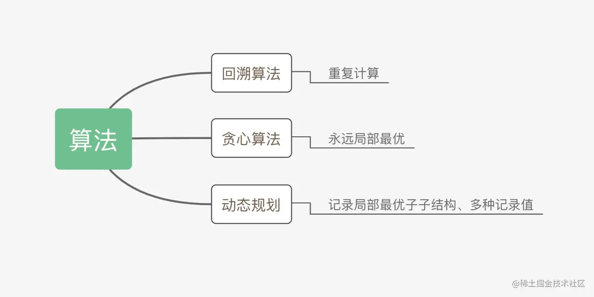

贪心算法：对问题求解的时候，总是做出在当前看来是最好的做法。

适用贪心算法的场景：问题能够分解成子问题来解决，子问题的最优解能递推到最终问题的最优解。这种子问题最优解成为最优子结构

思想: 

贪心算法，故名思义，总是做出当前的最优选择，即期望通过局部的最优选择获得整体的最优选择。

某种意义上说，贪心算法是很贪婪、很目光短浅的，它不从整体考虑，仅仅只关注当前的最大利益，所以说它做出的选择仅仅是某种意义上的局部最优，但是贪心算法在很多问题上还是能够拿到最优解或较优解，所以它的存在还是有意义的。