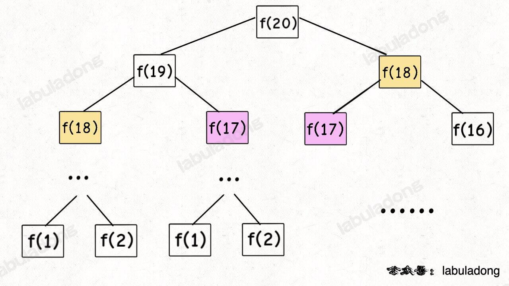

大家都知道斐波那契数列，现在要求输入一个整数n，请你输出斐波那契数列的第n项(从0开始，第0项为0）. 

0, 1, 1, 2, 3, 5, 8, ....

## 思路

但凡遇到需要递归的问题，最好都画出递归树！！！！！！！，这对你分析算法的复杂度，寻找算法低效的原因都有巨大帮助. 


递归的本质是吧一个问题分解成两个或者多个小问题，如果多个小问题存在互相重叠的情况，那么就存在重复计算. 

f(n) = f(n-1) + f(n-2)这种拆分使用递归是典型的存在重叠的情况，所以会造成非常多的重复计算.  例如f(18)会被计算2次; 

另外，每一次函数调用爱内存中都需要分配空间，每个进程的栈的容量是有限的，递归层次过多，就会造成栈溢出. 

递归是从最大数开始，不断拆解成小的数计算，如果不去考虑递归，我们只需要从小数开始算起，从底层不断往上累加就可以了，其实思路也很简单. 

```js
//  方法一 递归方法

function fibonacci(n) {
  // if (n === 0) return 0
  // if (n === 1) return 1
  //  整合成
  if (n < 2) return n
  return fibonacci(n - 1) + fibonacci(n - 2)
}

时间复杂度: O(2^n) - 即递归树中节点的总数. 显然二叉树节点总数为指数级别
空间复杂度: O(n)

//  递归加记忆化!!!!!!!! 带备忘录的递归解法！！！！！
//  使用一个数组缓存计算过的值. 
function fibonacci(n, memory = []) {
  if (n < 2) return n

  if (!memory[n]) {
    //  前后两个fibonacci, 计算斐波那契数列的每一项时只需计算一次，避免了重复计算. 这样可以大大提高计算效率
    memory[n] = fibonacci(n - 1, memory) + fibonacci(n - 2, memory)
  }

  return memory[n]
}
//  tip: 调用 fibonacci(5) 时，函数会先计算 fibonacci(4) 和 fibonacci(3) 的值，然后将它们相加得到5. 在计算过程中，memory 数组会被用来存储已经计算过的值，避免了重复计算. 
时间复杂度是 O(n)
空间复杂度: O(n)


//  动态规划解法!!!!!!!!
function Fibonacci(n){
    if(n<2){
        return n;
    }
    //  当前序号
    let i = 1;
    //  前一个值
    let pre = 0;
    //  当前值
    let current = 1;
    //  结果
    let result = 0;
    //  n>2开始都走这个
    while(i++ < n){
        result = pre + current;
        //  逐步往后推移
        pre = current;
        current = result;
    }
    return result;
}
时间复杂度: O(n)
空间复杂度: O(1)
```