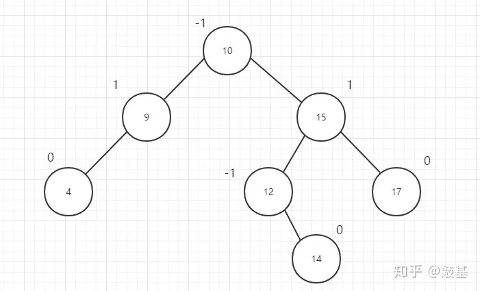

树是用来模拟具有树状结构性质的数据集合。根据它的特性可以分为非常多的种类，对于我们来讲，掌握`二叉树`这种结构就足够了，它也是树`最简单、应用最广泛`的种类。

> 二叉树是一种典型的树树状结构。如它名字所描述的那样，二叉树是每个节点`最多有两个子树`的树结构，通常子树被称作“左子树”和“右子树”。

### 二叉树遍历 - （Binary Tree，BT）
> 重点中的重点，最好同时掌握`递归和非递归`版本，递归版本很容易书写，但是`真正考察基本功的是非递归版本`。

- [二叉树的中序遍历](./二叉树/二叉树的中序遍历.md)
- [二叉树的前序遍历](./二叉树/二叉树的前序遍历.md)
- [二叉树的后序遍历](./二叉树/二叉树的后序遍历.md)

> 根据前序遍历和中序遍历的特点重建二叉树，逆向思维，很有意思的题目
- [重建二叉树](./二叉树/重建二叉树.md)
- [求二叉树的遍历](./二叉树/求二叉树的遍历.md)

### 二叉树的对称性

- [对称的二叉树](./二叉树/对称的二叉树.md)
- [二叉树的镜像](./二叉树/二叉树的镜像.md)

### 二叉树搜索树 - （Binary Search Tree，BST）【又叫二叉排序树 / 二叉查找树】 左小右大。

> 二叉搜索树，它只允许你在左侧储存比父节点小的值，在右侧储存比父节点大的值。这样的定义对于向树的节点中查找/插入/删除节点非常高效。

BST具有以下特性：
- 若任意节点的左子树不为空，则左子树上所有结点的值均小于它的根结点的值：这表示在二叉搜索树中，每个节点的左子树中的所有节点的值都要小于该节点的值。

- 若任意节点的右子树不为空，则右子树上所有结点的值均大于它的根结点的值：这表示在二叉搜索树中，每个节点的右子树中的所有节点的值都要大于该节点的值。

- 任意节点的左、右子树也分别为二叉查找树：这表示在二叉搜索树中，每个节点的左子树和右子树都是一个二叉搜索树，也就是说，每个子树都满足上述两个条件。

这些特性使得二叉搜索树具有一定的`有序性`，可以通过对比节点的值来快速定位目标值。通常，二叉搜索树被广泛应用于`数据的查找、插入和删除操作`，因为它们能够以较高效的方式组织和管理数据。

- [二叉搜索树的第k个节点](./二叉树/二叉搜索树的第k个节点.md)
- [二叉搜索树的后序遍历](./二叉树/二叉搜索树的后序遍历.md)

### 二叉树的深度

> 二叉树的深度为根节点到最远叶子节点的最长路径上的节点数。

> 平衡二叉树：左右子树深度之差大于1 [平衡二叉树定义：任意节点的子树的高度差都小于等于 1]

一个姓 AV 的大佬（G. M. Adelson-Velsky） 和一个姓 L 的大佬（ Evgenii Landis）提出「平衡二叉树」（AVL） 。

判断「平衡二叉树」的 2 个条件：

1. 是「二叉排序树」
2. 任何一个节点的左子树或者右子树都是「平衡二叉树」（左右高度差小于等于 1）

平衡因子 BF
定义：左子树和右子树高度差

计算：左子树高度 - 右子树高度的值

别名：简称 BF（Balance Factor 而不是 Boy Friend）

平衡二叉树要求`平衡因子的绝对值不大于1`，所以该图就是一个标准的平衡二叉树 [不确定的话，可以通过给节点标记BF 的方法来判断]

- [二叉树的最大深度](./二叉树/二叉树的最大深度.md)
- [二叉树的最小深度](./二叉树/二叉树的最小深度.md)
- [平衡二叉树](./二叉树/平衡二叉树.md)

## 其他

- [二叉树中和为某一值的路径](./二叉树/二叉树中和为某一值的路径.md)
- [二叉搜索树与双向链表](./二叉树/剑指-二叉搜索树与双向链表.md)
- [序列化二叉树](./二叉树/序列化二叉树.md)
- [二叉树的下一个节点](./二叉树/二叉树的下一个节点.md)
- [树的子结构](./二叉树/树的子结构.md)

tip: 一个二叉树，如果每一个层的结点数都达到最大值，则这个二叉树就是`满二叉树`。

在满叉树的基础上，我在最底层从右往左删去若干节点，得到的都是`完全二叉树`。

所以说，满二叉树一定是完全二叉树，但是完全二叉树不一定是满二叉树

平衡二叉树：树的左右子树的高度差不超过1的数，空树也是平衡二叉树的一种。