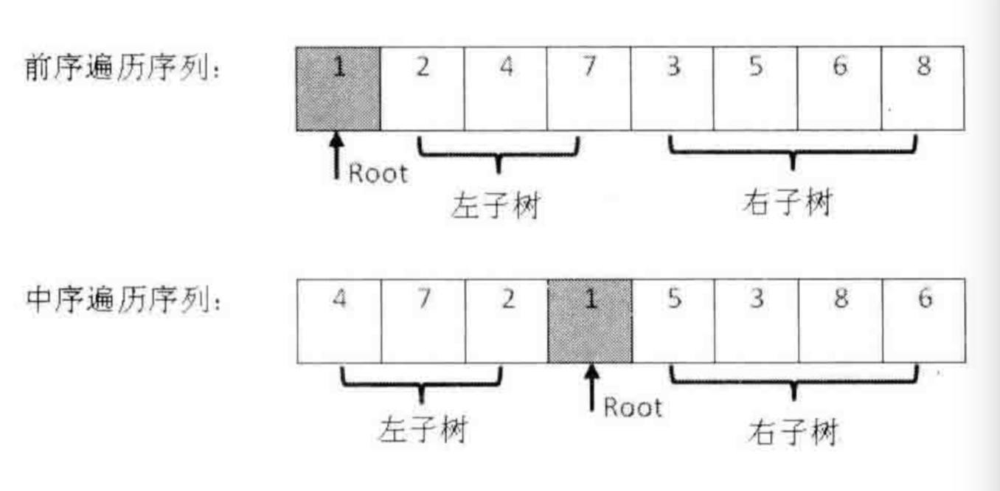

输入某二叉树的前序遍历和中序遍历的结果,请重建出该二叉树. 假设输入的前序遍历和中序遍历的结果中都不含重复的数字. 

例如输入前序遍历序列`{1,2,4,7,3,5,6,8}`和中序遍历序列`{4,7,2,1,5,3,8,6}`,则重建二叉树并返回. 

[题目](https://leetcode.cn/problems/construct-binary-tree-from-preorder-and-inorder-traversal/description/)

## 思路

前序遍历: 根节点 + 左子树前序遍历 + 右子树前序遍历
中序遍历: 左子树中序遍历 + 根节点 + 右字数中序遍历
后序遍历: 左子树后序遍历 + 右子树后序遍历 + 根节点
根据上面的规律: 

前序遍历找到根结点root
找到root在中序遍历的位置 -> 左子树的长度和右子树的长度
截取左子树的中序遍历、右子树的中序遍历
截取左子树的前序遍历、右子树的前序遍历
递归重建二叉树



```js
/**
 * pre 前序排列
 * vin 中序排列
 */
function reConstructBinaryTree(pre, vin) {
  //  注意这个条件！！！！ 数组的判断条件为长度！！！
  if (pre.length === 0) return null

  if (pre.length === 1) return new TreeNode(pre[0])
  //  根节点
  let value = pre[0]
  //  根节点在中序的位置
  let index = vin.indexOf(value)
  let vinLeft = vin.slice(0, index)
  let vinRight = vin.slice(index+1)

  //  结合上图分析
  let preLeft = pre.slice(1, index+1)
  let preRight = pre.slice(index+1)

  let node = new TreeNode(value)
  node.left = reConstructBinaryTree(preLeft, vinLeft)
  node.right = reConstructBinaryTree(preRight, vinRight)

  return node 
}

//  tip: 进行左右子树的拆分！！

```