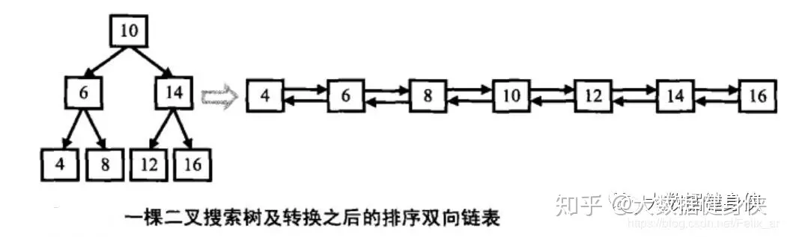

## 题目
- review

输入一棵二叉搜索树，将该二叉搜索树转换成一个排序的`循环双向链表`。要求不能创建任何新的结点，只能调整树中结点指针的指向。

tip: 二叉搜索树[查找、排序] 的 中序遍历 就是 返回从小到大的排序
详见 [here](./leetcode+tx-二叉搜索树的第k个节点.md)

循环双向链表 - 链表中的每个节点都有一个前驱和后继指针。对于双向循环链表，第一个节点的前驱是最后一个节点，最后一个节点的后继是第一个节点。

## 思路

方法一：中序遍历

二叉搜索树的中序遍历是有序序列，因此可以通过中序遍历得到有序序列，过程中构建双向链表。

遍历结束，将头节点和尾节点相连，返回头节点。

时间复杂度 O(n)，空间复杂度 O(n)。其中 n 为二叉搜索树的节点个数。

效果图


```js
/**
 * // Definition for a Node.
 * function Node(val,left,right) {
 *    this.val = val;
 *    this.left = left;
 *    this.right = right;
 * };
 */
/**
 * @param {Node} root
 * @return {Node}
 */
var treeToDoublyList = function (root) {
    if (!root) {
        return null;
    }

    //  链表的头节点
    let head = null;
    // 当前节点的 前一个节点
    let pre = null;
    //  中序遍历
    const dfs = node => {
        if (!node) {
            return;
        }
        //  递归处理左子树
        dfs(node.left);

        //  处理当前节点
        /**
         * 在遍历过程中，将当前节点的左指针指向前一个节点，将前一个节点的右指针指向当前节点。
         */
        if (pre) {
          // 前一个节点的右指针指向当前节点
          pre.right = node;
        } else {
          // 如果前一个节点为空，则当前节点为头节点
          head = node;
        }
        // 当前节点的左指针指向前一个节点
        node.left = pre;
        // 更新前一个节点为当前节点
        pre = node;

        //  递归处理右子树
        dfs(node.right);
    };

    dfs(root);
    // 将头节点和尾节点相连，构成循环双向链表
    head.left = pre;  // 头节点的左指针指向尾节点
    pre.right = head; // 尾节点的右指针指向头节点

    //  返回头节点
    return head;
};

```