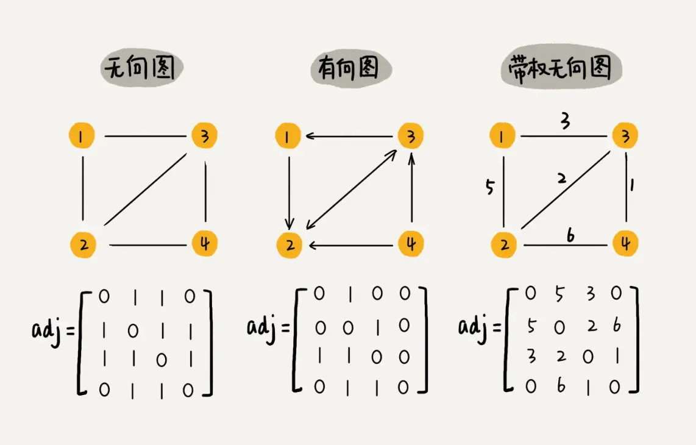
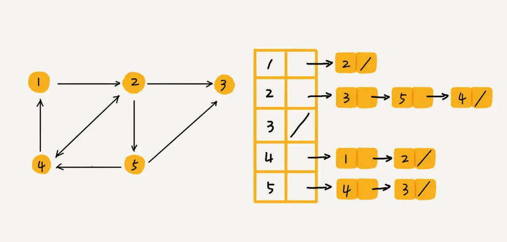
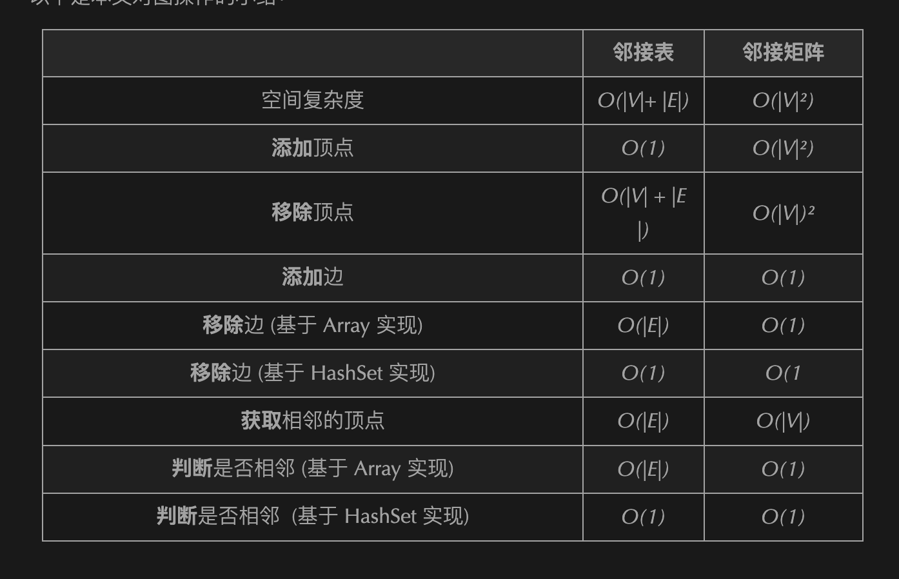

图是网状结构的抽象模型，由边和顶点组成。

图分为有向图和无向图

图的一种存储方式是 “邻接矩阵”。邻接矩阵就是一个二维数组，`A[i][j] === A[j][i]。`



1-邻接矩阵记录了所有顶点之间的关系，但其实很多顶点之间是没有关系的，所有这就造成了存储空间的浪费。但是邻接矩阵在获取两个顶点之间的关系时很高效。

图的另一种存储方式是 2-“邻接表”。邻接表中每个顶点对应一条链表，指向该顶点所指向的顶点。这样表中就没有了没有关系的顶点，节省了储存空间。但是相对的，查询相邻的顶点也就比较耗时。

邻接表 - 可以使用一个数组或者 HashMap 来建立一个邻接表，它存储这所有的顶点。每个顶点都有一个列表（可以是数组、链表、集合等数据结构），存放着与其相邻的顶点。

//  最简单的实现方式之一是使用 HashMap
```js
const graph = {
  a：[ 'a'，'b' ]，
  b：[ 'c' ]，
  c：[ 'd' ]，
  d：[ 'b'，'c' ]
};
```



其他知识：

一个顶点的 度（degree）是指与该顶点相连的边的条数

如果所有的边都是双向（译者注：或者理解为没有方向）的，那我们就有了一个无向图；反之如果边是有向的，我们得到的就是有向图（directed graph）

顶点的边可以是从自己出发再连接回自己，拥有这样的边的图被称为自环。

图可以有环（cycle），即如果遍历图的顶点，某个顶点可以被访问超过一次。而没有环的图被称为无环图（acyclic graph）。

无环无向图也被称为树（tree）

如果一个图中，从任一节点出发，沿着各条边可以访问图中任意节点，这样的图被称为连通图（connected graph）。

而当一个图中两两不同的顶点之间都恰有一条边相连，这样的图就是完全图（complete graph）。

当图的每条边都被分配了权重时，我们就有了一个加权图（weighted graph）




- [leetcode997-找到小镇的法官](./图/leetcode997-找到小镇的法官.md)
- [leetcode207-课程表问题](./图/leetcode207-课程表问题.md)
- [剑指Offer+Bigo-旋转矩阵](./图/剑指Offer+Bigo-旋转矩阵.md)
- [腾讯+leetcode-螺旋矩阵II](./图/腾讯+leetcode-螺旋矩阵II.md)
- [字节+剑指-顺时针打印矩阵](./数组/字节+剑指-顺时针打印矩阵)
