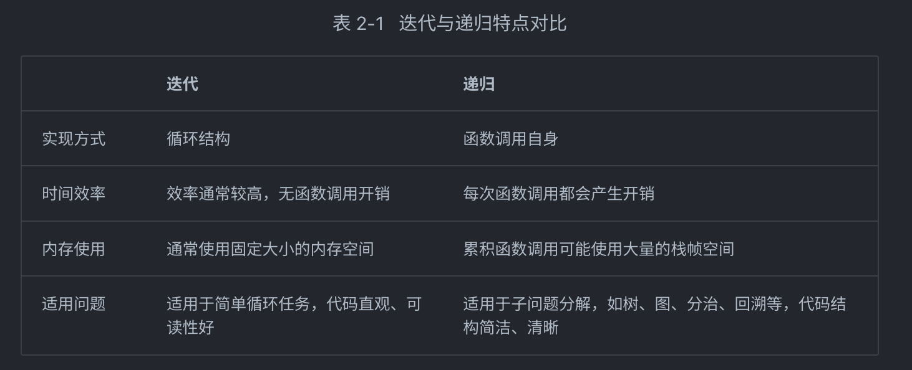

## 效率评估
在能够解决问题的前提下,算法效率已成为衡量算法优劣的主要评价指标,它包括以下两个维度. 

- 时间效率: 算法运行速度的快慢. 
- 空间效率: 算法占用内存空间的大小. 

简而言之,我们的目标是设计"既快又省"的数据结构与算法. 


## 迭代 & 递归

### 迭代
「迭代 iteration」是一种重复执行某个任务的控制结构. 在迭代中,程序会在满足一定的条件下重复执行某段代码,直到这个条件不再满足. 

- for 循环是最常见的迭代形式之一,适合在预先知道迭代次数时使用. 
- 在 while 循环中,程序每轮都会先检查条件,如果条件为真,则继续执行,否则就结束循环. 

while 循环比 for 循环的自由度更高. 在 while 循环中,我们可以自由地设计条件变量的初始化和更新步骤. 

总的来说,`for 循环的代码更加紧凑,while 循环更加灵活`


### 递归

「递归 recursion」是一种算法策略,通过函数调用自身来解决问题. 它主要包含两个阶段. 

递: 程序不断深入地调用自身,通常传入更小或更简化的参数,直到达到"终止条件". <br>
归: 触发"终止条件"后,程序从最深层的递归函数开始逐层返回,汇聚每一层的结果. 

而从实现的角度看,递归代码主要包含三个要素. 

- 终止条件: 用于决定什么时候由"递"转"归". 
- 递归调用: 对应"递",函数调用自身,通常输入更小或更简化的参数. 
- 返回结果: 对应"归",将当前递归层级的结果返回至上一层. 

```js
//  观察以下代码,我们只需调用函数 recur(n) ,就可以完成的计算
function recur(n) {
  if (n === 1) return 1
  let result = recur(n-1)
  return n + result
}
```

- 递归通常比迭代更加耗费内存空间. 
- 递归调用函数会产生额外的开销. 因此递归通常比循环的时间效率更低. 

新概念: 尾递归
```js
function tailRecur(n, res) {
  if (n === 0) return res
  return tailRecur(n - 1, res + n)
}
```


例子: 斐波那契数列(0,1,1,2,3,5,8....)每一项是前面两项的和; 求该数列的第n个数
```js
function fibonacci(n) {
  // if (n === 1) return 0
  // if (n === 2) return 1
  if (n <= 0) return undefined
  if (n <= 2) return n - 1
  return fibonacci(n - 1) + fibonacci(n - 2)
}
```

## 时间复杂度
时间复杂度- 算法运行时间随着数据量变大时的增长趋势

算法 A 只有 \(1\) 个打印操作,算法运行时间不随着 \(n\) 增大而增长. 我们称此算法的时间复杂度为"常数阶". <br>
算法 B 中的打印操作需要循环 \(n\) 次,算法运行时间随着 \(n\) 增大呈线性增长. 此算法的时间复杂度被称为"线性阶". <br>
算法 C 中的打印操作需要循环 \(1000000\) 次,虽然运行时间很长,但它与输入数据大小 \(n\) 无关. 因此 C 的时间复杂度和 A 相同,仍为"常数阶". 

1- 忽略 \(T(n)\) 中的常数项. 因为它们都与 \(n\) 无关,所以对时间复杂度不产生影响. <br>
2- 省略所有系数. 例如,循环 \(2n\) 次, \(5n + 1\) 次等,都可以简化记为 \(n\) 次,因为 \(n\) 前面的系数对时间复杂度没有影响. <br>
3- 循环嵌套时使用乘法. 总操作数量等于外层循环和内层循环操作数量之积,每一层循环依然可以分别套用第 1. 点和第 2. 点的技巧. 

时间复杂度由多项式 \(T(n)\) 中最高阶的项来决定. 这是因为在 \(n\) 趋于无穷大时,最高阶的项将发挥主导作用,其他项的影响都可以被忽略. 

### 常见类型
复杂度由低到高排序
1.   常数阶 \(O(1)\)
常数阶的操作数量与输入数据大小 \(n\) 无关,即不随着 \(n\) 的变化而变化. 

在以下函数中,尽管操作数量 size 可能很大,但由于其与输入数据大小 \(n\) 无关,因此时间复杂度仍为 \(O(1)\)

2.   对数阶 \(O(log n)\) 【以2为底数】
与指数阶相反,对数阶反映了"每轮缩减到一半"的情况. "每轮缩减到一半"的过程,时间复杂度为 \(O(log_2 n)\) 

```js
/* 对数阶(循环实现) */
function logarithmic(n) {
    let count = 0;
    while (n > 1) {
        n = n / 2;
        count++;
    }
    return count;
}

```

3.   线性阶 \(O(n)\)
线性阶的操作数量相对于输入数据大小 \(n\) 以线性级别增长. 


4.   线性对数阶 \(O(n * log n)\)
线性对数阶常出现于嵌套循环中,两层循环的时间复杂度分别为 \(O(\log n)\) 和 \(O(n)\) 


5.   平方阶 \(O(n^2)\)
平方阶的操作数量相对于输入数据大小 \(n\) 以平方级别增长. 平方阶通常出现在嵌套循环中

6.  指数阶 \(O(2^n)\)
生物学的"细胞分裂"是指数阶增长的典型例子: 初始状态为 \(1\) 个细胞,分裂一轮后变为 \(2\) 个,分裂两轮后变为 \(4\) 个,以此类推,分裂 \(n\) 轮后有 \(2^n\) 个细胞. 

7.   阶乘阶 \(O(n!)\)
阶乘阶对应数学上的"全排列"问题. 给定 \(n\) 个互不重复的元素,求其所有可能的排列方案

"最差时间复杂度"对应函数渐近上界,使用大记号$O$表示. 
相比之下,平均时间复杂度可以体现算法在随机输入数据下的运行效率,用 $\Theta$ 记号来表示. 

O(1) < O(log n) < O(n) < O(n log n) < O(n^2) < O(2^n) < O(n!)

## 空间复杂度

用于衡量算法占用内存空间随着数据量变大时的增长趋势. 

输入空间: 用于存储算法的输入数据. <br>
*暂存空间: 用于存储算法在运行过程中的变量, 对象, 函数上下文等数据. <br>
*输出空间: 用于存储算法的输出数据. 

空间复杂度的统计范围是"暂存空间"加上"输出空间". 

而与时间复杂度不同的是,我们通常只关注最差空间复杂度. 

最差空间复杂度中的"最差"有两层含义. 

以最差输入数据为准: 当 (n < 10) 时,空间复杂度为 (O(1)) ; 但当 (n > 10) 时,初始化的数组 nums 占用 (O(n)) 空间; 因此最差空间复杂度为 (O(n)) . <br>
以算法运行中的峰值内存为准: 例如,程序在执行最后一行之前,占用 (O(1)) 空间; 当初始化数组 nums 时,程序占用 (O(n)) 空间; 因此最差空间复杂度为 (O(n)) . 

O(1) < O(log n) < O(n) < O(n^2) < O(2^n)

常数阶: 在循环中初始化变量或调用函数而占用的内存,在进入下一循环后就会被释放,因此不会累积占用空间,空间复杂度仍为 (O(1)) 

线性阶 (O(n)): 线性阶常见于元素数量与 \(n\) 成正比的数组, 链表, 栈, 队列; 递归函数产生的线性阶空间复杂度

平方阶 \(O(n^2)\): 平方阶常见于矩阵和图,元素数量与 \(n\) 成平方关系

指数阶 \(O(2^n)\): 指数阶常见于二叉树. 

对数阶 \(O(log n)\): 对数阶常见于分治算法. 例如归并排序,输入长度为 \(n\) 的数组,每轮递归将数组从中点划分为两半,形成高度为 \(log n\) 的递归树,使用 \(O(log n)\) 栈帧空间

降低时间复杂度通常需要以提升空间复杂度为代价,反之亦然. 
在大多数情况下,时间比空间更宝贵,因此"以空间换时间"通常是更常用的策略. 

reference: [hellp-algo](https://www.hello-algo.com/chapter_computational_complexity/performance_evaluation/)