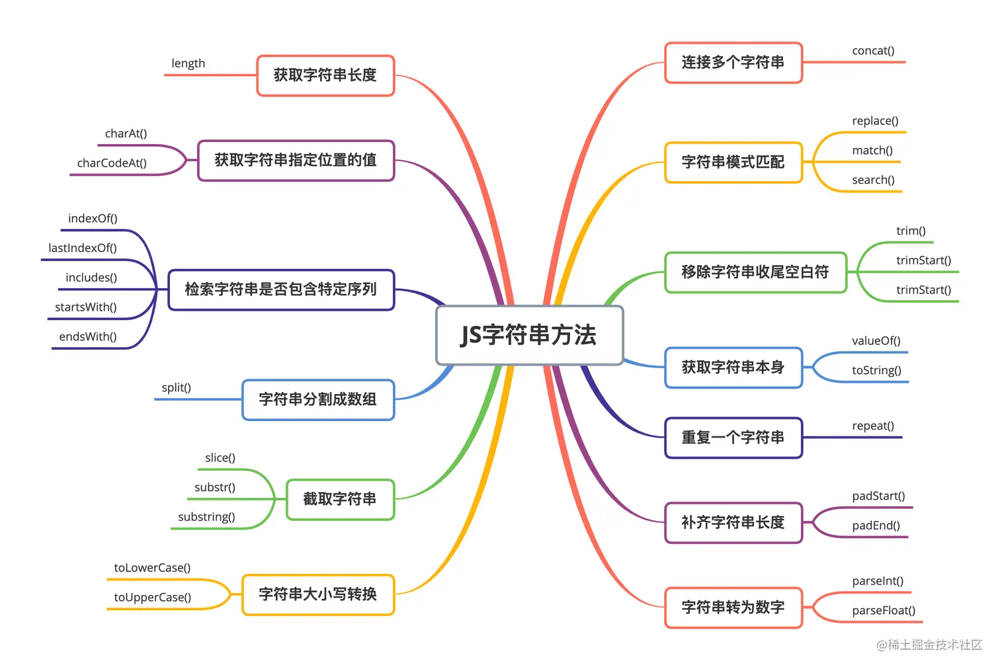

## others

注意⚠️: substr 方法弃用

常用api - https://juejin.cn/post/7240697872160440380

- [百度：判断回文字符串](./字符串/百度：判断回文字符串.md)
- [表示数值的字符串](./字符串/表示数值的字符串.md)
- [翻转单词顺序](./字符串/翻转单词顺序.md)
- [替换空格](./字符串/替换空格.md)
- [字符串排列](./字符串/字符串排列.md)
- [leetcode3+字节-无重复字符的最长子串](./字符串/leetcode3+字节-无重复字符的最长子串.md)
- [leetcode8+腾讯+剑指-字符串转换整数(atoi)](./字符串/leetcode8+腾讯+剑指-字符串转换整数(atoi).md)
- [leetcode14+pdd-最长公共前缀LCP](./字符串/leetcode14+pdd-最长公共前缀LCP.md)
- [leetcode43+腾讯-字符串相乘](./字符串/leetcode43+腾讯-字符串相乘.md)
- [leetcode151+字节-翻转字符串里的单词](./字符串/leetcode151+字节-翻转字符串里的单词.md)
- [leetcode415+Facebook+字节-字符串相加](./字符串/leetcode415+Facebook+字节-字符串相加.md)
- [字符流中第一个不重复的字符](./字符串/字符流中第一个不重复的字符.md)
