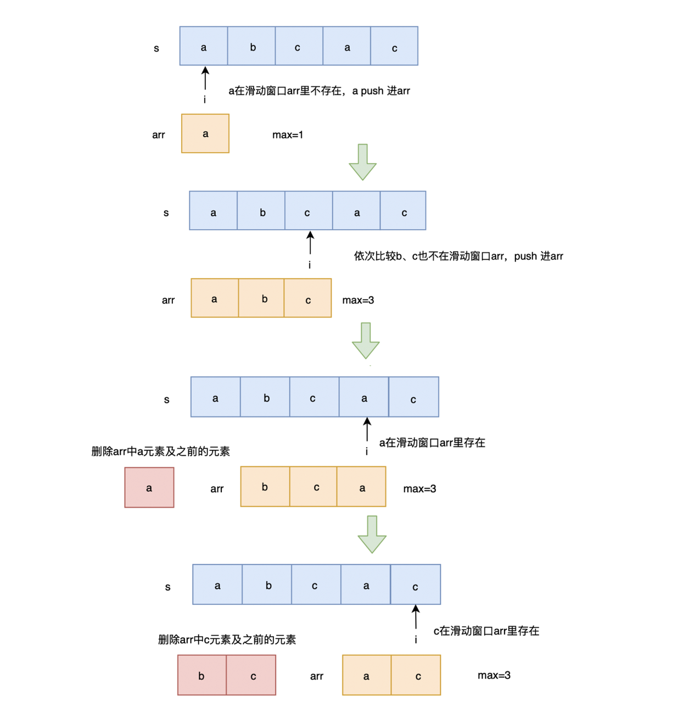

[leetcode3](https://leetcode.cn/problems/longest-substring-without-repeating-characters/description/)

给定一个字符串,请你找出其中不含有重复字符的 最长子串 的长度. 

示例 1:
```
输入: "abcabcbb"
输出: 3 
解释: 因为无重复字符的最长子串是 "abc",所以其长度为 3. 

示例 2:

输入: "bbbbb"
输出: 1
解释: 因为无重复字符的最长子串是 "b",所以其长度为 1. 

示例 3:

输入: "pwwkew"
输出: 3
解释: 因为无重复字符的最长子串是 "wke",所以其长度为 3. 
     请注意,你的答案必须是 子串 的长度,"pwke" 是一个子序列,不是子串. 
```
## 思路
1. 思路: 用滑动窗口记录当前无重复的字串,如果有重复的字符,则截取自该字符开始至末尾的字串为新的字串



## 题解
```js
//  使用数组来维护 滑动窗口 - 队列label
var lengthOfLongestSubstring = function(s) {
  if (typeof s !== 'string') return -1
  if (s.length === 1) return 1

  let win = [], max = 0

  for (let i=0; i<s.length; i++) {
    let index = win.indexOf(s[i])
    if (index !== -1) {
      //  win 是数组
      win.splice(0, index+1)
    }

    win.push(s[i])
    max = Math.max(max, win.length)
  }

  return max
}
O(n2)
O(n)

//  使用 map 来存储当前已经遍历过的字符,key 为字符,value 为下标
var lengthOfLongestSubstring = function(s) {
  if (typeof s !== 'string') return -1
  if (s.length === 1) return 1
  //  使用 map 来存储当前已经遍历过的字符
  let map = new Map(), max = 0
  //  使用 i 来标记无重复子串开始下标,j 为当前遍历字符下标
  for (let i=0, j=0; j<s.length; j++) {
    //  存在则更新无重复子串开始下标 i 为相同字符的下一位置
    if (map.has(s[j])) {
      //  看abba 这个例子;  a 会匹配第一个a,但是此时i 大于该值,所以需要取最大值
      i = Math.max(map.get(s[j]) + 1, i)
    }

    map.set(s[j], j)  //  会覆盖之前的值
    max = Math.max(max, j - i + 1)
  }

  return max
}
O(n)
O(n)
```