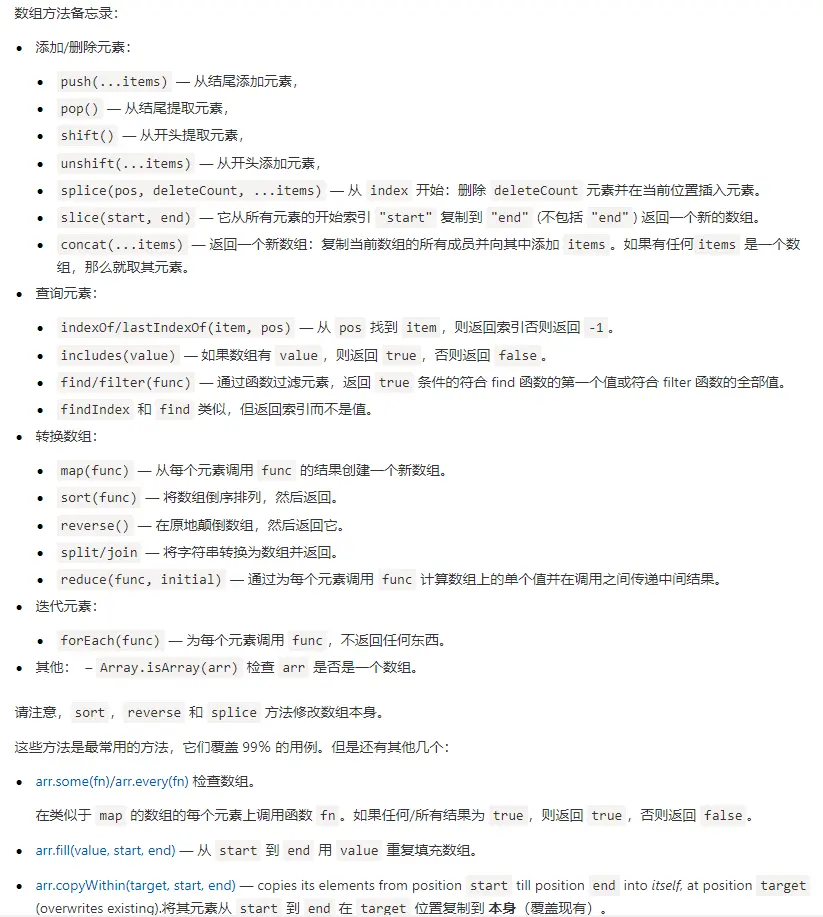

> 数组是一种线性表数据结构。它用一组连续的内存空间，来存储一组具有相同类型的数据。——数据结构与算法之美

js 原本没有真正的数组，因为 js 的数组可以存放不同类型的数据，不同数据类型存储所需要的空间大小不同，这就导致用来存放数组的内存地址不可能是连续的。所以 js 的数组是按照类似哈希映射的方法存储的，这种方式的数组读写操作相对低效。

v8 引擎对数组做了优化，如果一个数组中所有的类型都是一样的，那么就在内存中开辟一个连续的空间来储存数组。但是如果数组中又添加了一个不同的类型，那么 v8 引擎就会按之前的老办法将数组重建，这时反而会更低效。

ES6 的新增了 ArrayBuffer ，它可以创建内存空间连续的数组。显而易见，对通过 ArrayBuffer 创建的数组进行遍历操作，速度更快。

### 双指针

> 上面链表中提到的一类题目，主要是利用两个或多个不同位置的指针，通过速度和方向的变换解决问题。注意这种技巧经常在排序数组中使用。

- [调整数组顺序使奇数位于偶数前面](./数组/调整数组顺序使奇数位于偶数前面.md)
- [和为S的两个数字](./数组/和为S的两个数字.md)
- [和为S的连续正整数序列](./数组/和为S的连续正整数序列.md)

### N数之和问题

> 非常常见的问题，基本上都是一个套路，主要考虑如何比暴利法降低时间复杂度，而且也会用到上面的双指针技巧

- [两数之和](./数组/两数之和)
- [三数之和](./数组/三数之和)
- [四数之和](./数组/四数之和)
- [N数之和](./数组/N数之和)

### 二维数组

> 建立一定的抽象建模能力，将实际中的很多问题进行抽象

- [构建乘积数组](./数组/构建乘积数组)
- [顺时针打印矩阵](./数组/顺时针打印矩阵)

### 数据统计

> 数组少不了的就是统计和计算，此类问题考察如何用更高效的方法对数组进行统计计算。

- [数组中出现次数超过数组长度一半的数字](./数组/数组中出现次数超过数组长度一半的数字.md)
- [连续子数组的最大和](./数组/连续子数组的最大和.md)
- [扑克牌顺子](opens new window)
- [第一个只出现一次的字符]