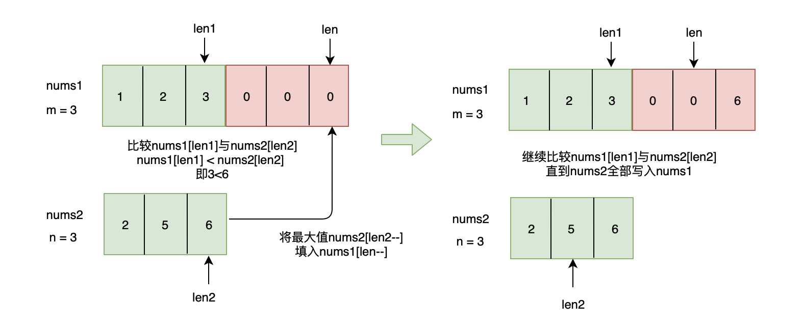

## 题目

给你两个有序整数数组 nums1 和 nums2,请你将 nums2 合并到 nums1 中,使 num1 成为一个有序数组. 

说明:

初始化 nums1 和 nums2 的元素数量分别为 m 和 n . 
你可以假设 nums1 有足够的空间(空间大小大于或等于 m + n )来保存 nums2 中的元素. 

示例:
```
输入:
nums1 = [1,2,3,0,0,0], m = 3
nums2 = [2,5,6],       n = 3

输出: [1,2,2,3,5,6]
```


## 思路

充分利用题目所提供的; 比如充分利用m, n; 有些方法不需要m, n

1. 


```js
const merge = function (nums1, m, nums2, n) {
  let len1 = m - 1,
      len2 = n - 1,
      len = m + n - 1
  while (len2 >= 0) {
    if (len1 < 0) {
      nums1[len--] = nums2[len2--] 
    }

    nums1[len--] = nums1[len1] > nums2[len2] ? nums1[len1--] : nums2[len2--]
  }

  return nums1
}
```

2 巧用数组splice

```js
const merge = function (nums1, m, nums2, n) {
  nums1.splice(m, n, ...nums2)

  nums1.sort((a, b) => a - b)

  return nums1
}
```

```
splice(start, deleteCount, item1, item2, itemN)

start 从 0 开始计算的索引,表示要开始改变数组的位置
deleteCount 表示数组中要从 start 开始删除的元素数量
item1, …, itemN - 从 start 开始要加入到数组中的元素. 
```