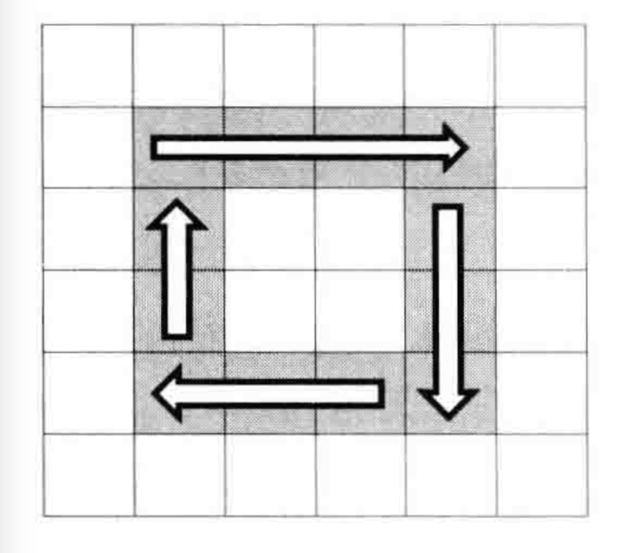
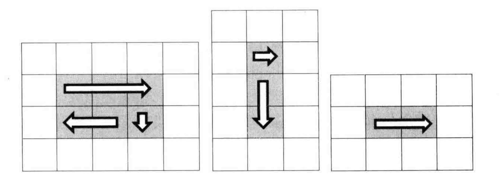

## 题目
[题目](https://leetcode.cn/problems/shun-shi-zhen-da-yin-ju-zhen-lcof/description/)

输入一个矩阵,按照从外向里以顺时针的顺序依次打印出每一个数字. 

例如,如果输入如下4 X 4矩阵: 
```
1  2  3  4 
5  6  7  8
9  10 11 12 
13 14 15 16 
```
则依次打印出数字`1,2,3,4,8,12,16,15,14,13,9,5,6,7,11,10`

## 思路



借助图形思考,将复杂的矩阵拆解成若干个圈,循环打印矩阵,每次打印其中一个圈

设起点坐标为(start,start),矩阵的行数为rows,矩阵的列数为columns

进入循环条件为 rows > start*2 并且 columns > start*2

将打印一圈拆解为四部,

- 第一步: 从左到右打印一行
- 第二步: 从上到下打印一列
- 第三步: 从右到左打印一行
- 第四步: 从下到上打印一列

最后一圈很有可能出现几种异常情况,打印矩阵最里面一圈可能只需三步、两步、甚至一步



所以在每一行打印时要做好条件判断:

能走到最后一圈,从左到右必定会打印

结束行号大于开始行号,需要从上到下打印

结束列号大于开始列号,需要从右到左打印

结束行号大于开始行号+1,需要从下到上打印

```js
// 顺时针打印
function printMatrix(matrix) {
  var start = 0;
  var rows = matrix.length;
  var coloums = matrix[0].length;
  var result = [];
  if (!rows || !coloums) {
    return false;
  }
  while (coloums > start * 2 && rows > start * 2) {
    printCircle(matrix, start, coloums, rows, result);
    start++;
  }
  return result;
}

// 打印一圈
function printCircle(matrix, start, coloums, rows, result) {
  //  表示当前圈的打印的最大的列坐标,即当前圈从左到右的最后一列
  var endX = coloums - start - 1;
  //  表示当前圈的打印的最大的行坐标,即当前圈从上到下的最后一行
  var endY = rows - start - 1;
  //  肯定有从左到右的打印
  for (var i = start; i <= endX; i++) {
    result.push(matrix[start][i]);
  }
  //  最大行坐标 大于 start, 意味着有从上到下的打印
  if (endY > start) {
    for (var i = start + 1; i <= endY; i++) {
      result.push(matrix[i][endX]);
    }
    //  最大列坐标 大于 start, 意味着有从右到左的打印
    if (endX > start) {
      for (var i = endX - 1; i >= start; i--) {
        result.push(matrix[endY][i]);
      }
      //  最大行坐标 大于 start + 1, 意味着有从下到上的打印
      if (endY > start + 1) {
        for (var i = endY - 1; i > start; i--) {
          result.push(matrix[i][start]);
        }
      }
    }
  }
}

```

## 思路2

借助 [腾讯+leetcode-螺旋矩阵II](./图/腾讯+leetcode-螺旋矩阵II.md) 的思想: 

用四个变量up, down, left, right分别记录当前上下左右范围,每遍历一行或一列就修改相应的值. 
例如遍历了上面第一行,就应该把up加一,遍历了右边第一列就应把right减一

```js
//  假设是m*n 的矩阵
function spiralArray(matrix) {
  let m = matrix.length
    if (m === 0) {
    return []
  }
  let n = matrix[0].length

  let result = []

  let left = 0, right = n-1, top = 0, bottom = m-1

  while(true) {
    for (let i=left; i<=right; i++) {
      result.push(matrix[top][i])
    }
    top++
    if (top>bottom) break

    for (let i=top; i<=bottom; i++) {
      result.push(matrix[i][right])
    }
    right--
    if (right < left) break

    for (let i=right; i>=left; i--) {
      result.push(matrix[bottom][i])
    }
    bottom--
    if (bottom < top) break

    for (let i=bottom; i>=top; i--) {
      result.push(matrix[i][left])
    }
    left++
    if (left > right) break
  }

  return result
}
```