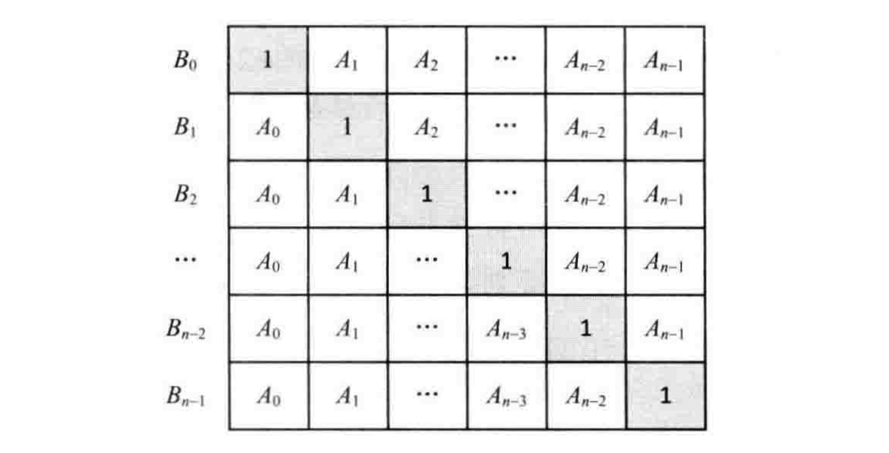

## 题目

给定一个数组`A[0,1,...,n-1]`,请构建一个数组`B[0,1,...,n-1]`,其中`B`中的元素`B[i]=A[0]*A[1]*...*A[i-1]*A[i+1]*...*A[n-1]`. 不能使用除法. 

## 思路

`B[i]`的值是A数组所有元素的乘积再除以`A[i]`，但是题目中给定不能用除法，我们换一个思路，将`B[i]`的每个值列出来，如下图: 

`B[i]`的值可以看作下图的矩阵中每行的乘积. 

可以将B数组分为上下两个三角，先计算下三角，然后把上三角乘进去. 

tip: 分解为一个数学问题; 表示为矩阵更容易理解

```js
function multiply(arr) {
  const result = []
  const len = arr.length
  if (Array.isArray(arr) && len > 0) {
    //  先计算下三角形， 包含斜对角的1
    result[0] = 1
    for (let i = 1; i < len; i++) {
      result[i] = result[i - 1] * arr[i - 1]
    }

    let tmp =  1
    //  在计算上三角形，不包含斜对角的1
    for (let i = len - 2; i >= 0; i--) {
      tmp = tmp * arr[i + 1]
      result[i] = tmp * result[i]
    }
  }

  return result
}

//  fourSum([1, 0, -1, 0, -2, 2])

```