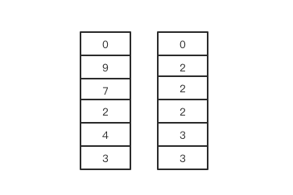

## 题目

定义栈的数据结构，请在该类型中实现一个能够得到栈中所含最小元素的min函数(时间复杂度应为O(1））. 

[最小栈](https://leetcode.cn/problems/min-stack/description/)

## 思路

1. 定义两个栈，一个栈用于存储数据，另一个栈用于存储每次数据进栈时栈的最小值.
2. 每次数据进栈时，将此数据和最小值栈的栈顶元素比较，将二者比较的较小值再次存入最小值栈.
4. 数据栈出栈，最小值栈也出栈. 
3. 这样最小值栈的栈顶永远是当前栈的最小值. 

例子


```js
let dataStack = []
let minStack = []

function push(ele) {
  dataStack.push(ele)
  //  注意条件，如果最小值栈没有值 或者 压入的值小于min()
  if (minStack.length === 0 || ele < min()) {
    minStack.push(ele)
  } else {
    minStack.push(min())
  }
}

function pop() {
  minStack.pop()
  return dataStack.pop()
}

function min() {
  let len = minStack.length

  return len > 0 && minStack[len - 1]
}
```