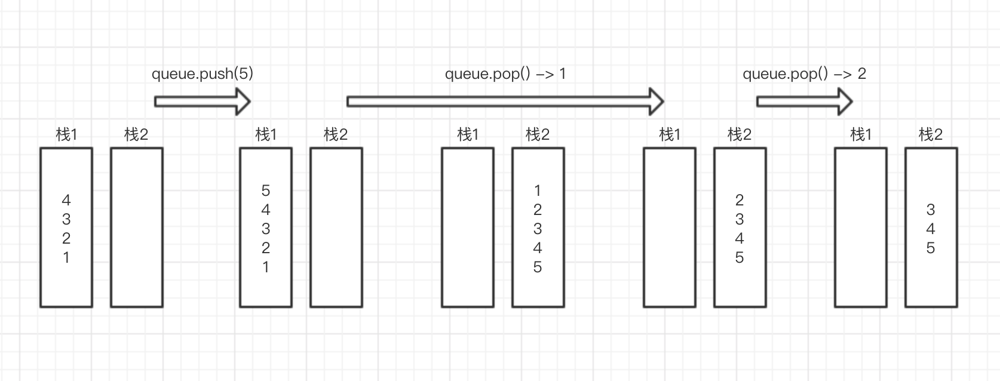

## 题目

用两个栈来实现一个队列,完成队列的Push和Pop操作.  队列中的元素为int类型. 

## 思路

栈1: 用于入队列存储

栈2: 出队列时将栈1的数据依次出栈,并入栈到栈2中 <br>
栈2出栈即栈1的底部数据即队列要出的数据. 



```js
class queueWithStack() {
  constructor() {
    this.stack1 = []  //  假装是栈,先进后出
    this.stack2 = []
  }

  push(ele) {
    this.stack1.push(ele)
  }

  pop() {
    //  此时stack2 为空, 压入stack1的值
    if (this.stack2.length === 0) {
      while(this.stack1.length > 0) {
        this.stack2.push(this.stack1.pop())
      }
    }

    //  此时stack2 有之前的值,先pop 完
    if (this.stack2.length > 0) {
      return this.stack2.pop()  //  返回站顶元素
    } else {
      return null //  队列为空返回; 
    }
  }
}
```

## 扩展 - 用两个队列实现一个栈
```js
class stackWithQueue() {
  constructor() {
    this.stack1 = []  //  假装是队列, 先进先出
    this.stack2 = []
  }

  push(ele) {
    this.stack1.push(ele)
  }

  pop() {
    if (this.queue1.length === 0) { // 如果 queue1 为空,则返回 null
      return null;
    }

    while (this.queue1.length > 1) { // 将 queue1 中的元素依次弹出并压入 queue2,直到 queue1 中只剩下一个元素
      this.queue2.push(this.queue1.shift());
    }
    
    const result = this.queue1.shift(); // 弹出 queue1 中的最后一个元素,即为栈顶元素
    [this.queue1, this.queue2] = [this.queue2, this.queue1]; // 交换 queue1 和 queue2,使下一次入栈操作仍然加入 queue1
    return result;
  }
}
```
