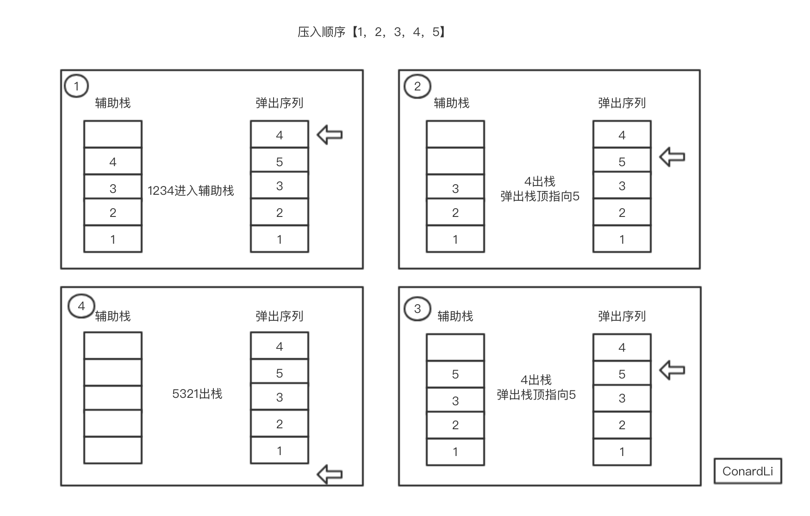

## 题目

输入两个整数序列，第一个序列表示栈的压入顺序，请判断第二个序列是否可能为该栈的弹出顺序。假设压入栈的所有数字均不相等。例如序列`1,2,3,4,5`是某栈的压入顺序，序列`4,5,3,2,1`是该压栈序列对应的一个弹出序列，但`4,3,5,1,2`就不可能是该压栈序列的弹出序列。（注意：这两个序列的长度是相等的）

## 思路



```js

function isPopOrder(pushV, popV) {
  if (!pushV || !popV || pushV.length === 0 || popV.length === 0) {
    return 
  }

  let stack = []  //  辅助栈
  let index = 0

  for (let i=0; i < pushV.length; i++) {
    stack.push(pushV[i])

    if (stack.length > 0 && stack[stack.length - 1] === popV[index]) {
      stack.pop()
      index++
    }
  }

  return stack.length === 0


}
```


tip:

if - 
string - 非空

object null undefined

number 非0/NAN

array length === 0