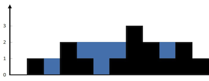
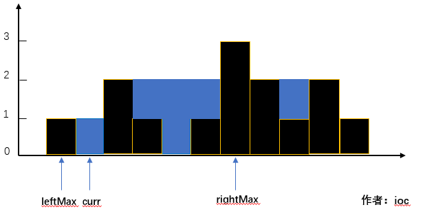
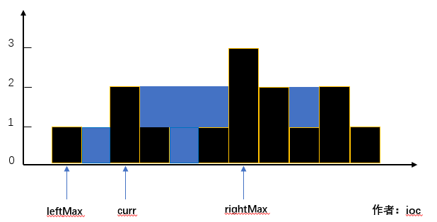

https://leetcode.cn/problems/trapping-rain-water/description/

给定 n 个非负整数表示每个宽度为 1 的柱子的高度图，计算按此排列的柱子，下雨之后能接多少雨水。



### 题目分析：

通过题意，一个“凹槽”可以存储的雨水的容量取决于它前后的柱子。

### 解法一：

仔细想想，其实这跟木桶原理是有相似的地方的，针对每一个柱子，我们需要往前看和往后看，分别找出当前柱子前面最高的柱子和后面最高的柱子。

这里有**三种情况**我们需要了解：

- **当前柱子小于前后两个柱子中最矮的那个**
  
  **当前位置可以存储的雨水容量 = leftMax - curr = 1**


- **当前柱子等于前后两个柱子中最矮的那个**
  

  **当前位置可以存储的雨水容量为0**

- **当前柱子大于前后两个柱子中最矮的那个**


**因为curr < leftMax，所以当前位置无法存储雨水**

```js
/**
 * @param {number[]} height
 * @return {number}
 */
var trap = function(height) {
  let sum = 0

  //最两端的列不用考虑，因为一定不会有水。所以下标从 1 到 length - 2 
  for (let i=1; i<height.length - 1; i++) {
    let max_left = 0

    //  找出左边最高
    for (let j=i-1; j>=0; j--) {
      if (height[j] > max_left) max_left = height[j]
    }

    let max_right = 0
    //  找出右边最高
    for (let j=i+1; j<height.length; j++) {
      if (height[j] > max_right) max_right = height[j]
    }

    //找出两端较小的  
    let min = Math.min(max_left, max_right)

    //  如果两端较小值大于当前高度，那么可以蓄水
    if (min > height[i]) {
      sum += min - height[i]
    }
  }

  return sum

};

O(n^2)
O(1)
```

既然使用的是**双指针**的思路，那么我们需要分别从数组的最前面和最后面开始，这两个指针是互不影响，都是各走各的，但是如何确定当前指针走过的地方能存放多少雨水量呢？

这个时候，我们就需要两块挡板**leftMax**和**rightMax**，这两块挡板最开始都是挡在最外面的墙边，随着两个指针前进，**leftMax**代表的是**left**走过的路中最高的墙，**rightMax**同理。

**那么如何计算雨水量呢？**

比较左右两个挡板的高度，然后根据两个挡板各自的指针配合计算。

- 如果左边挡板的高度小于右边的挡板高度，那么左边指针之前的雨水量取决于**leftMax**和height[left]的大小关系，如果前者大于后者，那么容量等与前者减去后者；反之，容量为0（可以参考解法一中的图来理解）

- 如果左边挡板的高度大于等于右边挡板的高度，与上一种情况基本相同，只不过是求的右边的雨水量。

- 在每次移动指针之后，我们要将挡板更新到最大值。

**其实道理也是比较简单，用宏观的思维去看待整个问题，最起码先保证两边的墙的高度（两块挡板），然后依次去到其中各个墙之间能装多少雨水的问题上。（求每次更新最高的挡板和指针指向的墙之间可以存储的雨水量）**

```js TBD
var trap = function(height) {
  if (height.length === 0) return 0

  let left = 0
  let right = height.length - 1
  let leftMax = 0
  let rightMax = 0
  let result = 0

  while(left <= right) {
    if (leftMax < rightMax) {
      result += leftMax - height[left] > 0 ? 
        leftMax - height[left] : 0
      leftMax = Math.max(leftMax, height[left])
      left++
    } else {
      result += rightMax - height[right] > 0 ? 
        rightMax - height[right] : 0
      rightMax = Math.max(rightMax, height[right])
      right--
    }
  }

  return result 
}
O(n)
O(1)
```