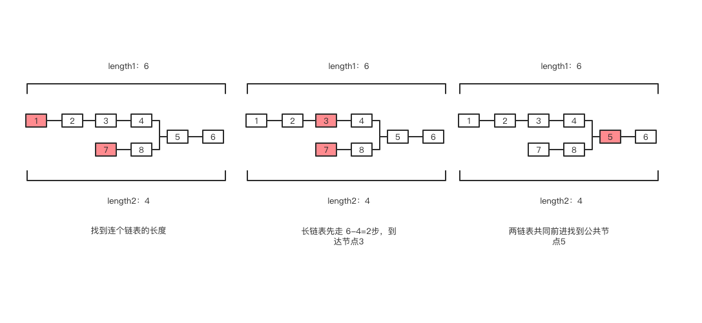

## 题目

输入两个链表,找出它们的第一个公共结点. 

1.先找到两个链表的长度length1, length2

2.让长一点的链表先走length2-length1步,让长链表和短链表起点相同

3.两个链表一起前进,比较获得第一个相等的节点

时间复杂度O(length1+length2) 空间复杂度O(0)



```js

function FindFirstCommonNode(pHead1, pHead2) {
  //  得到两个链表的长度
  let len1 = getLength(pHead1)
  let len2 = getLength(pHead2)
  //  如果长度不一致,长的链表需要先行
  while(len1 !== len2) {
    if (len1 > len2) {
      pHead1 = pHead1.next
      len1-- 
    } else {
      pHead2 = pHead2.next
      len2-- 
    }
  }
  //  长度一致后,进行同步调往后走
  while(pHead1 != pHead2 && pHead1 && pHead2) {
    pHead1 = pHead1.next
    pHead2 = pHead2.next
  }
  //  要么null 要么就是相等的节点
  return pHead1
}

function getLength(head) {
  let current = head
  result = 0
  if (current) {
    result++
    current = current.next
  }

  return result
}
```