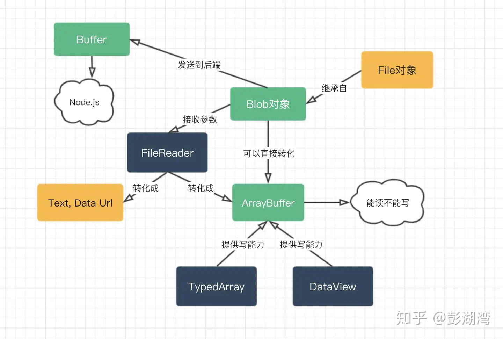
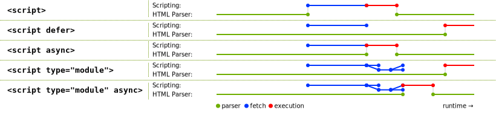

```js
q: 如何找到当前页面出现的所有标签

document.querySelectorAll('*'),//  标准规范实现
document.getElementsByTagName('*')
$$('*') //  devtools 实现

1 如何找到当前页面出现次数前三多的 HTML 标签
2 如果多个标签出现次数同样多,则取多个标签

//  统计每个标签出现次数

// 利用hash
const map =new Map();
[...document.querySelectorAll("*")].forEach(item => {
    const tagName = item.tagName.toLowerCase(); 
    map.set( tagName , map.has(tagName) ? map.get(tagName)+1 : 1);
});

//  输出标签数最多的标签及次数 方法1
const maxBy = (list, keyBy) => list.reduce((x, y) => keyBy(x) > keyBy(y) ? x : y)

function getFrequentTag () {
  const tags = [...document.querySelectorAll('*')].map(x => x.tagName).reduce((o, tag) => {
    o[tag] = o[tag] ? o[tag] + 1 : 1;
    return o
  }, {})
    console.log(tags, Object.entries(tags))
  return maxBy(Object.entries(tags), tag => tag[1])
}
//  方法2
Object.entries(
  $$('*')
    .map((it) => it.tagName.toLowerCase())
    .reduce((cntArr, tag) => {
      cntArr[tag] = cntArr[tag] ? cntArr[tag] + 1 : 1
      return cntArr
    }, {}),
).reduce((x, y) => (x[1] > y[1] ? x : y))


JSONP 基于两个原理:

动态创建 script,使用 script.src 加载请求跨过跨域
script.src 加载的脚本内容为 JSONP: 即 PADDING(JSON) 格式
//  前端代码
function jsonp ({ url, onData, params }) {
  const script = document.createElement('script')

  // 一, 为了避免全局污染,使用一个随机函数名
  const cbFnName = `JSONP_PADDING_${Math.random().toString().slice(2)}`

  // 二, 默认 callback 函数为 cbFnName
  script.src = `${url}?${stringify({ callback: cbFnName, ...params })}`

  // 三, 使用 onData 作为 cbFnName 回调函数,接收数据
  window[cbFnName] = onData;

  document.body.appendChild(script)
}

// 发送 JSONP 请求
jsonp({
  url: 'http://localhost:10010',
  params: { id: 10000 },
  onData (data) {
    console.log('Data:', data)
  }
})

//  服务端代码
const http = require('http')
const url = require('url')
const qs = require('querystring')

const server = http.createServer((req, res) => {
  const { pathname, query } = url.parse(req.url)
  const params = qs.parse(query)

  const data = { name: 'shanyue', id: params.id }
  //  关键！！！！
  if (params.callback) {
    // 服务端将要返回的字符串
    str = `${params.callback}(${JSON.stringify(data)})`
    res.end(str)
  } else {
    res.end()
  }
})

server.listen(10010, () => console.log('Done'))


// 图片懒加载
方案1: clientTop,offsetTop,clientHeight 以及 scrollTop 各种关于图片的高度作比对
背不过这些东西.... 放弃

方案二: getBoundingClientRect API + Scroll with Throttle + DataSet API

// clientHeight 代表当前视口的高度
img.getBoundingClientRect().top < document.documentElement.clientHeight

监听 window.scroll 事件也优化一下

加个节流器,提高性能. 工作中一般使用 lodash.throttle 就可以了,万能的 lodash 啊！

方案三: IntersectionObserver API + DataSet API

const observer = new IntersectionObserver((changes) => {
  changes.forEach((change) => {
    // intersectionRatio
    if (change.isIntersecting) {
      const img = change.target
      img.src = img.dataset.src
      observer.unobserve(img)
    }
  })
})
 
observer.observe(img) //  img element

HTMLElement 接口的只读属性 dataset 提供了对元素上自定义数据属性(data-*)读/写访问
<div id="user" data-id="1234567890" data-user="johndoe" data-date-of-birth>
  John Doe
</div>

const el = document.querySelector("#user");

// el.id === 'user'
// el.dataset.id === '1234567890'
// el.dataset.user === 'johndoe'
// el.dataset.dateOfBirth === ''


  localStorage.getItem('name'); // jack
  localStorage.setItem('name','tom'); 
  localStorage.removeItem('name');

  session Storage 关闭 会话后 就自动删除

如何设置一个支持过期时间的 localStorage
设置如下数据结构,当用户存储数据时,存储至 __value 字段. 并将过期时间存储至 __expires 字段. 
{  __value, __expires }
而当每次获取数据时,判断当前时间是否已超过 __expires 过期时间,如果超过,则返回 undefined,并删除该数据. 


常见的cookie属性及其含义: 

Domain(域):  这个属性指定了哪些域名可以接受该 Cookie. 例如,如果设置为 ".example.com",则所有子域名(如 "blog.example.com")都可以接受该 Cookie. 

Path(路径):  Cookie 的路径属性指定了在哪个路径下的页面可以发送该 Cookie. 默认情况下,Cookie 只在设置它的页面及其子目录中有效. 

Expires/Max-Age(过期时间/最大存活时间):  这些属性用于指定 Cookie 的过期时间. Expires 是一个具体的日期时间,而 Max-Age 是一个相对于当前时间的秒数. 一旦超过了过期时间,浏览器就会自动删除该 Cookie. 
【如果没有 maxAge,则 cookie 的有效时间为会话时间. 】

HttpOnly(仅HTTP):  当设置为 true 时,表示该 Cookie 不允许被 JavaScript 访问. 这样可以防止跨站脚本攻击(XSS),因为攻击者无法通过 JavaScript 来访问该 Cookie. 

Secure(安全):  当设置为 true 时,表示该 Cookie 只能通过 HTTPS 连接发送给服务器. 这样可以确保 Cookie 在传输过程中不被窃取. 

SameSite(同站策略):  这个属性可以控制浏览器是否发送 Cookie,以防止跨站请求伪造(CSRF)攻击. 它有三个可选值: Strict, Lax 和 None. Strict 表示只有在同站请求时才发送 Cookie,Lax 则表示在某些情况下(比如从外部网站链接过来)也会发送 Cookie,而 None 表示始终发送 Cookie,无论请求来源. 
【Lax模式比Strict模式稍微宽松一些,允许一些外部站点跳转时发送Cookie,而Strict模式则更加严格,只有在用户直接导航到目标站点时才会发送Cookie. 】

主流浏览器 Same-Site 的默认值为 Lax,而在以前是 None,将会预防大部分 CSRF 攻击

cookie 
通过把该 cookie 的过期时间改为过去时即可删除成功,具体操作的话可以通过操作两个字段来完成
> document.cookie = 'a=3'

> document.cookie = 'a=3; max-age=-1'

max-age: 将要过期的最大秒数,设置为 -1 即可删除
expires: 将要过期的绝对时间,存储到 cookies 中需要通过 date.toUTCString() 处理,设置为过期时间即可删除


addEventListener(type, listener);
addEventListener(type, listener, options);
addEventListener(type, listener, useCapture);

options ----
capture. 监听器会在时间捕获阶段传播到event.target时触发. 
passive. 监听器不会调用preventDefault(). 
once. 监听器只会执行一次,执行后移除. 
singal. 调用abort()移除监听器. 

当 useCapture(设为 true)时,沿着 DOM 树向上冒泡的事件不会触发 listener. 
useCapture 默认为 false. 

先捕获 到达 target 之后,再往上冒泡
addEventListener 可以多同一个元素 定义多个 监听函数,按代码顺序执行


事件委托指当有大量子元素触发事件时,将事件监听器绑定在父元素进行监听,此时数百个事件监听器变为了一个监听器,提升了网页性能. 

另外,React17 把所有事件委托在 Root Element,用以提升性能.  React16 是在html

Event.currentTarget 接口的只读属性,标识是当事件沿着 DOM 触发时事件的当前目标. 它总是指向事件绑定的元素
Event.target 则是事件触发的元素. 


e.preventDefault(): 阻止事件触发后默认动作的发生
e.cancelable: 事件是否可取消
如果 addEventListener 第三个参数 { passive: true},preventDefault 将会无效

stopPropagation() 方法阻止捕获和冒泡阶段中当前事件的进一步传播
stopImmediatePropagation() 方法阻止附加到相同元素的相同事件类型的其他事件处理器

input 中onChange 事件监听的原生事件是
keypress
keydown
keyup
input - 实时触发
注: onChange 无法做到实时监听,因为 onChange 需要失去焦点才能触发

React 的 onChange 在底层实现时,就是用了原生的 input 事件

题目: 在浏览器中如何获取剪切板中内容
// 是否能够有读取剪贴板的权限
// result.state == "granted" || result.state == "prompt"
const result = await navigator.permissions.query({ name: "clipboard-read" })
 
// 获取剪贴板内容
const text = await navigator.clipboard.readText()

禁止复制
使用css
user-select: none;

document.body.onselectstart = e => {  
  e.preventDefault();
}
 
document.body.oncopy = e => {  
  e.preventDefault();
}

credentials 指在使用 fetch 发送请求时是否应当发送 cookie

omit: 从不发送 cookie.
same-origin: 同源时发送 cookie (浏览器默认值)
include: 同源与跨域时都发送 cookie

 const response = await fetch(url, {
    method: "POST", // *GET, POST, PUT, DELETE, etc.
    mode: "cors", // no-cors, *cors, same-origin
    cache: "no-cache", // *default, no-cache, reload, force-cache, only-if-cached
    credentials: "same-origin", // include, *same-origin, omit
    headers: {
      "Content-Type": "application/json",
      // 'Content-Type': 'application/x-www-form-urlencoded',
    },
    redirect: "follow", // manual, *follow, error
    referrerPolicy: "no-referrer", // no-referrer, *no-referrer-when-downgrade, origin, origin-when-cross-origin, same-origin, strict-origin, strict-origin-when-cross-origin, unsafe-url
    body: JSON.stringify(data), // body data type must match "Content-Type" header
  });

题目:  取消请求发送
如果使用XMLHttpRequest发送请求可以使用
XMLHttpRequest.abort()

如果使用fetch发送请求可以使用AbortController
const controller = new AbortController();
const signal = controller.signal;
fetch('https://somewhere', { signal })
controller.abort()

如果使用axios,取消原理同fetch
var CancelToken = axios.CancelToken;
var source = CancelToken.source();
axios.get('/https://somewhere', {
  cancelToken: source.token
}
source.cancel()

如何判断在移动端
navigator.userAgent

或者使用相关的库
import isMobile from 'ismobilejs'
 
const mobile = isMobile()

React Hooks for Data Fetching - swr

requestIdleCallback() API)提供了由用户代理决定的,在空闲时间自动执行队列任务的能力. 
window.requestIdleCallback =
  window.requestIdleCallback ||
  function (handler) {
    let startTime = Date.now();

    return setTimeout(function () {
      handler({
        didTimeout: false,
        timeRemaining: function () {
          return Math.max(0, 50.0 - (Date.now() - startTime));
        },
      });
    }, 1);
  };

const rIC = window['requestIdleCallback'] || (f => setTimeout(f, 1))


在 rIC 中执行任务时需要注意以下几点: 

执行重计算而非紧急任务
空闲回调执行时间应该小于 50ms,最好更少
空闲回调中不要操作 DOM,因为它本来就是利用的重排重绘后的间隙空闲时间,重新操作 DOM 又会造成重排重绘


如何把 DOM 转化为图片?
html2canvas: Screenshots with JavaScript
dom-to-image: Generates an image from a DOM node using HTML5 canvas
[domtoimage.toPng(cloneNode)]

htmlToImage.toJpeg(element, ....)

DOM -> SVG -> Canvas -> JPEG/PNG

jpeg 比 png 更小

defer 与 async 的区别如下:
相同点: 异步加载 (fetch)
不同点: async 加载(fetch)完成后立即执行 (execution),因此可能会阻塞 DOM 解析; defer 加载(fetch)完成后延迟到 DOM 解析完成后才会执行(execution)**,但会在事件 DomContentLoaded 之前

* DOMContentLoaded事件触发时: 仅当DOM解析完成后,不包括样式表,图片等资源. 
当 HTML 文档完全解析,且所有延迟脚本(<script defer src="…"> 和 <script type="module">)下载和执行完毕后,会触发 DOMContentLoaded 事件. 它不会等待图片, 子框架和异步脚本等其他内容完成加载. 
* onload 事件触发时,页面上所有的 DOM,样式表,脚本,图片等资源已经加载完毕. 

document.addEventListener("DOMContentLoaded", (event) => {
    console.log("DOM 完全加载和解析");
  });

window.addEventListener("load", (event) => {
  console.log("page is fully loaded");
});


window.onload = (event) => {
  console.log("page is fully loaded");
};


前端路由实现的本质是监听url变化,实现方式有两种: Hash模式和History模式,无需刷新页面就能重新加载相应的页面.  

* Hash url的格式为www.a.com/#/,当#后的哈希值发生变化时,通过hashchange事件监听,然后页面跳转. 

*History url通过history.pushState和history.replaceState改变url

history.pushState({ page: 1 }, "title 1", "?page=1");    
//    URL改变为 xxx?page=1
history.pushState({ page: 2 }, "title 2", "?page=2");    
//    URL改变为 xxx?page=2
history.replaceState({ page: 3 }, "title 3", "?page=3"); 
//    URL改变为 xxx?page=3 均不触发popstate事件

window.addEventListener("popstate", function() {
// 监听浏览器前进后退事件,pushState 与 replaceState 方法不会触发该方法
});

* pushState 和 replaceState 两个 API 来操作实现 URL 的变化 ; 
* 我们可以使用 popstate 事件来监听 url 的变化,从而对页面进行跳转(渲染); 
* history.pushState() 或 history.replaceState() 不会触发 popstate 事件,popstate 事件只会在在点击浏览器后退按钮或js调用forward(), back(), go()时触发

history API
-通过 history.pushState() 跳转路由
-通过 popstate event 监听路由变化,但无法监听到 history.pushState() 时的路由变化

hash
-通过 location.hash 跳转路由
-通过 hashchange event 监听路由变化

基于hash 实现 【location.hash】
<body>
    <!-- 模拟单页页面应用 -->
    <ul>
        <li><a href="#/home">首页</a></li> 
        <li><a href="#/about">关于</a></li>
        <!-- 判断url的变化,绑定点击事件不好,页面过多就很累赘,有个hashchange的官方方法 -->
    </ul>

    <div id="routeView">
        <!-- 放一个代码片段 点击首页首页代码片段生效,反之关于生效-->
    </div>
    <script>
        const routes = [
          {
              path: '#/home',
              component: '首  容'
          },
          {
              path: '#/about',
              component: '关于页面内容'
          }
        ]
        
        const routeView = document.getElementById('routeView')
        window.addEventListener('DOMContentLoaded', onHashChange) 
        // 与vue的声明周期一个道理,dom一加载完毕就触发
        window.addEventListener('hashchange', onHashChange)
        
        function onHashChange() {
            console.log(location) // url详情,里面就有个hash值  liveserver可以帮你把html跑成服务器
            routes.forEach((item, index) => {
                if(item.path === location.hash) {
                    routeView.innerHTML = item.component
                }
            })
        }
    </script>
</body>


基于history实现 【location.pathname
const routeView = document.getElementById('routeView')

window.addEventListener('DOMContentLoaded', onLoad)
window.addEventListener('popstate', onPopState)

function onLoad() {
    const links = document.querySelectorAll('li a') // 获取所有的li下的a标签
    // console.log(links)
    links.forEach((a) => {
        // 禁用a标签的默认跳转行为
        a.addEventListener('click', (e) => {
            console.log(e)
            e.preventDefault() // 阻止a的跳转行为
            // 核心方法  a.getAttribute('href')获取a标签下的href属性
            history.pushState(null, '', a.getAttribute('href')) 
            // 映射对应的dom
            onPopState()
        })
    })
}

function onPopState() {
    console.log(location.pathname)
    routes.forEach((item) => {
        if(item.path === location.pathname) {
            routeView.innerHTML = item.component
        }
    })
}

如何修改url还不引起页面的刷新
1 在浏览器url后加个哈希值,哈希值的变更不会引起浏览器页面的刷新
2 可以修改url且不引起页面的刷新

如何知道url变化了
1 hashchange
2 popstate

### JS二进制家族

Blob就是一个不可修改的二进制文件！
Blob.slice(start,end)可以分割大Blob为多个小Blob

File对象 其实就是特殊类型的 Blob,即 Blob 的属性和方法同样适用于 File 对象. 

JS 中主要有两个地方产生 File 对象: 
通过<input type='file'> 元素上传文件后,返回的 FileList 对象
文件拖放操作生成的 DataTransfer 对象

FileReader 是一个异步 API,用于读取文件并提取其内容以供进一步使用. 
FileReader 可以将 Blob 读取为不同的格式

FileReader.readAsText(Blob): 将Blob转化为文本字符串
FileReader.readAsArrayBuffer(Blob):  将Blob转为ArrayBuffer格式数据
FileReader.readAsDataURL(Blob): 将Blob转化为Base64格式的Data URL


ArrayBuffer 对象用来表示通用的, 固定长度的原始二进制数据缓冲区

Object URL 又称 Blog URL; 用来表示File Object 或Blob Object 的URL;  创建一个指向 Blob 或 File 对象的可以用作图像, 二进制数据下载链接等的 URL 源
window.URL.createObjectURL(new Blob([ab], {type: 'png'}))

Base64 是一种基于64个可打印字符来表示二进制数据的表示方法
atob(): 解码,解码一个 Base64 字符串; 
btoa(): 编码,从一个字符串或者二进制数据编码一个 Base64 字符串. 


大文件上传 实现过程
https://juejin.cn/post/7356817667574136884#heading-12
前端拿到整个文件后利用文件 Blob 原型上的 slice 方法进行切割,将得到的切片数组 chunkList 添加一些信息,比如文件名和下标,得到 uploadChunkList ,【因为网络原因,切片不可能是按照顺序接收的,这里我给 chunkList 再加上下标,还有文件名,切片名】
但是 uploadChunkList 想要传给后端还需要将其转换成表单数据格式,通过 Promise.all 并发发给后端,传输完毕后发送一个合并请求,合并请求带上文件名和切片大小信息

这里有几个方案可以实现

1 后端监听上传请求,当所有的请求都上传完毕时,出发合并请求操作
2 前端发完切片后,最后发一个合并请求 【用最多的方案】
3 后端设置一个预期切片数量,达标后合并切片

	Promise.all(requestList).then(mergeChunks())

面试官当时问我的就是万一有个切片失败了怎么办,沉默许久,现在心中已经有答案了,后端 fse 用 promise 实现了封装,里面可以捕获错误,如果切片上传失败,我可以记录好这个失败切片的索引,告诉前端让其重传

切片带来的优点
将大文件切割成片实现并发传输,可以提高传输速度
可以实现传输进度功能,提高用户体验

```

JS二进制家族 - https://zhuanlan.zhihu.com/p/97768916





event loop它的执行顺序: 
* 一开始整个脚本作为一个宏任务执行
* 执行过程中同步代码直接执行,宏任务进入宏任务队列,微任务进入微任务队列
* 当前宏任务执行完出队,检查微任务列表,有则依次执行,直到全部执行完
* 执行浏览器UI线程的渲染工作
* 检查是否有Web Worker任务,有则执行
* 执行完本轮的宏任务,回到2,依此循环,直到宏任务和微任务队列都为空

微任务包括: MutationObserver, Promise.then()或catch(), Promise为基础开发的其它技术,比如fetch API, V8的垃圾回收过程, Node独有的process.nextTick. 

宏任务包括: script , setTimeout, setInterval , setImmediate , I/O , UI rendering. 

注意⚠️: 在所有任务开始的时候,由于宏任务中包括了script,所以浏览器会先执行一个宏任务,在这个过程中你看到的延迟任务(例如setTimeout)将被放到下一轮宏任务中来执行. 