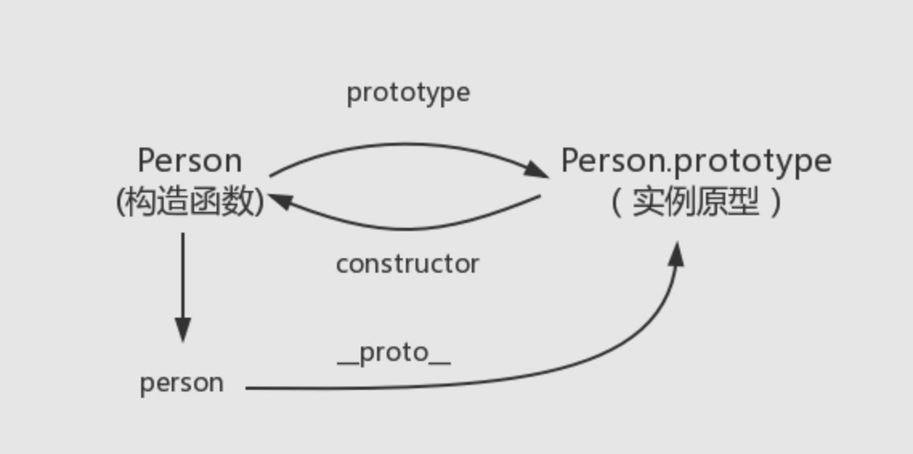
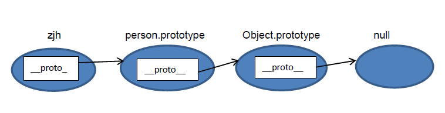

## 知识回顾

### 基本类型
|类型|typeof返回值|note|
|:-|:-:|:-:|
|Boolean|'boolean'|
|String|'string'|
|Number|'number'|
|Undefined|'undefined'|
|Null|*'object'*|
|Symbol|'symbol'|生成全局唯一的值
|BigInt|'bigint'|生成巨大的整数

undefined 表示值的缺失，null 表示对象的缺失;（这也可以说明 typeof null === "object" 的原因）

- 该语言通常默认为 undefined：
没有值（return;）的 return 语句，隐式返回 undefined;
访问不存在的对象属性（obj.iDontExist），返回 undefined。

- null 在核心语言中使用频率少得多。最重要的地方是原型链的末端

Number: +Infinity 和 -Infinity 行为类似于数学上的无穷大
存储 2的-1074方（Number.MIN_VALUE）和 2的1024方（Number.MAX_VALUE）之间的正浮点数;

NaN（“Not a Number”）是一个特殊种类的数值; NaN === NaN   // 输出false

NaN有两个特点：一是任何涉及NaN的操作都会返回NaN，二是NaN不与任何数值相等，包括自己;但可以通过isNaN()方法来判断一个数值是否为NaN

BigInt 类型在 Javascript 中是一个数字的原始值，它可以表示任意大小的*整数*。
BigInt 是通过将 n 附加到整数末尾或调用 BigInt() 函数来创建的。
你可以使用大多数运算符处理 BigInt，包括 +、*、-、** 和 %。——唯一被禁止的是 >>>。
BigInt 不能表示小数，但可以更精确地表示大整数。
```
const x = BigInt(1928989289894)
x + 1n === x + 2n //  false
```

Symbol 是唯一并且不可变的原始值并且可以用来作为对象属性的键
```
const a = Symbol()
```
Object 类型数据就是键值对的集合，键是一个字符串（或者 Symbol） ，值可以是任意类型的值；
Object
- Array
- Date
- RegExp
- Function -> typeof Person === 'function'
- Set

可以通过 Object.prototype.toString.call(e) 再细区分

### 延伸
```js
Object.prototype.toString.call(new Array())
//  '[object Array]'
Object.prototype.toString.call(new Date())
//  '[object Date]'
Object.prototype.toString.call(new RegExp())
//  '[object RegExp]'
Object.prototype.toString.call(Person)
//  '[object Function]'
Object.prototype.toString.call(new Set())
//  '[object Set]'
```

基本数据类型（存放在栈中）
引用数据类型。存放在堆内存中的对象

reference: [基本类型](https://developer.mozilla.org/zh-CN/docs/Web/JavaScript/Data_structures#%E5%8E%9F%E5%A7%8B%E5%80%BC)


### 函数对象
```
普通对象Object 和 函数对象Function

凡是通过 new Function() 创建的对象都是函数对象，其他的都是普通对象。

原型链的形成真正是靠__proto__ 而非prototype

```

### 原型&原型链


```js
function Person() {

}

var person = new Person();

console.log(person.__proto__ == Person.prototype)  // true

// 顺便学习一个ES5的方法,可以获得对象的原型
console.log(Object.getPrototypeOf(person) === Person.prototype) // true

//  person 中并没有 constructor 属性,当不能读取到constructor 属性时，会从 person 的原型也就是 Person.prototype 中读取
person.constructor === Person // true
Person.prototype.constructor === Person // true

Object.prototype.__proto__ === null //  Object.prototype没有原型

// prototype是函数才会有的属性
Person.prototype.name = 'Kevin';
person.name //  'Kevin'

```

```
知识点：
- __proto__然而它并不存在于 Person.prototype 中
实际上，它是来自于 Object.prototype ，与其说是一个属性，不如说是一个 getter/setter，当使用 obj.__proto__ 时，可以理解成返回了 Object.getPrototypeOf(obj)。
- 每个函数都有一个 prototype 属性
- 读取 person.name，从 person 对象中找不到 name 属性就会从 person 的原型也就是 person.__proto__ ，也就是 Person.prototype中查找
```


reference: [JavaScript深入之从原型到原型链
](https://github.com/mqyqingfeng/Blog/issues/2)
