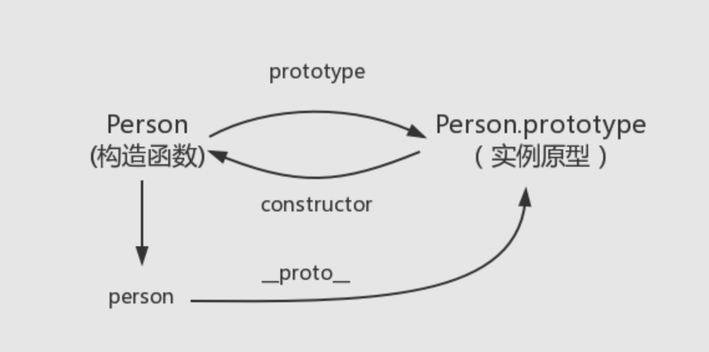
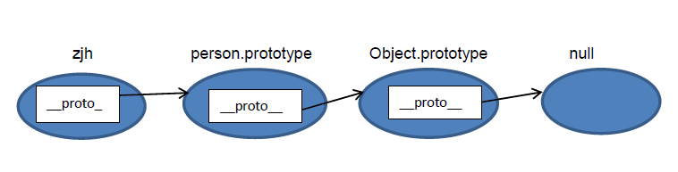

## 知识回顾

### 基本类型
|类型|typeof返回值|note|
|:-|:-:|:-:|
|Boolean|'boolean'|
|String|'string'|
|Number|'number'|
|Undefined|'undefined'|
|Null|*'object'*|
|Symbol|'symbol'|生成全局唯一的值
|BigInt|'bigint'|生成巨大的整数

undefined 表示值的缺失，null 表示对象的缺失;（这也可以说明 typeof null === "object" 的原因）

- 该语言通常默认为 undefined：
没有值（return;）的 return 语句，隐式返回 undefined;
访问不存在的对象属性（obj.iDontExist），返回 undefined。

- null 在核心语言中使用频率少得多。最重要的地方是原型链的末端

Number: +Infinity 和 -Infinity 行为类似于数学上的无穷大
存储 2的-1074方（Number.MIN_VALUE）和 2的1024方（Number.MAX_VALUE）之间的正浮点数;

NaN（“Not a Number”）是一个特殊种类的数值; NaN === NaN   // 输出false

NaN有两个特点：一是任何涉及NaN的操作都会返回NaN，二是NaN不与任何数值相等，包括自己;但可以通过isNaN()方法来判断一个数值是否为NaN

BigInt 类型在 Javascript 中是一个数字的原始值，它可以表示任意大小的*整数*。
BigInt 是通过将 n 附加到整数末尾或调用 BigInt() 函数来创建的。
你可以使用大多数运算符处理 BigInt，包括 +、*、-、** 和 %。——唯一被禁止的是 >>>。
BigInt 不能表示小数，但可以更精确地表示大整数。

`它提供了一种方法来表示大于 2^53 - 1 的整数。这原本是 Javascript 中可以用 Number 表示的最大数字。`
```
const x = BigInt(1928989289894) //  另外一种写法： 7975n
x + 1n === x + 2n //  false
```

Symbol 是唯一并且不可变的原始值并且可以用来作为对象属性的键
```
const a = Symbol()
```
Object 类型数据就是键值对的集合，键是一个字符串（或者 Symbol） ，值可以是任意类型的值；
Object
- Array
- Date
- RegExp
- Function -> typeof Person === 'function'
- Set

```js
//  ES6 提供了新的数据结构 Set。
//  似于数组，但它的一大特性就是所有元素都是唯一的，没有重复。
//  我们可以利用这一唯一特性进行数组的去重工作。
let arr1 = [1, 2, 3, 4]
let arr2 = [2, 3, 4, 5, 6]
let set7 = new Set([...arr1, ...arr2])
console.log('distinct 2:', set7)

set1.add(3)
set1.delete(1)
set1.has(1)
set1.clear()
new Set([4,5,6])
new Set(new Array(7, 8, 9))

//  Set转数组
[…set4]
Array.from(set4)
```

可以通过 Object.prototype.toString.call(e) 再细区分

### 延伸
```js
Object.prototype.toString.call(new Array())
//  '[object Array]'
Object.prototype.toString.call(new Date())
//  '[object Date]'
Object.prototype.toString.call(new RegExp())
//  '[object RegExp]'
Object.prototype.toString.call(Person)
//  '[object Function]'
Object.prototype.toString.call(new Set())
//  '[object Set]'
```
实现一个全局通用的数据类型判断函数
```js
function getType(obj) {
  const type = typeof obj
  if (type !== 'object' ) {
    return type
  }

  return Object.prototype.toString.call(obj).replace(/^\[object (\S+)\]$/, '$1')
}
```

基本数据类型（存放在栈中）
引用数据类型。存放在堆内存中的对象

reference: [基本类型](https://developer.mozilla.org/zh-CN/docs/Web/JavaScript/Data_structures#%E5%8E%9F%E5%A7%8B%E5%80%BC)


### 函数对象
```
普通对象Object 和 函数对象Function

凡是通过 new Function() 创建的对象都是函数对象，其他的都是普通对象。

new Object ，new Function 是JS自带的函数对象
//  example
function myFunction(a,b){
    return a+b;
}
//等价于
var myFunction=new Function("a","b","return a+b");

函数对象的一个属性就是原型对象 prototype。注：普通对象没有prototype,但有__proto__属性。

JS在创建对象（不论是普通对象还是函数对象）的时候，都有一个叫做__proto__的内置属性，用于指向创建它的函数对象的原型对象prototype

原型链的形成真正是靠__proto__ 而非prototype

```

### 原型&原型链


```js
function Person() {

}

var person = new Person();

console.log(person.__proto__ == Person.prototype)  // true

// 顺便学习一个ES5的方法,可以获得对象的原型
console.log(Object.getPrototypeOf(person) === Person.prototype) // true

//  person 中并没有 constructor 属性,当不能读取到constructor 属性时，会从 person 的原型也就是 Person.prototype 中读取
person.constructor === Person // true
Person.prototype.constructor === Person // true

Object.prototype.__proto__ === null //  Object.prototype没有原型

// prototype是函数才会有的属性
Person.prototype.name = 'Kevin';
person.name //  'Kevin'

```

```
知识点：
- __proto__然而它并不存在于 Person.prototype 中
实际上，它是来自于 Object.prototype ，与其说是一个属性，不如说是一个 getter/setter，当使用 obj.__proto__ 时，可以理解成返回了 Object.getPrototypeOf(obj)。
- 每个函数都有一个 prototype 属性
- 读取 person.name，从 person 对象中找不到 name 属性就会从 person 的原型也就是 person.__proto__ ，也就是 Person.prototype中查找
```


reference: [JavaScript深入之从原型到原型链
](https://github.com/mqyqingfeng/Blog/issues/2)

### this调用场景
```
var obj = {
  a: 1, 
  b: function() {
    console.log(this);
  }
}
1、作为对象调用时，指向该对象 obj.b(); // 指向obj
2、作为函数调用, var b = obj.b; b(); // 指向全局window
3、作为构造函数调用 var b = new Fun(); // this指向当前实例对象
4、作为call与apply调用 obj.b.apply(object, []); // this指向当前的object
```

### apply call bind
call() 方法在使用一个指定的 this 值和若干个指定的参数值的前提下调用某个函数或方法。

call方法传递给调用函数的参数是逐个列出的，而apply则是要写在数组中。
调用 call 或 apply 都会自动执行对应的函数，而 bind 不会执行对应的函数；

```js
zlw.say.call(object, 23,24,25)
zlw.say.apply(object, [23,24,25])
//  均可
zlw.say.bind(object, 23,24,25)() 
zlw.say.bind(object, [23,24,25])() 

//  this 参数可以传 null，当为 null 的时候，视为指向 window
```

```js
//  手写call
Function.prototype.call2 = function(context = window, ...arg) {
  if (this === Function.prototype) {
    return undefined  //  用于防止Function.prototype.call2() 直接调用
  }

  context = context || window //  null / undefined 指向window
  const fn = Symbol()
  context[fn] = this
  const result = context[fn](...arg)
  delete context[fn]
  return result

}

//  手写apply
Function.prototype.apply2 = function(context = window, arg) {
  if (this === Function.prototype) {
    return undefined
  }

  context = context || window
  const fn = Symbol()
  context[fn] = this
  let result
  if (Array.isArray(arg)) {
    result = context[fn](...arg)
  } else {
    result = context[fn]()
  }

  delete context[fn]
  return result

}

//  手写bind - TBD
review
/**
1.处理参数，返回一个闭包
2.判断是否为构造函数调用，如果是则使用new调用当前函数
3.如果不是，使用apply，将context和处理好的参数传入
 */
Function.prototype.bind = function (context, ...args1) {
  if (this === Function.prototype) {
    throw new TypeError('error')
  }

  const _this = this
  return function F(...args) {
    if (this instanceof F) {
      return new _this(...args1, ...args2)
    }

    return _this.apply(context, args1.concat(args2))
  }
}
```
> 知识点： 类数组对象与arguments 
<br>类数组对象: 拥有一个 length 属性和若干索引属性的对象
```js
var arrayLike = {
    0: 'name',
    1: 'age',
    2: 'sex',
    length: 3
}
//  无法使用数组方法， 可以通过!!!!!!
var arrayLike = {0: 'name', 1: 'age', 2: 'sex', length: 3 }

Array.prototype.join.call(arrayLike, '&'); // name&age&sex

Array.prototype.slice.call(arrayLike, 0); // ["name", "age", "sex"] 
// slice可以做到类数组转数组

Array.prototype.map.call(arrayLike, function(item){
    return item.toUpperCase();
}); 
// ["NAME", "AGE", "SEX"]

//  类数组转数组!!!!!!
var arrayLike = {0: 'name', 1: 'age', 2: 'sex', length: 3 }
// 1. slice
Array.prototype.slice.call(arrayLike); // ["name", "age", "sex"] 
// 2. splice
Array.prototype.splice.call(arrayLike, 0); // ["name", "age", "sex"] 
// 3. ES6 Array.from
Array.from(arrayLike); // ["name", "age", "sex"] 
// 4. apply
Array.prototype.concat.apply([], arrayLike)
```

获取函数的参数
```js
  // 获取argument对象 类数组对象 不能调用数组方法
  function test1() {
    console.log('获取argument对象 类数组对象 不能调用数组方法', arguments);
  }

  // 获取参数数组  可以调用数组方法; 将arguments 轻松转为数组
  function test2(...args) {
    console.log('获取参数数组  可以调用数组方法', args);
  }

  // 获取除第一个参数的剩余参数数组
  function test3(first, ...args) {
    console.log('获取除第一个参数的剩余参数数组', args);
  }

  // 透传参数!!!!!!
  function test4(first, ...args) {
    fn(...args);
    fn(...arguments);
  }

  //  tip: 传入的参数，实参和 arguments 的值会共享，当没有传入时，实参与 arguments 值不会共享

function foo(name, age, sex, hobbit) {

  console.log(name, arguments[0]); // name name

  // 改变形参
  name = 'new name';

  console.log(name, arguments[0]); // new name new name

  // 改变arguments
  arguments[1] = 'new age';

  console.log(age, arguments[1]); // new age new age

  // 测试未传入的是否会绑定
  console.log(sex); // undefined

  sex = 'new sex';

  console.log(sex, arguments[2]); // new sex undefined

  arguments[3] = 'new hobbit';

  console.log(hobbit, arguments[3]); // undefined new hobbit

}

foo('name', 'age')


```

### others
数组的众多函数中，只有concat() slice() map() filter() join()函数，原数组不会改变；
