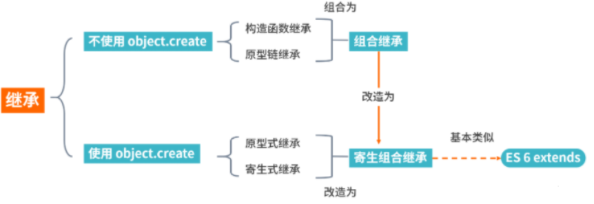

## 1.原型链继承

```js
function Parent() {
  this.names = ['kevin', 'daisy'];
}

function Child() {

}
Child.prototype = new Parent()

var child1 = new Child()
child1.names.push('test')
console.log(child1.names) //  ['kevin', 'daisy', 'test']

var child2 = new Child()
console.log(child2.names) //  ['kevin', 'daisy', 'test']
```
### 问题
1. 引用类型的属性被所有实例共享
2. 在创建 Child 的实例时，不能向Parent传参


## 2. 构造函数继承【经典继承】
```js
function Parent (name) {
    this.name = [name];
}

Parent.prototype.getName = function () {
    return this.name;
}

function Child (name) {
  Parent.call(this, name)
}

var child1 = new Child('kevin');
child1.name.push('tony')
console.log(child1.name); // kevin

var child2 = new Child('daisy');
console.log(child2.name); // daisy

console.log(child1.getName());  // 会报错, 反应问题2
```
### 优点
1. 避免了引用类型的属性被所有实例共享
2. 可以在 Child 中向 Parent 传参

### 问题
1. 方法都在构造函数中定义，每次创建实例都会创建一遍方法。
2. 只能继承父类的实例属性和方法，不能继承原型属性或者方法

## 3.组合继承
```js
function Parent (name) {
    this.name = [name];
}

Parent.prototype.getName = function () {
    return this.name;
}

Child.prototype = new Parent()


function Child (name) {
  Parent.call(this, name)
}

var child1 = new Child('kevin');
child1.name.push('tony')
console.log(child1.name); // kevin

var child2 = new Child('daisy');
console.log(child2.name); // daisy

console.log(child1.getName());  // 会报错, 反应问题2
```
### 优点
融合原型链继承和构造函数的优点，是 JavaScript 中最常用的继承模式。

### 问题
从上面代码我们也可以看到Parent 执行了两次，造成了多构造一次的性能开销

## 4.原型式继承
```js
//  Object.create模拟实现，将传入的对象作为创建对象的原型
function createObj(obj) {
  function F(){}
  F.prototype = obj
  return new F()
}

var person = {
    name: 'kevin',
    friends: ['daisy', 'kelly']
}

var person1 = createObj(person);  //  Object.create(person)
var person2 = createObj(person);

person1.friends.push("jerry");
person2.friends.push("lucy");

person1.name = 'person1';
console.log(person2.name); // kevin
//  注意：修改person1.name的值，person2.name的值并未发生改变，并不是因为person1和person2有独立的 name 值，而是因为person1.name = 'person1'，给person1添加了 name 值，并非修改了原型上的 name 值。

console.log(person4.friends); // ['daisy', 'kelly',"jerry","lucy"]
console.log(person5.friends); // ['daisy', 'kelly',"jerry","lucy"]

```

### 问题
包含引用类型的属性值始终都会共享相应的值，这点跟原型链继承一样。

## 5.寄生式继承

```js
function createObj (o) {
    var clone = Object.create(o);
    clone.sayName = function () {
        console.log('hi');
    }
    return clone;
}
```

### 问题
跟构造函数模式一样，每次创建对象都会创建一遍方法。

## 6.寄生组合继承[TBD]
```js
function Parent (name) {
    this.name = name;
    this.colors = ['red', 'blue', 'green'];
}

Parent.prototype.getName = function () {
    console.log(this.name)
}

function Child (name, age) {
    Parent.call(this, name);
    this.age = age;
}

// 关键的三步 - 替代了组合继承里的 Child.prototype = new Parent()
var F = function () {};

F.prototype = Parent.prototype;

Child.prototype = new F();


var child1 = new Child('kevin', '18');

console.log(child1);

//  最终代码 封装后的代码
function object(o) {
  function F() {}
  F.prototype = o
  return new F()
}

function clone(child, parent) {
  const prototype = object(parent.prototype)
  prototype.constructor = child;
  child.prototype  = prototype 
}

// 当我们使用的时候：
prototype(Child, Parent);
```

开发人员普遍认为寄生组合式继承是引用类型最理想的继承范式。

ES6 中的extends关键字直接实现 JavaScript的继承
```js
class Person {
  constructor(name) {
    this.name = name
  }
  // 原型方法
  // 即 Person.prototype.getName = function() { }
  // 下面可以简写为 getName() {...}
  getName = function () {
    console.log('Person:', this.name)
  }
}
class Gamer extends Person {
  constructor(name, age) {
    // 子类中存在构造函数，则需要在使用“this”之前首先调用 super()。
    super(name)
    this.age = age
  }
}
const asuna = new Gamer('Asuna', 20)
asuna.getName() // 成功访问到父类的方法
```
利用babel工具进行转换，我们会发现extends实际采用的也是寄生组合继承方式，因此也证明了这种方式是较优的解决继承的方式

## 总结
