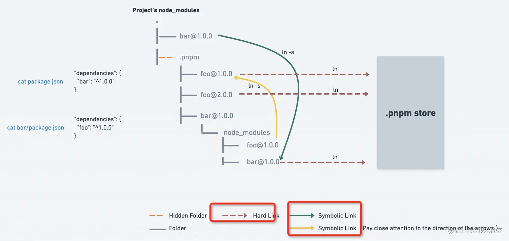

```js
1 Webpack的配置主要包括以下几个部分: 

entry. 指定Webpack打包的入口文件,可以是单个或多个JavaScript文件. 这个配置决定了Webpack从哪个模块开始生成依赖关系图. 1234
output. 设置Webpack打包后输出的目录和文件名称,包括path, filename和publicPath等. 235
module. 配置了不同的loaders来处理不同的模块,例如,对于CSS文件,可以使用css-loader和style-loader. 2345
resolve. 设置Webpack如何解析模块依赖,包括别名, 扩展名等. 
plugins. 使用不同的插件可以增强Webpack的功能,例如,使用html-webpack-plugin可以将打包后的js文件自动引用到HTML文件中. 
devServer. 提供了一个简单的web服务器和实时重载功能,可以通过devServer.contentBase, devServer.port, devServer.proxy等进行配置. 
optimization. 可以使用optimization.splitChunks和optimization.runtimeChunk配置代码拆分和运行时代码提取等优化策略. 
externals. 用于配置排除打包的模块,例如,可以将jQuery作为外置扩展,避免将其打包到应用程序中. 
devtool. 配置source-map类型. 
context. webpack使用的根目录,string类型必须是绝对路径. 
target. 指定Webpack编译的目标环境. 
performance. 输出文件的性能检查配置. 
noParse. 不用解析和处理的模块. 
stats. 控制台输出日志控制. 

2 Loader:

babel-loader: 将ES6+的代码转换成ES5的代码. 
css-loader: 解析CSS文件,并处理CSS中的依赖关系. 
style-loader: 将CSS代码注入到HTML文档中. 
file-loader: 解析文件路径,将文件赋值到输出目录,并返回文件路径. 
url-loader: 类似于file-loader,但是可以将小于指定大小的文件转成base64编码的Data URL格式
sass-loader: 将Sass文件编译成CSS文件. 
less-loader: 将Less文件编译成CSS文件. 
postcss-loader: 自动添加CSS前缀,优化CSS代码等. 
vue-loader: 将Vue单文件组件编译成JavaScript代码. 

Plugin:

HtmlWebpackPlugin: 生成HTML文件,并自动将打包后的javaScript和CSS文件引入到HTML文件中. 
CleanWebpackPlugin: 清除输出目录. 
ExtractTextWebpackPlugin: 将CSS代码提取到单独的CSS文件中. 
DefinePlugin: 定义全局变量. 
UglifyJsWebpackPlugin: 压缩JavaScript代码. 
HotModuleReplacementPlugin: 热模块替换,用于在开发环境下实现热更新. 
MiniCssExtractPlugin: 与ExtractTextWebpackPlugin类似,将CSS代码提取到单独的CSS文件中. 
BundleAnalyzerPlugin: 分析打包后的文件大小和依赖关系. 

Loader本质是一个函数,它是一个转换器. webpack只能解析原生js文件,对于其他类型文件就需要loader进行转换. 

Plugin它是一个插件,用于增强webpack功能. webpack在运行的生命周期中会广播出许多事件,Plugin 可以监听这些事件,在合适的时机通过 webpack 提供的 API 改变输出结果 . 

module.exports = {
  module: {
    rules: [{ test: /\.txt$/, use: 'raw-loader' }],
  },
  plugins: [
    new HtmlWebpackPlugin({ template: './src/index.html' })
  ],
};

Webpack的构建流程主要包括以下几个步骤: 

-初始化参数. 解析Webpack配置参数,合并Shell传入和webpack.config.js文件配置的参数,形成最终的配 置结果. 
-开始编译. 使用上一次得到的参数初始化compiler对象,注册所有配置的插件,插件监听Webpack构建生命周期的事件节点,做出相应的反应,执行对象的run方法开始执行编译. 
-确定入口. 从配置的entry入口,开始解析文件构建AST语法树,找出依赖,递归下去. 
-编译模块. 递归中根据文件类型和loader配置,调用所有配置的loader对文件进行转换,再找出该模块依赖的模块,再递归本步骤直到所有入口依赖的文件都经过了本步骤的处理. 
-完成模块编译. 在经过第四步使用Loader翻译完所有模块后,得到了每个模块被翻译后的最终内容以及它们之间的依赖关系. 
-输出资源. 根据入口和模块之间的依赖关系,组装成一个个包含多个模块的Chunk,再把每个Chunk转换成单独的文件加入到输出列表,这步是可以修改输出内容的最后机会. 
-输出完成. 在确定好输出内容后,根据配置确定输出的路径和文件名,把文件内容写入到文件系统. 

5.什么是Webpack的热更新(Hot Module Replacement)?原理是什么?
Webpack的热更新,在不刷新页面的前提下,将新代码替换掉旧代码. 
HRM的原理实际上是 webpack-dev-server(WDS)和浏览器之间维护了一个websocket服务. 当本地资源发生变化后,webpack会先将打包生成新的模块代码放入内存中,然后WDS向浏览器推送更新,并附带上构建时的hash,让客户端和上一次资源进行对比.

6.什么是Code Splitting
Code Splitting代码分割,是一种优化技术. 它允许将一个大的chunk拆分成多个小的chunk,从而实现按需加载,减少初始加载时间,并提高应用程序的性能 . 
在Webpack中通过optimization.splitChunks配置项来开启代码分割

7.Webpack的Source Map是什么?如何配置生成Source Map?
Source Map是一种文件,它建立了构建后的代码与原始源代码之间的映射关系. 通常在开发阶段开启,用来调试代码,帮助找到代码问题所在. 
在Webpack配置文件中的devtool选项中指定devtool: 'source-map'来开启

8.Webpack的Tree Shaking原理
Webpack的Tree Shaking是一个利用ES6模块静态结构特性来去除生产环境下不必要代码的优化过程. 其工作原理在于: 

*当Webpack分析代码时,它会标记出所有的import语句和export语句. 
然后,当Webpack确定某个模块没有被导入时,它会在生成的bundle中排除这个模块的代码. *
同时,Webpack还会进行递归的标记清理,以确保所有未使用的依赖项都不会出现在最终的bundle中. 

为了启用Tree Shaking,需要在webpack配置文件中添加如下设置: 
module.exports = {  
  // ...  
  optimization: {    
    usedExports: true,    
    concatenateModules: true,    minimize: true,  
  },  
  // ...
};

确保你使用的是ES6模块语法(即import和export),因为只有这样才能让Tree Shaking发挥作用. 

9.如何提高webpack的打包速度

利用缓存: 利用Webpack的持久缓存功能,避免重复构建没有变化的代码
使用多进程/多线程构建 : 使用thread-loader, happypack等插件可以将构建过程分解为多个进程或线程
使用DllPlugin和HardSourceWebpackPlugin:  DllPlugin可以将第三方库预先打包成单独的文件,减少构建时间. HardSourceWebpackPlugin可以缓存中间文件,加速后续构建过程
使用Tree Shaking: 配置Webpack的Tree Shaking机制,去除未使用的代码,减小生成的文件体积
移除不必要的插件: 移除不必要的插件和配置,避免不必要的复杂性和性能开销

10.如何减少打包后的代码体积

代码分割(Code Splitting): 将应用程序的代码划分为多个代码块,按需加载
Tree Shaking: 配置Webpack的Tree Shaking机制,去除未使用的代码
压缩代码: 使用工具如UglifyJS或Terser来压缩JavaScript代码
使用生产模式: 在Webpack中使用生产模式,通过设置mode: 'production'来启用优化
使用压缩工具: 使用现代的压缩工具,如Brotli和Gzip,来对静态资源进行压缩
利用CDN加速: 将项目中引用的静态资源路径修改为CDN上的路径,减少图片, 字体等静态资源等打包

11 vite webpack 对比
当使用 Webpack 时,所有的模块都需要在开发前进行打包,这会增加启动时间和构建时间. 
而 Vite 则采用了不同的策略,它会在请求模块时再进行实时编译,这种按需动态编译的模式极大地缩短了编译时间,特别是在大型项目中,文件数量众多,Vite 的优势更为明显. 

现代浏览器本身就支持 ES Modules,会主动发起请求去获取所需文件. Vite充分利用了这一点,将开发环境下的模块文件直接作为浏览器要执行的文件,而不是像 Webpack 那样先打包,再交给浏览器执行. 这种方式减少了中间环节,提高了效率. 
什么是ES Modules?
通过使用 export 和 import 语句,ES Modules 允许在浏览器端导入和导出模块. 

Webpack 是基于 Node.js 构建的,而 Vite 则是基于 esbuild 进行预构建依赖. esbuild 是采用 Go 语言编写的,Go 语言是纳秒级别的,而 Node.js 是毫秒级别的. 因此,Vite 在打包速度上相比Webpack 有 10-100 倍的提升. 

什么是预构建依赖?

预构建依赖通常指的是在项目启动或构建之前,对项目中所需的依赖项进行预先的处理或构建. 这样做的好处在于,当项目实际运行时,可以直接使用这些已经预构建好的依赖,而无需再进行实时的编译或构建,从而提高了应用程序的运行速度和效率. 

(4), 热更新的处理

在 Webpack 中,当一个模块或其依赖的模块内容改变时,需要重新编译这些模块. 

而在 Vite 中,当某个模块内容改变时,只需要让浏览器重新请求该模块即可,这大大减少了热更新的时间. 

Monorepo 是一种项目代码管理方式,指单个仓库中管理多个项目,有助于简化代码共享, 版本控制, 构建和部署等方面的复杂性,并提供更好的可重用性和协作性. 

优势
✅ 多项目代码都在一个仓库中,相同版本依赖提升到顶层只安装一次,节省磁盘内存,
代码复用高,方便进行代码重构
多项目在一个仓库,工程配置一致,代码质量标准及风格也很容易一致. 
构建性 Monorepo 工具可以配置依赖项目的构建优先级,可以实现一次命令完成所有的部署. 

劣势
多个项目代码都在一个仓库中,没有项目粒度的权限管控,一个项目出问题,可能影响所有项目. 
增加了非owner改动代码的风险

monorepo 工具对比
Turborepo / Rush / Nx / Lerna / pnpm workspaces


pnpm比npm快的原因主要有以下几点: 

符号链接(Symlink): pnpm使用符号链接来共享依赖项,而不是像npm那样将依赖项复制到每个项目的node_modules目录中. 这样做可以节省磁盘空间,同时减少安装时间. 
本地缓存: pnpm使用本地缓存来存储已安装的依赖项,当需要安装相同的依赖项时,可以直接从本地缓存中复制,而不需要重新下载. 这可以加快安装速度并减少网络开销. 
并行安装: pnpm支持并行安装依赖项,可以同时下载和安装多个依赖项,从而提高安装速度. 
版本控制: pnpm使用一个单独的文件来追踪所有项目的依赖项,而不是像npm那样在每个项目中都有一个package-lock.json文件. 这样做可以更好地管理依赖项的版本和依赖关系. 

npm2 - node_modules 是嵌套
有问题的,多个包之间难免会有公共的依赖,这样嵌套的话,同样的依赖会复制很多次,会占据比较大的磁盘空间. 

这个还不是最大的问题,致命问题是 windows 的文件路径最长是 260 多个字符,这样嵌套是会超过 windows 路径的长度限制的. 
当时 npm 还没解决,社区就出来新的解决方案了,就是 yarn

yarn 是怎么解决依赖重复很多次,嵌套路径过长的问题的呢?
铺平. 所有的依赖不再一层层嵌套了,而是全部在同一层
[但仍有一些有嵌套]因为一个包是可能有多个版本的,提升只能提升一个,所以后面再遇到相同包的不同版本,依然还是用嵌套的方式. 

npm 后来升级到 3 之后,也是采用这种铺平的方案了

扁平化的方案也有相应的问题. 

幽灵依赖问题 - 也就是你明明没有声明在 dependencies 里的依赖,但在代码里却可以 require 进来. 
这个也很容易理解,因为都铺平了嘛,那依赖的依赖也是可以找到的. 
但是这样是有隐患的,因为没有显式依赖,万一有一天别的包不依赖这个包了,那你的代码也就不能跑了,因为你依赖这个包,但是现在不会被安装了. 

还有一个问题,就是上面提到的依赖包有多个版本的时候,只会提升一个,那其余版本的包不还是复制了很多次么,依然有浪费磁盘空间的问题. 

pnpm 出现就解决以上问题

*硬连接就是同一个文件的不同引用,而软链接是新建一个文件,文件内容指向另一个路径. *
多个文件名指向同一索引节点是存在的. 一般这种连接就是硬连接. 
软链接文件有类似于Windows的快捷方式. 它实际上是一个特殊的文件

node_modules  不再是扁平化 / .pnpm目录 所有的依赖都在这里铺平了,都是从全局 store 硬连接过来的,然后包和包之间的依赖关系是通过软链接组织的. 

pnpm 首先将依赖安装到全局 store,然后通过 symbolic link 和 hard link 来组织目录结构,将全局的依赖链接到项目中,将项目的直接依赖链接到 node_modules 的顶层,所有的依赖则平铺于 node_modules/.pnpm 目录下,实现了所有项目的依赖共享 store 的全局依赖,解决了幽灵依赖和 NPM 分身的问题

首先,最大的优点是节省磁盘空间呀,一个包全局只保存一份,剩下的都是软硬连接,这得节省多少磁盘空间呀. 

其次就是快,因为通过链接的方式而不是复制,自然会快. 

总结 -
1 npm2 是通过嵌套的方式管理 node_modules 的,会有同样的依赖复制多次的问题. 
2 npm3+ 和 yarn 是通过铺平的扁平化的方式来管理 node_modules,解决了嵌套方式的部分问题,但是引入了幽灵依赖的问题,并且同名的包只会提升一个版本的,其余的版本依然会复制多次. 
*3 pnpm 则是用了另一种方式,不再是复制了,而是都从全局 store 硬连接到 node_modules/.pnpm,然后之间通过软链接来组织依赖关系. 
*4 这样不但节省磁盘空间,也没有幽灵依赖问题,安装速度还快,从机制上来说完胜 npm 和 yarn. 

节约磁盘空间并提升安装速度, 解决幽灵依赖

Linter 是 eslint 最核心的类了,它提供了这几个 api: 
检查: verify
检查并修复: verifyAndFix
获取 AST: getSourceCode
定义 Parser: defineParser
定义 Rule: defineRule
获取所有的 Rule: getRules

其中SourceCode指的是AST(抽象语法树),源代码字符串通过Parser解析成AST,之后ESLint就可以通过AST提供的信息与Rules对比,从而给出代码规范分析的结果,指出错误,并且还可以自动修复. 

ESLint拿到源代码后会进行parse操作,生成AST用于静态分析. ESLint使用的是Espree parser. 

Babel是一个流行的用于将新版本ES6+代码转换为向后兼容版本(ES5)代码的JavaScript编译器. 它还为JSX语法提供了编译支持
【总结来说,Babel 的原理就是将 JavaScript 源代码转换为抽象语法树(AST),然后对 AST 进行转换,生成与源代码功能相同但向后兼容的代码. 】

- 解析
当 Babel 接收到源代码时,将会调用一个叫做解析器的工具,用于将源代码转换为抽象语法树(AST)

- 转换
一旦 AST 被创建,Babel 将遍历整个树形结构,对每个节点进行转换. 这些转换可以是插件, 预设或手动创建的. 转换器会检查 AST 中的每个节点,然后对其进行相应的修改或替换,以将新语法转换为旧语法

- 生成
最后,Babel 将基于转换后的 AST 生成代码文本. 在这个步骤中,Babel 将遍历转换后的 AST,并创建对应的代码字符串,并将这些字符串组合成一个完整的 JavaScript 文件

Polyfill是一种用于填补浏览器或者JavaScript引擎缺失功能的代码. 一些新的JavaScript特性可能在某些旧版本的浏览器中不被支持,这时就需要使用polyfill来模拟这些新特性,以便在不同环境中实现一致的行为. 【提升兼容性 / 模拟es6+新特性】


CSS 工程化实践: 
预处理器: Less,  Sass 等; 
重要的工程化插件:  PostCss; 
Webpack loader 等 . 

预处理器支持我们写一种类似 CSS, 但实际并不是 CSS 的语言,然后把它编译成 CSS 代码
预处理器普遍会具备这样的特性: 
-嵌套代码的能力,通过嵌套来反映不同 css 属性之间的层级关系 ; 
-支持定义 css 变量; 
-提供计算函数; 
-允许对代码片段进行 extend 和 mixin; 
-支持循环语句的使用; 
-支持将 CSS 文件模块化,实现复用. 

Babel 可以将高版本的 JS 代码转换为低版本的 JS 代码. PostCss 做的是类似的事情: 它可以编译尚未被浏览器广泛支持的先进的 CSS 语法,还可以自动为一些需要额外兼容的语法增加前缀. 

Webpack 在裸奔的状态下,是不能处理 CSS 的,Webpack 本身是一个面向 JavaScript 且只能处理 JavaScript 代码的模块化打包工具; 
Webpack 在 loader 的辅助下,是可以处理 CSS 的. 

css-loader: 导入 CSS 模块,对 CSS 代码进行编译处理; 
style-loader: 创建style标签,把 CSS 内容写入标签. 
```
pnpm 实现原理
