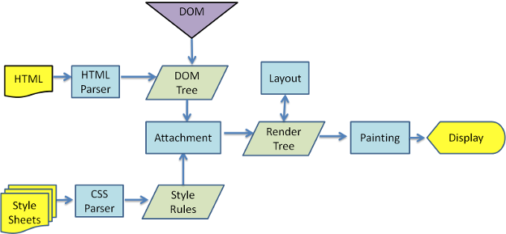

## 经验之谈

候选人的挑战在于面对问题时，如何在一两分钟内作出有效回答。有效回答是指：用两三句话对问题作出概括性回答，并引导面试官对回答中提到的关键词进一步深入提问。

复习阶段应该有意识的复习高频内容。

面试时考察候选人对知识点的理解和运用，需要候选人在有限时间内言简意赅的回答问题。

在有限时间内，无法对高频知识点进行吸收和总结，只能不断地在面试环节中试错，机会成本和时间成本极高。


本书主要整理了高频面试题和对应篇幅可控的答案。高频题是为了提高候选人复习效率，篇幅可控的答案则节省候选人的阅读时间

「回答关键点」作为高度概括的总结性语言，可用于第一时间回答面试官的问题；「知识点深入」以递进方式深入解析，可作为引导面试官进一步提问的方向。

## 模拟题1

### 浏览器跨域

什么是跨域： *跨域问题的来源是浏览器为了请求安全而引入的基于同源策略的安全特性。当页面和请求的协议、主机名或端口不同时，浏览器判定两者不同源，即为跨域请求。需要注意的是跨域是浏览器的限制，服务端并不受此影响。当产生跨域时，我们可以通过 JSONP、CORS、postMessage 等方式解决。*


一个 origin 由协议（Protocol）、主机名（Host）和端口（Port）组成，这三块也是同源策略的判定条件，只有当协议、主机名和端口都相同时，浏览器才判定两者是同源关系，否则即为跨域。

⚠️注意：二级域名不同也被视为跨域

- 方法1：
CORS (Cross-Origin Resource Sharing) 【服务端/后端】
CORS 是目前最为广泛的解决跨域问题的方案。方案依赖服务端/后端在响应头中添加 Access-Control-Allow-* 头，告知浏览器端通过此请求

CORS 引入了以下几个以 Access-Control-Allow-* 开头：

Access-Control-Allow-Origin 表示允许的来源
Access-Control-Allow-Methods 表示允许的请求方法
Access-Control-Allow-Headers 表示允许的请求头
Access-Control-Allow-Credentials 表示允许携带认证信息

- 方法2
反向代理 【服务端/后端】
在页面同域下配置一套反向代理服务，页面请求同域的服务端，服务端请求上游的实际的服务端，之后将结果返回给前端。

- 方法3 【前端/后端】
JSONP 是一个相对古老的跨域解决方案，只支持 GET 请求。*主要是利用了浏览器加载 JavaScript 资源文件时不受同源策略的限制而实现跨域获取数据。*

```js
1 全局注册一个函数，例如：window.getHZFEMember = (num) => console.log('HZFE Member: ' + num);。
2 构造一个请求 URL，例如：https://hzfe.org/api/hzfeMember?callback=getHZFEMember。
3 生成一个 <script> 并把 src 设为上一步的请求 URL 并插入到文档中，如 <script src="https://hzfe.org/api/hzfeMember?callback=getHZFEMember" />。
4 服务端构造一个 JavaScript 函数调用表达式并返回，例如：getHZFEMember(17)。
5 浏览器加载并执行以上代码，输出 HZFE Member: 17。
```

- 方法4 
postMessage

```js
1. 发送消息
在发送端（例如，父窗口）使用 postMessage 发送消息：

// 发送消息到目标窗口
const targetWindow = document.getElementById('iframe').contentWindow;
const message = { text: 'Hello from parent' };
targetWindow.postMessage(message, 'https://target-origin.com');
targetWindow 是目标窗口对象，可以是 iframe、window.open 打开的窗口等。
message 是要发送的消息，可以是字符串或对象。
https://target-origin.com 是目标窗口的来源（origin）。你应该指定准确的来源以确保安全。

2. 接收消息
在接收端（例如，iframe）使用 message 事件监听器接收消息：

window.addEventListener('message', (event) => {
  // 验证消息来源
  if (event.origin !== 'https://expected-origin.com') {
    return;
  }

  // 处理消息
  console.log('Received message:', event.data);
});
event.origin 用于检查消息的来源，以确保消息来自预期的域。
event.data 包含发送的消息内容。

```

- 方法4
document.domain
用途：document.domain 允许设置共享相同主域的不同子域之间的跨域访问。

在子域中设置 document.domain 为主域：

document.domain = 'example.com';
设置后，同一主域下的其他子域（如 sub.example.com）可以访问该文档的内容。

Tip：LocalStorage 和 SessionStorage 同样受到同源策略的限制。

### 浏览器重排 & 重绘

浏览器渲染大致分为四个阶段，其中在解析 HTML 后，会依次进入 Layout 和 Paint 阶段。样式或节点的更改，以及对布局信息的访问等，都有可能导致重排和重绘。而重排和重绘的过程在主线程中进行，这意味着不合理的重排重绘会导致渲染卡顿，用户交互滞后等性能问题。



从上面这个图上，我们可以看到，浏览器渲染过程如下：
1. 解析HTML，生成DOM树，解析CSS，生成CSSOM树
2. 将DOM树和CSSOM树结合，生成渲染树(Render Tree)
3. Layout(回流):根据生成的渲染树，进行回流(Layout)，得到节点的几何信息（位置，大小）
4. Painting(重绘):根据渲染树以及回流得到的几何信息，得到节点在屏幕上绘制的实际像素大小
5. Display:将像素发送给GPU，展示在页面上。

注意：渲染树只包含可见的节点

引起重排/重绘的常见操作
外观有变化时，会导致*重绘*。相关的样式属性如 color opacity 等。
布局结构或节点内容变化时，会导致*重排*。相关的样式属性如 height float position 等。
盒子尺寸和类型。
定位方案（正常流、浮动和绝对定位）。
文档树中元素之间的关系。
外部信息（如视口大小等）。
获取布局信息时，会导致重排。相关的方法属性如 offsetTop getComputedStyle 等。

回流这一阶段主要是计算节点的位置和几何信息，那么当页面布局和几何信息发生变化的时候，就需要回流。比如以下情况：
* 添加或删除可见的DOM元素
* 元素的位置发生变化
* 元素的尺寸发生变化（包括外边距、内边框、边框大小、高度和宽度等）
* 内容发生变化，比如文本变化或图片被另一个不同尺寸的图片所替代。
* 页面一开始渲染的时候（这肯定避免不了）
* 浏览器的窗口尺寸变化（因为回流是根据视口的大小来计算元素的位置和大小的）
注意：回流一定会触发重绘，而重绘不一定会回流

如何减少！！！
解决方案
* 对 DOM 进行批量写入和读取（通过虚拟 DOM 或者 DocumentFragment 实现）。【创建一个documentFragment，在它上面应用所有DOM操作，最后再把它添加到文档中。】
* 避免对样式频繁操作，了解常用样式属性触发 Layout / Paint / Composite 的机制，合理使用样式。【最好一次性重写style属性，或者将样式列表定义为class并一次性更改class属性。】
* 合理利用特殊样式属性（如 transform: translateZ(0) 或者 will-change），将渲染层提升为合成层，开启 GPU 加速，提高页面性能。
* 使用变量对布局信息（如 clientTop）进行缓存，避免因频繁读取布局信息而触发重排。
* 对具有复杂动画的元素使用绝对定位，使它脱离文档流，否则会引起父元素及后续元素频繁回流。

### webpack 工作流程

webpack 是一种模块打包工具，可以将各类型的资源，例如图片、CSS、JS 等，转译组合为 JS 格式的 bundle 文件。

