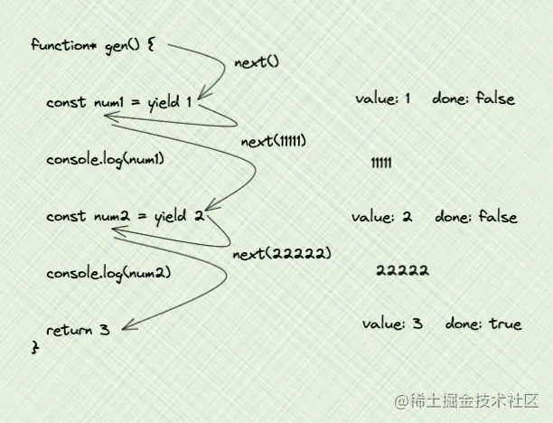

```js
### 数组去重
[...new Set(arr)]

//  O(n^2)
arr.filter((item, index) => arr.indexOf(item) === index)

arr.reduce((pre, cur) => pre.includes(cur) ? pre : [...pre, cur], [])


### 浅拷贝 shallow copy
function shallowCopy(obj) {  
  if (typeof obj !== 'object' || obj === null) {  
    return obj;  
  }  
  return Object.assign({}, obj);
 // 对象里的对象 是引用, 不是新的对象
 // 或者 {...obj}  
}  
  
const original = { a: 1, b: { c: 2 } };  
const copied = shallowCopy(original);  
console.log(copied); // { a: 1, b: { c: 2 } }


### 深拷贝 deep copy
function isRegExp(obj) {
  return Object.prototype.toString.call(obj) === '[object RegExp]'
}
function isDate(obj) {
  return Object.prototype.toString.call(obj) === '[object Date]'
}
function isSet(obj) {
  return Object.prototype.toString.call(obj) === '[object Set]'
}
function isObject(obj) {
  return typeof obj === 'object'
  // return Object.prototype.toString.call(obj) === '[object Object]'
}
function isArray(obj) {
  return Object.prototype.toString.call(obj) === '[object Array]' 
  //  return Array.isArray(obj)
}
//  涵盖所有类型的复制
function deepCopy(obj, map = new WeakMap()) {
  //  判断是否为regExp / Date / Set
  if (isRegExp(obj) || isDate(obj) || isSet(obj)) {
    return new obj.constructor(obj) //  类似于new Date()  ！！！记住加上参数
  }
  //  判断是否为null
  if (obj === null) return obj
  //  基本类型值 & function
  if (typeof obj !== 'object') return obj
  //  赋值循环引用的结果
  if (map.has(obj)) {
    return map.get(obj)
  }

  const cloneObj = Array.isArray(obj) ? [] : {}
  //  let cloneObj = new obj.constructor(); 与上一句话等价
  // 缓存循环引用的拷贝结果！！！！！！
  map.set(obj, cloneObj)
  //  会把原型链上的属性都遍历！！！！！
  for (let prop in obj) {
    //  过滤,仅复制自身属性！！！！！！！！
    if (obj.hasOwnProperty(prop)) {
      cloneObj[prop] = deepCopy(obj[prop])
    }
  }

  return cloneObj

}

### 手写new
function mynew(func, ...args) {
  // 1.创建一个新对象
  var obj = {}
  // 2.新对象原型指向构造函数原型对象
  obj.__proto__ = func.prototype
  // 3. 将这个新对象作为 this 上下文, 并调用构造函数  
  const result = func.apply(obj, args)  //  args 为数组
  // 4. 如果构造函数返回的是一个对象, 则返回这个对象；否则返回新创建的对象  
  return result instanceof Object ? result : obj
}

### 柯里化
// 经典题目
function add() {
  // 创建空数组来维护所有要 add 的值
  const args = []
  // curry 函数,存入每次调用传入的参数
  function curried(...nums) {
    if (nums.length === 0) {
      // 长度为0,说明调用结束,返回 args 的 sum
      return args.reduce((pre, cur) => pre + cur, 0);
    } else {
      // 长度不为0,将传入的参数存入 args,返回 curried函数给下一次调用
      args.push(...nums);
      return curried;
    }
  }

  // 一开始给 curried 传递 add 接收到的参数 arguments
  return curried(...Array.from(arguments));
}

console.log(add(1, 2)(1)()); // 输出: 4
console.log(add(1)(2)(3)(4)()); // 输出: 10
console.log(add(5)()); // 输出: 5


### 实现 add(3)(2)(1) = 6
function add(a) {
  return function(b) {
    return function(c) {
      return a + b + c;
    };
  };
}
// const add = x => y => z => x + y + z;

// 调用 add 函数
const result = add(3)(2)(1);

console.log(result); // 输出 6

//  如果同时支持下面这几种的用法呢
add(1, 2, 3);
add(1, 2)(3);
add(1)(2, 3);

//  主要思路是什么呢, 要判断当前传入函数的参数个数 (args.length) 是否大于等于原函数所需参数个数 (fn.length) , 如果是, 则执行当前函数；如果是小于, 则返回一个函数. 
function add() {
  let args = Array.from(arguments); // 将参数转换为数组
  let sum = args.reduce((acc, current) => acc + current, 0); // 使用reduce方法计算累加结果

  function innerAdd() {
    args = args.concat(Array.from(arguments)); // 将新传入的参数与之前的参数合并
    sum = args.reduce((acc, current) => acc + current, 0); // 重新计算累加结果
    return innerAdd; // 返回自身, 支持链式调用
  }

  innerAdd.toString = function() {
    return sum; // 重写toString方法, 返回累加结果
  };

  return innerAdd; // 返回内部函数
}

// 测试
console.log(add(1, 2, 3).toString()); // 输出 6
console.log(add(1, 2)(3).toString()); // 输出 6
console.log(add(1)(2, 3).toString()); // 输出 6


### 使用promise封装ajax
function ajaxRequest(url, method = 'GET', data = null) {  
    return new Promise((resolve, reject) => {  
        const xhr = new XMLHttpRequest();  
        xhr.open(method, url, true);  
  
        // 设置请求头  
        if (method === 'POST') {  
            xhr.setRequestHeader('Content-Type', 'application/x-www-form-urlencoded');  
        }  
  
        xhr.onload = function() {  
            if (this.status === 200) {  
                resolve(this.responseText);  
            } else {  
                reject(new Error(this.statusText));  
            }  
        };  
  
        xhr.onerror = function() {  
            reject(new Error('Network Error'));  
        };  
  
        if (data) {  
            xhr.send(data);  
        } else {  
            xhr.send();  
        }  
    });  
}  
  
// 使用示例  
ajaxRequest('https://api.example.com/data', 'GET')  
    .then(response => {  
        console.log(response);  
    })  
    .catch(error => {  
        console.error('Error:', error);  
    });

### 交换ab值 不使用第三个变量
[a, b] = [b, a]

### 数组元素求和
let sum = 0;  
for (let i = 0; i < arr.length; i++) {  
    sum += arr[i];  
}  

arr.reduce((pre, cur) => pre + cur);


### 数组扁平化
1 
functino flatten(arr) {  
  let result = [];  
  for (let i = 0; i < arr.length; i++) {  
    if (Array.isArray(arr[i])) {  
      result = result.concat(flatten(arr[i]));  
    } else {
      result.push(arr[i]);  
    }
  }

  return result
}

2
function flatten(arr) {  
  return arr.reduce((pre, cur) => {
    return Array.isArray(cur) ? pre.concat(flatten(cur)) : [...pre, cur]
  }, []);  
}

3
function flattenArray(arr) {  
    while (arr.some(item => Array.isArray(item))) { 
        arr = [].concat(...arr);  
    }  
    return arr;  
}  

4
let nestedArray = [1, [2, [3, [4]], 5]];  
console.log(nestedArray.flat(Infinity)); // 输出 [1, 2, 3, 4, 5]


### 类数组转化为数组
var arrayLike = {0: 'a', 1: 'b', 2: 'c', length: 3};  

Array.prototype.slice.call(arrayLike)

[...arrayLike]

Array.from(arrayLike)

### Promise实现图片异步加载

function loadImage(url) {
  return new Promise((resolve, reject) => {
    let img = new Image();
    //  当图片加载成功时, onload事件处理器会被调用, 我们使用resolve方法将图片对象传递给Promise的链式调用
    img.onload = function() {
      resolve(img);
    }

    img.onerror = function() {
      reject(new Error('Could not load image at ' + url));
    }

    img.src = url;
  })
}

// 使用方式  
loadImage('https://example.com/path/to/image.jpg')  
    .then(img => {  
        document.body.appendChild(img);  
        console.log('图片加载成功');  
    })  
    .catch(error => {  
        console.error('图片加载失败', error);  
    });

### fetch 相关

这种功能以前是使用 XMLHttpRequest 实现的. Fetch 提供了一个更理想的替代方案

fetch 规范与 jQuery.ajax() 主要有以下的不同: 
- 当接收到一个代表错误的 HTTP 状态码时, 从 fetch() 返回的 Promise 不会被标记为 reject, 即使响应的 HTTP 状态码是 404 或 500. 
- fetch 不会发送跨域 cookie, 除非你使用了 credentials 的初始化选项. 

// 封装fetch函数  
async function fetchData(url, options = {}) {  
    try {  
        const response = await fetch(url, options);  
          
        // 检查响应状态码是否在200-299之间  
        if (!response.ok) {  
            throw new Error(`HTTP error! status: ${response.status}`);  
        }  
          
        // 解析响应数据  
        const data = await response.json();  
        return data;  
    } catch (error) {  
        console.error('Fetch error:', error);  
        throw error; // 可以选择是否重新抛出错误  
    }  
}  

### 斐波那契数列
1 - 递归
0 1 1 2 3 5 8 13 21
function fibonacci(n) {
  if (n<2) return n
  return fibonacci(n-1) + fibonacci(n-2)
}
时间复杂度: O(2^n) - 即递归树中节点的总数. 显然二叉树节点总数为指数级别
空间复杂度: O(n)

2 - 增加备忘录
function fibonacci(n, memo = []) {
    if (n<2) return n
    if (!memo[n]) {
      memo[n] = fibonacci(n-1, memo) + fibonacci(n-2, memo)
    }

    return memo[n]
}
时间复杂度是 O(n)
空间复杂度: O(n)

3 - 动态规划
function fibonacci(n) {
  if (n<2) return n

  let i = 1
  let pre = 0
  let cur = 1
  let result = 0

  while(i++ < n) {
    result = pre + cur
    pre = cur
    cur = result
  }

  return result
}

时间复杂度: O(n)
空间复杂度: O(1)

### 使用setTimout 实现 setInterval
function myInterval(cb, wait) {

  const timer = setTimeout(() => {
    clearTimeout(timer)

    myInterval(cb, wait)

    cb()
  }, wait)
}

### 字符串出现不重复的最长长度
//  滑动窗口 leetcode-3
function lenOfLongestStr(s) {
  let start = 0
  let maxLen = 0
  let seen = new Set()

  for (let end=0; end<s.length; end++) {
    while(seen.has(s[end])) {
      seen.delete(s[start])
      start++
    }

    seen.add(s[end])

    maxLen = Math.max(maxLen, end - start + 1)
  }

  return maxLen
}


### async/await

用同步方式, 执行异步操作

- async 是 function 的一个前缀, 只有 async 函数中才能使用 await 语法
- async 函数是一个 Promise 对象, 有无 resolve 取决于有无在函数中 return 值
- await 后面跟的是一个 Promise 对象, 如果不是, 则会包裹一层 Promise.resolve()

async/await 是由 generator函数 来实现的

function* generator() {
  yield 1;
  yield 2;
  yield 3;
}

const gen = generator();

console.log(gen.next()); // {"value":1,"done":false}
console.log(gen.next()); // {"value":2,"done":false}
console.log(gen.next()); // {"value":3,"done":false}
console.log(gen.next()); // {"done":true}

* yield后面接函数的话, 到了对应暂停点yield, 会马上执行此函数, 并且该函数的执行返回值, 会被当做此暂停点对象的value

* yield后面接Promise
function fn(num) {
  return new Promise(resolve => {
    setTimeout(() => {
      resolve(num)
    }, 1000)
  })
}
function* gen() {
  yield fn(1)
  yield fn(2)
  return 3
}
const g = gen()
console.log(g.next()) // { value: Promise { <pending> }, done: false }
console.log(g.next()) // { value: Promise { <pending> }, done: false }
console.log(g.next()) // { value: 3, done: true }

其实我们想要的结果是, 两个Promise的结果1 和 2, 那怎么做呢

const g = gen()
const next1 = g.next()

next1.value.then(res1 => {
  console.log(next1) // 1秒后输出 { value: Promise { 1 }, done: false }
  console.log(res1) // 1秒后输出 1

  const next2 = g.next()
  next2.value.then(res2 => {
    console.log(next2) // 2秒后输出 { value: Promise { 2 }, done: false }
    console.log(res2) // 2秒后输出 2
    console.log(g.next()) // 2秒后输出 { value: 3, done: true }
  })
})

next函数穿参
- 第一次next传参是没用的, 只有从第二次开始next传参才有用
- next传值时, 要记住顺序是, 先右边yield, 后左边接收参数

高阶函数的特点是: 参数是函数, 返回值也可以是函数

--- async/await版本

async function asyncFn() {
  const num1 = await fn(1)
  console.log(num1) // 2
  const num2 = await fn(num1)
  console.log(num2) // 4
  const num3 = await fn(num2)
  console.log(num3) // 8
  return num3
}
const asyncRes = asyncFn()
console.log(asyncRes) // Promise
asyncRes.then(res => console.log(res)) // 8


--- 使用generatorToAsync函数的版本

function* gen() {
  const num1 = yield fn(1)
  console.log(num1) // 2
  const num2 = yield fn(num1)
  console.log(num2) // 4
  const num3 = yield fn(num2)
  console.log(num3) // 8
  return num3
}

const genToAsync = generatorToAsync(gen)
const asyncRes = genToAsync()
console.log(asyncRes) // Promise
asyncRes.then(res => console.log(res)) // 8

function generatorToAsync(generatorFn) {
  return function() {
    const gen = generatorFn.apply(this, arguments) // gen有可能传参

    // 返回一个Promise
    return new Promise((resolve, reject) => {

      function go(key, arg) {
        let res
        try {
          res = gen[key](arg) // 这里有可能会执行返回reject状态的Promise
        } catch (error) {
          return reject(error) // 报错的话会走catch, 直接reject
        }

        // 解构获得value和done
        const { value, done } = res
        if (done) {
          // 如果done为true, 说明走完了, 进行resolve(value)
          return resolve(value)
        } else {
          // 如果done为false, 说明没走完, 还得继续走

          // value有可能是: 常量, Promise, Promise有可能是成功或者失败
          return Promise.resolve(value).then(val => go('next', val), err => go('throw', err))
        }
      }

      go("next") // 第一次执行
    })
  }
}

### 手写promise

1, 执行了resolve, Promise状态会变成fulfilled
2, 执行了reject, Promise状态会变成rejected
3, Promise只以第一次为准, 第一次成功就永久为fulfilled, 第一次失败就永远状态为rejected
4, Promise中有throw的话, 就相当于执行了reject

https://mp.weixin.qq.com/s/w5RF1LKkX1F77CQQgR4pnA


### 实现双向数据绑定

//  最简单的双向数据绑定

//  Object.defineProperty实现
  <input type="text" id="input">
  <p id="output"></p>

    let data = {
      message: ''
    };

    let input = document.getElementById('input');
    let output = document.getElementById('output');

    // 视图到数据的绑定
    input.addEventListener('input', function() {
      data.message = input.value;
    });

    // 数据到视图的绑定
    Object.defineProperty(data, 'message', {
      get: function() {
        return this._message;
      },
      set: function(value) {
        this._message = value;
        output.innerText = value;
      }
    });
优点: 
兼容性好, 支持 IE9, 而 Proxy 的存在浏览器兼容性问题,而且无法用 polyfill 磨平
缺点: 
检测不到对象属性的添加和删除
数组API方法无法监听到
需要对每个属性进行遍历监听, 如果嵌套对象, 需要深层监听, 造成性能问题


  //  proxy实现
    let data = new Proxy({
      message: ''
    }, {
      set: function(target, key, value) {
        if (key === 'message') {
          target[key] = value;
          output.innerText = value;
          return
        }
      }
      //  下面代码无关
      get: function (target, key) {
        //  和 target[key]类似
        return Reflect.get(target, key)
      }
    });

    let input = document.getElementById('input');
    let output = document.getElementById('output');

    // 数据到视图的绑定
    input.addEventListener('input', function() {
      data.message = input.value;
    });
缺点: 
Proxy 不兼容IE, 也没有 polyfill, defineProperty 能支持到IE9

```

[async/await原理](https://mp.weixin.qq.com/s/RFK0QWeE-jXRUJUR0KDpSA)

[手写promise](https://mp.weixin.qq.com/s/w5RF1LKkX1F77CQQgR4pnA)


